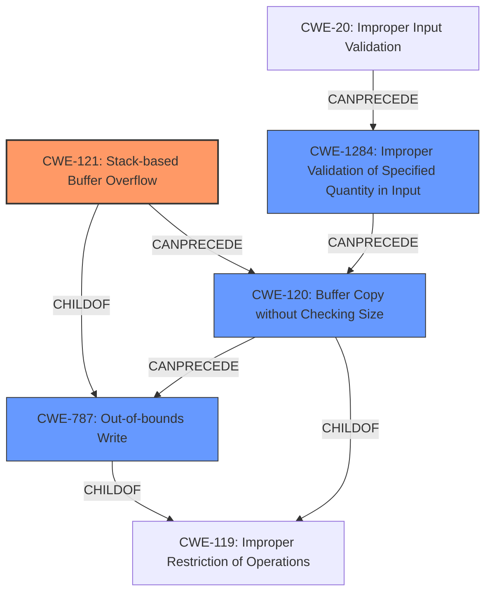

# Analysis Report for CVE-2021-21903

# Vulnerability Analysis Report: CVE-2021-21903

## Description

A stack-based buffer overflow vulnerability exists in the CMA check_udp_crc function of Garrett Metal Detectors iC Module CMA Version 5.0. A specially-crafted packet can lead to a stack-based buffer overflow during a call to strcpy. An attacker can send a malicious packet to trigger this vulnerability.

## Vulnerability Description Key Phrases

**Rootcause:** strcpy
**Weakness:** stack-based buffer overflow
**Vector:** specially-crafted packet
**Attacker:** attacker
**Product:** Garrett Metal Detectors iC Module
**Version:** CMA Version 5.0
**Component:** CMA check_udp_crc function

## Analysis (with Relationship Data)

# Summary
| CWE ID | CWE Name | Confidence | CWE Abstraction Level | CWE Vulnerability Mapping Label | CWE-Vulnerability Mapping Notes |
|---|---|---|---|---|---|
| CWE-121 | Stack-based Buffer Overflow | 0.95 | Variant | Primary | The vulnerability is a stack-based buffer overflow due to the use of `strcpy` without proper bounds checking. |
| CWE-120 | Buffer Copy without Checking Size of Input ('Classic Buffer Overflow') | 0.60 | Base | Secondary | This CWE is related, but CWE-121 is more specific. |

## Evidence and Confidence

*   **Confidence Score:** 0.90
*   **Evidence Strength:** HIGH

- **Analysis and Justification:**  
  - *Explanation:* The vulnerability description clearly states a **stack-based buffer overflow** in the `check_udp_crc` function due to an unbounded `strcpy`. The CVE reference links content summary provides further details, explaining that the `strcpy` copies the CRC field into a fixed-size buffer without validation, leading to a buffer overflow if the CRC string exceeds 8 bytes. This directly aligns with the characteristics of CWE-121 (Stack-based Buffer Overflow), which is a variant of CWE-119 (Improper Restriction of Operations within the Bounds of a Memory Buffer). The use of `strcpy` without checking the size of the input makes CWE-120 (Buffer Copy without Checking Size of Input ('Classic Buffer Overflow')) a related, but less specific, CWE.

  - *Relationship Analysis:* CWE-121 is a variant of CWE-119, representing a more specific type of buffer overflow that occurs on the stack. It is also related to CWE-787 (Out-of-bounds Write), as a stack-based buffer overflow is a type of out-of-bounds write. The vulnerability description explicitly mentions the stack, making CWE-121 the most appropriate choice.

- **Confidence Score:**  
  - Confidence: 0.95 (High confidence due to clear technical details and explicit mention of "stack-based buffer overflow")

---

## Criticism of Analysis

Okay, here's a review of the provided analysis, considering the full CWE specifications you've included:

**Overall Assessment:**

The primary CWE mapping of **CWE-121: Stack-based Buffer Overflow** is accurate and well-justified.  The confidence level of 0.95 is appropriate, given the strong evidence and explicit mention of "stack-based buffer overflow" in the original description. The inclusion of **CWE-120: Buffer Copy without Checking Size of Input ('Classic Buffer Overflow')** as a secondary CWE is also reasonable, providing a broader context for the vulnerability.

**Detailed Review:**

**1. Primary CWE: CWE-121: Stack-based Buffer Overflow**

*   **Correctness:** The analysis correctly identifies this as the primary CWE. The vulnerability description clearly states a stack-based buffer overflow, and the analysis explains how `strcpy` without bounds checking leads to this specific type of overflow.
*   **Abstraction Level:** Using a "Variant" level CWE is the correct approach, as it provides a more specific categorization than the more general "Class" or "Base" level CWEs.
*   **Mapping Guidance Adherence:** The analysis followed the mapping guidance.  CWE-121 is appropriate because the root cause is a buffer overflow, and the description explicitly states it occurs on the *stack*.
*   **Mitigation Awareness:** The analysis implicitly recognizes that using safer string handling functions (Mitigation 2 for CWE-120) would help mitigate the risk. It also touches on the usefulness of compilers/compiler extensions (Mitigation 1 for CWE-121) for detecting the overflow.
*   **Evidence Strength:** The evidence is compelling because the description includes the function name (`check_udp_crc`), the vulnerable function (`strcpy`), the buffer location (stack), and the mechanism for triggering the overflow (specially-crafted packet with a CRC field exceeding the buffer size). The overwritten PC register further supports this.
*   **Confidence Score:** The confidence score of 0.95 is justified.

**2. Secondary CWE: CWE-120: Buffer Copy without Checking Size of Input ('Classic Buffer Overflow')**

*   **Correctness:** While CWE-121 is more precise, CWE-120 accurately reflects the immediate cause: a buffer copy operation (using `strcpy`) without any size checks. It's a valid, albeit less specific, categorization.
*   **Abstraction Level:** The "Base" level is acceptable as a broader categorization.
*   **Mapping Guidance Adherence:** The analysis considers the mapping guidance: "This CWE entry is only appropriate for 'Buffer Copy' operations (not buffer reads), in which where there is no 'Checking [the] Size of Input', and (by implication of the copy) writing past the end of the buffer."  The `strcpy` fits this perfectly.
*   **Mitigation Awareness:** The analysis correctly identifies that using safer string handling functions (Mitigation 2 for CWE-120) is relevant.  Also, language selection (Mitigation 1) could help.
*    **Relationship analysis:** The analysis correctly describes that CWE-121 is a more specific case of CWE-120.

**Critiques and Suggestions:**

*   **Consider CWE-787:** Even though CWE-121 is a child of CWE-787, you might want to briefly mention CWE-787 in the "Relationship Analysis" section. Emphasize that a stack-based buffer overflow *is* an out-of-bounds write, and that CWE-787 is a more general case, but CWE-121 is preferred because of the specific location (stack).
*   **Input Validation (CWE-20 Family):** While the *immediate* cause is the lack of bounds checking in the `strcpy`, a deeper root cause is often missing or inadequate *input validation*. The program *should* validate the size of the CRC field *before* copying it.  Consider *briefly* discussing the role of input validation. However, avoid making CWE-20 a primary CWE, because it is too abstract. CWE-1284 (Improper Validation of Specified Quantity in Input) would be a stronger candidate related to CWE-20, as the *quantity* being validated is the size/length of the CRC.  But given that this analysis focuses on the *buffer overflow* itself, and not the *lack of input validation*, it's fine to omit it.
*   **Potential Chain:** The analysis could mention the potential for a chain like:  `CWE-20 (Improper Input Validation) -> CWE-120 (Buffer Copy without Checking Size of Input) -> CWE-121 (Stack-based Buffer Overflow)`.  This reinforces the importance of addressing vulnerabilities at multiple levels.
*   **Defense in Depth:** The mitigations section could be strengthened by explicitly mentioning a "defense in depth" approach. This means combining multiple mitigations for greater security. For example, using safer string functions *and* compiler-based overflow detection.

**Updated Summary Table (incorporating Suggestions)**

| CWE ID | CWE Name | Confidence | CWE Abstraction Level | CWE Vulnerability Mapping Label | CWE-Vulnerability Mapping Notes |
|---|---|---|---|---|---|
| CWE-121 | Stack-based Buffer Overflow | 0.95 | Variant | Primary | The vulnerability is a stack-based buffer overflow due to the use of `strcpy` without proper bounds checking. |
| CWE-120 | Buffer Copy without Checking Size of Input ('Classic Buffer Overflow') | 0.60 | Base | Secondary | This CWE is related, but CWE-121 is more specific. The immediate cause is unbounded `strcpy`. |
| CWE-787 | Out-of-bounds Write | N/A | Base | Related | Mentioned for completeness; CWE-121 is a type of out-of-bounds write on the stack. |
| CWE-20 or CWE-1284 | Improper Input Validation or Improper Validation of Specified Quantity in Input | N/A | Class/Base | Related (Consider) | The code doesn't validate size before copying, exposing an avenue for large packets. |

**Revised Evidence and Confidence Section:**

*   **Confidence Score:** 0.95
*   **Evidence Strength:** HIGH

- **Analysis and Justification:**
  - *Explanation:* The vulnerability description clearly states a **stack-based buffer overflow** in the `check_udp_crc` function due to an unbounded `strcpy`. The CVE reference links content summary provides further details, explaining that the `strcpy` copies the CRC field into a fixed-size buffer without validation, leading to a buffer overflow if the CRC string exceeds 8 bytes. This directly aligns with the characteristics of CWE-121 (Stack-based Buffer Overflow), which is a variant of CWE-119 (Improper Restriction of Operations within the Bounds of a Memory Buffer). The use of `strcpy` without checking the size of the input makes CWE-120 (Buffer Copy without Checking Size of Input ('Classic Buffer Overflow')) a related, but less specific, CWE.  This can be viewed as a chain: CWE-20 -> CWE-120 -> CWE-121. Additionally, CWE-121 can be seen as a specific instance of CWE-787.

  - *Relationship Analysis:* CWE-121 is a variant of CWE-119, representing a more specific type of buffer overflow that occurs on the stack. It is also a type of CWE-787 (Out-of-bounds Write). While a general lack of input validation (CWE-20) is at play, the more specific `CWE-1284 (Improper Validation of Specified Quantity in Input)` could be considered as another related issue, as the quantity (size) of input is not validated.  The vulnerability description explicitly mentions the stack, making CWE-121 the most appropriate choice.

- **Confidence Score:**
  - Confidence: 0.95 (High confidence due to clear technical details and explicit mention of "stack-based buffer overflow")

By incorporating these suggestions, the analysis will be even more comprehensive and informative, while adhering to the CWE specifications.

## Final Resolution

# Summary
| CWE ID | CWE Name | Confidence | CWE Abstraction Level | CWE Vulnerability Mapping Label | CWE-Vulnerability Mapping Notes |
|---|---|---|---|---|---|
| CWE-121 | Stack-based Buffer Overflow | 0.95 | Variant | Primary | The vulnerability is a **stack-based buffer overflow** due to the use of `strcpy` without proper bounds checking. |
| CWE-120 | Buffer Copy without Checking Size of Input ('Classic Buffer Overflow') | 0.60 | Base | Secondary | This CWE is related, but CWE-121 is more specific. The immediate cause is unbounded `strcpy`. |
| CWE-787 | Out-of-bounds Write | 0.40 | Base | Related | Mentioned for completeness; CWE-121 is a type of out-of-bounds write on the stack. |
| CWE-1284 | Improper Validation of Specified Quantity in Input | 0.30 | Base | Related (Consider) | The code doesn't validate size before copying, exposing an avenue for large packets. |

## Evidence and Confidence

*   **Confidence Score:** 0.95
*   **Evidence Strength:** HIGH

## Relationship Analysis
The primary relationship is that CWE-121 is a variant (child) of CWE-119 (Improper Restriction of Operations within the Bounds of a Memory Buffer) and also a child of **CWE-787 (Out-of-bounds Write)**. CWE-120 is a related **weakness** because it describes the specific operation that leads to the buffer overflow: copying a buffer without checking its size. CWE-1284 describes the lack of proper input validation which could have prevented the overflow. The abstraction levels influenced the selection because while CWE-119 is relevant, CWE-121 is more specific due to the **stack-based** nature of the overflow.

## Vulnerability Chain
The vulnerability chain starts with a lack of input validation (**CWE-1284** or **CWE-20**), leading to a buffer copy operation without size checking (**CWE-120**), which then results in a **stack-based buffer overflow** (**CWE-121**).
  - **Root Cause:** Lack of input validation (**CWE-1284**)
  - **Weakness 1:** Unchecked buffer copy (**CWE-120**)
  - **Impact:** Stack-based buffer overflow (**CWE-121**)

## Summary of Analysis
The initial analysis and criticism both accurately identify **CWE-121 (Stack-based Buffer Overflow)** as the primary **weakness**. The vulnerability description explicitly mentions a **stack-based buffer overflow** caused by `strcpy` without bounds checking. The use of CWE-120 as a secondary CWE is justified because it reflects the specific operation (buffer copy) that leads to the overflow.

The inclusion of **CWE-787 (Out-of-bounds Write)** is for completeness, as CWE-121 is a specific type of out-of-bounds write. The addition of **CWE-1284 (Improper Validation of Specified Quantity in Input)** acknowledges the missing input validation that could have prevented the vulnerability.

The selection of CWEs is at the optimal level of specificity. **CWE-121** is preferred over the more general **CWE-119** because the vulnerability is explicitly **stack-based**. **CWE-120** is included to highlight the buffer copy operation without size checking. **CWE-1284** is added to show the lack of input validation.

The analysis is primarily based on the provided evidence, specifically: "A **stack-based buffer overflow** vulnerability exists in the CMA check_udp_crc function of Garrett Metal Detectors iC Module CMA Version 5.0. A specially-crafted packet can lead to a **stack-based buffer overflow** during a call to strcpy."

The graph relationships reinforced the decision by highlighting the hierarchical relationship between CWE-121 and CWE-119 and the chain relationship between CWE-1284, CWE-120, and CWE-121. This provides a more complete understanding of the vulnerability's root cause and potential mitigations.

*Report generated on 2025-03-17 22:59:23*
