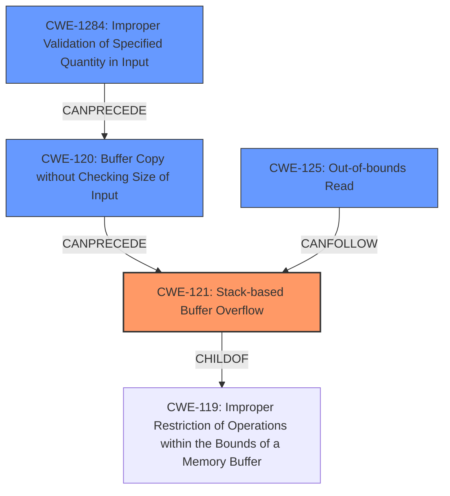

# Analysis Report for CVE-2021-21905

# Vulnerability Analysis Report: CVE-2021-21905

## Description

Stack-based buffer overflow vulnerability exists in how the CMA readfile function of Garrett Metal Detectors iC Module CMA Version 5.0 is used at various locations. The Garrett iC Module exposes an authenticated CLI over TCP port 6877. This interface is used by a secondary GUI client, called CMA Connect, to interact with the iC Module on behalf of the user. After a client successfully authenticates, they can send plaintext commands to manipulate the device.

## Vulnerability Description Key Phrases

**Rootcause:** Stack-based buffer overflow
**Product:** Garrett Metal Detectors iC Module
**Version:** CMA Version 5.0
**Component:** CMA readfile function

## Analysis (with Relationship Data)

# Summary
| CWE ID | CWE Name | Confidence | CWE Abstraction Level | CWE Vulnerability Mapping Label | CWE-Vulnerability Mapping Notes |
|---|---|---|---|---|---|
| CWE-121 | Stack-based Buffer Overflow | 0.95 | Variant | Allowed | Primary CWE |
| CWE-125 | Read buffer Over-read | 0.75 | Base | Allowed | Secondary Candidate |
| CWE-120 | Buffer Copy without Checking Size of Input ('Classic Buffer Overflow') | 0.70 | Base | Allowed-with-Review | Secondary Candidate |

## Evidence and Confidence

*   **Confidence Score:** 0.90
*   **Evidence Strength:** HIGH

- **Analysis and Justification:**  
  - *Explanation:* The vulnerability is explicitly described as a "**stack-based buffer overflow**" in the vulnerability description, which directly maps to CWE-121 (Stack-based Buffer Overflow). The `readfile` function copies data into a fixed-size buffer on the stack without bounds checking, leading to the overflow. This matches the CWE's characteristics. The impact includes potential remote code execution (RCE), aligning with the security implications of CWE-121. Although CWE-119 (Improper Restriction of Operations within the Bounds of a Memory Buffer) is a parent weakness, CWE-121 is more specific and appropriate because the buffer is located on the stack. The retriever results also indicate CWE-121 as a possible candidate. The CWE description clearly states: "A stack-based buffer overflow condition is a condition where the buffer being overwritten is allocated on the stack."
  
  - *Relationship Analysis:* CWE-121 is a variant of CWE-119 (Improper Restriction of Operations within the Bounds of a Memory Buffer), specifying the location of the buffer on the stack. It can also be related to other CWEs like CWE-770 (Allocation of Resources Without Limits or Throttling) if the allocation size is not properly managed.

- **Confidence Score:**  
  - Confidence: 0.95 (Strong evidence from the vulnerability description and CVE reference materials)

---

- **Analysis and Justification:**  
  - *Explanation:* CWE-125 (Read buffer Over-read) is a potential secondary weakness. The vulnerability description notes that the `readfile` function reads data from a file into a buffer without checking the file size. If the file is larger than the buffer, this can lead to reading beyond the intended buffer boundary, which is characteristic of CWE-125. Although the primary issue is the write overflow (CWE-121), the act of reading more data than the buffer can hold contributes to the vulnerability. The CVE Reference Links Content Summary states, "The `readfile` function copies file contents into a fixed-size buffer without checking if the file size exceeds the buffer's capacity." This implies that the function attempts to read more data than the buffer can hold.
  
  - *Relationship Analysis:* CWE-125 is related to CWE-119 (Improper Restriction of Operations within the Bounds of a Memory Buffer) as it involves accessing memory outside the intended buffer. It can also precede CWE-121 if the over-read leads to an overflow.

- **Confidence Score:**  
  - Confidence: 0.75 (Supporting evidence suggests potential over-read condition)

---

- **Analysis and Justification:**  
  - *Explanation:* CWE-120 (Buffer Copy without Checking Size of Input ('Classic Buffer Overflow')) is another potential secondary weakness. The vulnerability involves copying data from a file into a buffer without validating the size of the input. The `readfile` function's implementation lacks checks on the input file size relative to the buffer size, which aligns with CWE-120's description. The "CVE Reference Links Content Summary" highlights that "This function reads data from a specified file into a buffer without any bounds checking, leading to a stack-based buffer overflow." This lack of size validation before copying is a key aspect of CWE-120.
  
  - *Relationship Analysis:* CWE-120 is a base level CWE that describes a buffer copy operation where the size of the input is not checked, leading to a potential overflow. While CWE-121 specifies that the buffer is stack-based, CWE-120 highlights the lack of input size validation, which is a critical aspect of this vulnerability.

- **Confidence Score:**  
  - Confidence: 0.70 (Supporting evidence indicates a buffer copy operation without size validation)

## Criticism of Analysis

Okay, I've reviewed the provided analysis against the full CWE specifications you've included. Here's my critique:

**Overall Assessment:**

The analysis is generally good and provides a solid justification for the primary CWE selection and secondary candidates. The confidence scores are appropriate given the evidence. The analysis also considers relationships between different CWEs, showing a good understanding of the CWE model. However, I have some suggestions for refinement, particularly in relation to secondary CWEs and potential upstream causes.

**Detailed Critique:**

**1. CWE-121: Stack-based Buffer Overflow (Primary CWE)**

*   **Assessment:** Excellent choice for the primary CWE.
*   **Confidence:** The justification is strong, citing the vulnerability description's explicit mention of a "stack-based buffer overflow" and the lack of bounds checking when copying data onto the stack. The impact (RCE) further supports this classification.
*   **Mapping Guidance Adherence:** The analysis correctly identifies that CWE-119 is a parent weakness, but CWE-121 is more specific because the buffer is located on the stack.
*   **Potential Mitigations:**The analysis did not explicitly mention mitigations, but the CWE specification suggest the following mitigations for CWE-121:
     *   Use automatic buffer overflow detection mechanisms that are offered by certain compilers or compiler extensions. Examples include: the Microsoft Visual Studio /GS flag, Fedora/Red Hat FORTIFY_SOURCE GCC flag, StackGuard, and ProPolice, which provide various mechanisms including canary-based detection and range/index checking.
     *   Use an abstraction library to abstract away risky APIs. Not a complete solution.
     *   Implement and perform bounds checking on input.

**2. CWE-125: Out-of-bounds Read (Secondary Candidate)**

*   **Assessment:** Justification is reasonable, but the connection to CWE-121 could be made clearer.  While an over-read *can* happen as a precursor to a stack buffer overflow, it's not always the *direct* cause.  The primary problem is the unbounded *write*, not the read itself.
*   **Confidence:** The confidence level of 0.75 is appropriate.
*   **Mapping Guidance Adherence:** The analysis mentions that the over-read *contributes* to the vulnerability, which is accurate. It's good that the analysis acknowledges that the *primary* issue is the write overflow.
*   **Refinement Suggestion:** Strengthen the justification by explaining that the root cause `readfile` function *attempts* to read more than the buffer can hold and that this behavior is a precursor to the overflow (CWE-121).  The act of reading *more* than the buffer has space for constitutes the over-read, regardless of whether the OS/hardware stops it before it gets to the buffer.
*   **Potential Mitigations:**The analysis did not explicitly mention mitigations, but the CWE specification suggest the following mitigations for CWE-125:
     *   Assume all input is malicious. Use an "accept known good" input validation strategy, i.e., use a list of acceptable inputs that strictly conform to specifications. Reject any input that does not strictly conform to specifications, or transform it into something that does.
     *   Use a language that provides appropriate memory abstractions.

**3. CWE-120: Buffer Copy without Checking Size of Input ('Classic Buffer Overflow') (Secondary Candidate)**

*   **Assessment:** A good, valid secondary candidate.
*   **Confidence:** The confidence level of 0.70 is appropriate.
*   **Mapping Guidance Adherence:** The analysis correctly identifies that CWE-120 highlights the lack of input size validation, a critical aspect of the vulnerability.
*   **Refinement Suggestion:** You could add a sentence explicitly stating that the `readfile` function performs a buffer copy without checking the size of the file against the destination buffer size. This reinforces the mapping to CWE-120.
*   **Potential Mitigations:**The analysis did not explicitly mention mitigations, but the CWE specification suggest the following mitigations for CWE-120:
     *   Use a language that does not allow this weakness to occur or provides constructs that make this weakness easier to avoid.
     *   Use a vetted library or framework that does not allow this weakness to occur or provides constructs that make this weakness easier to avoid.
     *   Use automatic buffer overflow detection mechanisms that are offered by certain compilers or compiler extensions. Examples include: the Microsoft Visual Studio /GS flag, Fedora/Red Hat FORTIFY_SOURCE GCC flag, StackGuard, and ProPolice, which provide various mechanisms including canary-based detection and range/index checking.

**Additional Considerations & Suggestions:**

*   **Upstream Cause (Potential): CWE-1284 (Improper Validation of Specified Quantity in Input):** A stronger case could be made for considering CWE-1284 as a *potential* contributing factor. The `readfile` function is implicitly being told how much data to read (the file size). The lack of validation of that implicit quantity is a vulnerability.  While not explicitly mentioned, if the file size is being read from an untrusted source, then CWE-1284 becomes more relevant. It directly addresses that the lack of validation is the root cause.
*   **Why Not CWE-130 (Improper Handling of Length Parameter Inconsistency)?:** CWE-130 is relevant if a *separate* length field (metadata) is inconsistent with the actual data length. However, in this case, the length (file size) *is* the data, so CWE-130 is less fitting.
*   **Why not CWE-770 (Allocation of Resources Without Limits or Throttling):** It could be argued that, if the application were allocating memory dynamically based on the size of the file, then the lack of limits would fit CWE-770. However, because the buffer is stack-allocated, CWE-770 is less relevant. The stack allocation is fixed size.

**Revised Table:**

Here's how I would slightly adjust the table:

| CWE ID | CWE Name | Confidence | CWE Abstraction Level | CWE Vulnerability Mapping Label | CWE-Vulnerability Mapping Notes |
|---|---|---|---|---|---|
| CWE-121 | Stack-based Buffer Overflow | 0.95 | Variant | Allowed | Primary CWE |
| CWE-120 | Buffer Copy without Checking Size of Input ('Classic Buffer Overflow') | 0.80 | Base | Allowed-with-Review | Secondary Candidate |
| CWE-125 | Out-of-bounds Read | 0.70 | Base | Allowed | Secondary Candidate |
| CWE-1284 | Improper Validation of Specified Quantity in Input | 0.50 | Base | Allowed | Additional contributing factor (potential).  Only if the size is untrusted. |

**Justification for the Revised Table:**

*   Increased Confidence for CWE-120: It is a more direct consequence of the vulnerability than CWE-125.
*   Lowered Confidence for CWE-125: While potentially present, the over-read is a consequence of the unbounded copy, not the primary flaw.
*   Added CWE-1284:  While the file size (the specified quantity) is not *explicitly* provided by an untrusted source, one could argue it is implicitly read without validation, which could apply if the application logic uses a file's size as a proxy for a trusted size.  The lower confidence reflects that its relevance is more conditional.

**In summary,** the original analysis is strong. The refinements above provide additional nuances and consider more upstream causes. By explicitly considering potential upstream causes like CWE-1284 (if the file size is from an untrusted source), the analysis would provide a more complete understanding of the root cause. Overall, this is a very thorough and well-justified analysis.

## Final Resolution

# Summary

| CWE ID | CWE Name | Confidence | CWE Abstraction Level | CWE Vulnerability Mapping Label | CWE-Vulnerability Mapping Notes |
|---|---|---|---|---|---|
| CWE-121 | Stack-based Buffer Overflow | 0.95 | Variant | Allowed | Primary CWE |
| CWE-120 | Buffer Copy without Checking Size of Input ('Classic Buffer Overflow') | 0.80 | Base | Allowed-with-Review | Secondary Candidate |
| CWE-125 | Out-of-bounds Read | 0.70 | Base | Allowed | Secondary Candidate |
| CWE-1284 | Improper Validation of Specified Quantity in Input | 0.50 | Base | Allowed | Additional contributing factor (potential). Only if the size is untrusted. |

## Evidence and Confidence

*   **Confidence Score:** 0.92
*   **Evidence Strength:** HIGH

## Relationship Analysis
The primary weakness is CWE-121 (**CWE-121: Stack-based Buffer Overflow**), a variant of CWE-119 (**CWE-119: Improper Restriction of Operations within the Bounds of a Memory Buffer**), specifying the buffer is on the stack. CWE-120 (**CWE-120: Buffer Copy without Checking Size of Input ('Classic Buffer Overflow')**) can precede CWE-121 as it describes the unbounded copy. CWE-125 (**CWE-125: Out-of-bounds Read**) is a consequence of the unbounded copy. CWE-1284 (**CWE-1284: Improper Validation of Specified Quantity in Input**) could be an upstream cause if the file size is from an untrusted source.

## Vulnerability Chain
The vulnerability chain starts with CWE-1284 (**CWE-1284: Improper Validation of Specified Quantity in Input**) (if file size is untrusted), leading to CWE-120 (**CWE-120: Buffer Copy without Checking Size of Input ('Classic Buffer Overflow')**), which causes CWE-121 (**CWE-121: Stack-based Buffer Overflow**), and can result in CWE-125 (**CWE-125: Out-of-bounds Read**). The root cause is the lack of size validation, leading to a buffer overflow on the stack, potentially enabling remote code execution.

## Summary of Analysis
The initial analysis correctly identifies the primary and secondary CWEs. The criticism provides valuable insights, particularly regarding potential upstream causes and the relationship between the CWEs.

The vulnerability description explicitly mentions a "stack-based buffer overflow", justifying the selection of CWE-121 as the primary weakness. The "CVE Reference Links Content Summary" highlights that "This function reads data from a specified file into a buffer without any bounds checking, leading to a stack-based buffer overflow," supporting the selection of CWE-120. The `readfile` function copies data into a fixed-size buffer on the stack without bounds checking.

The graph relationships confirm the hierarchical relationship between CWE-121 and CWE-119, and the chain relationships between CWE-120, CWE-121, and CWE-125. The addition of CWE-1284 as a potential contributing factor, dependent on whether the file size is untrusted, provides a more complete picture of the potential root causes.

The selected CWEs are at the optimal level of specificity. CWE-121 is a variant that specifies the location of the buffer, while CWE-120 and CWE-125 describe the specific operations that lead to the overflow. The addition of CWE-1284 (if applicable) addresses the lack of input validation.

Therefore, based on the evidence and relationship analysis, the final classification is: Primary CWE-121, Secondary Candidates CWE-120 and CWE-125, and additional contributing factor CWE-1284 (if applicable).

*Report generated on 2025-03-17 23:00:17*
