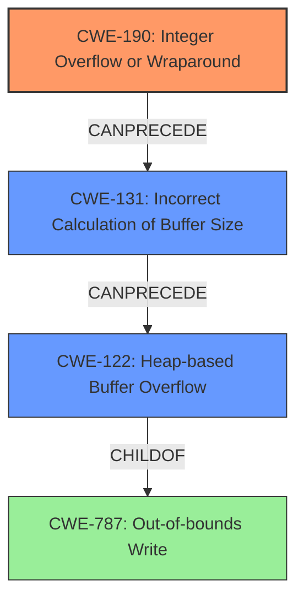

# Analysis Report for CVE-2021-21914

# Vulnerability Analysis Report: CVE-2021-21914

## Description

A heap-based buffer overflow vulnerability exists in the DecoderStreamAppend functionality of Accusoft ImageGear 19.10. A specially-crafted file can lead to code execution. An attacker can provide a malicious file to trigger this vulnerability.

## Vulnerability Description Key Phrases

**Rootcause:** heap-based buffer overflow
**Impact:** code execution
**Vector:** specially-crafted file
**Attacker:** attacker
**Product:** Accusoft ImageGear
**Version:** 19.1
**Component:** DecoderStreamAppend functionality

## Analysis (with Relationship Data)

# Summary
| CWE ID | CWE Name | Confidence | CWE Abstraction Level | CWE Vulnerability Mapping Label | CWE-Vulnerability Mapping Notes |
|---|---|---|---|---|---|
| CWE-190 | Integer Overflow or Wraparound | 0.95 | Base | Primary | Allowed |
| CWE-122 | Heap-based Buffer Overflow | 0.90 | Variant | Secondary Candidate | Allowed |
| CWE-131 | Incorrect Calculation of Buffer Size | 0.85 | Base | Secondary Candidate | Allowed |

## Evidence and Confidence

*   **Confidence Score:** 0.90
*   **Evidence Strength:** HIGH

- **Analysis and Justification:**  
  - *Explanation:* The vulnerability description clearly states that there is a **heap-based buffer overflow** vulnerability. The CVE Reference Links Content Summary provides more details, stating that the root cause is an **integer overflow** when calculating the size of the heap buffer in `DecoderStream::Append`. This integer overflow leads to an undersized buffer allocation. This undersized buffer allocation results in the heap-based buffer overflow when data is written to it. Therefore, the integer overflow (CWE-190) is the primary root cause, which then leads to the heap-based buffer overflow (CWE-122). CWE-131 (Incorrect Calculation of Buffer Size) is also relevant as the integer overflow causes an incorrect buffer size to be calculated.

  - *Relationship Analysis:* "CWE-190 (Integer Overflow or Wraparound) can precede CWE-122 (Heap-based Buffer Overflow) as the integer overflow leads to an undersized buffer allocation, causing the heap overflow when data is written. CWE-122 is a specific type of CWE-119 (Improper Restriction of Operations Within the Bounds of a Memory Buffer)."

- **Confidence Score:**
  - *CWE-190:* Confidence: 0.95 (High confidence due to explicit mention of integer overflow in CVE reference).
  - *CWE-122:* Confidence: 0.90 (High confidence because the description specifies heap-based buffer overflow.)
  - *CWE-131:* Confidence: 0.85 (High confidence due to the integer overflow causing an incorrect buffer size calculation).

## Criticism of Analysis

Okay, I've reviewed the provided analysis against the full CWE specifications. Here's a critique:

**Overall Assessment:**

The analysis is generally good and identifies the core issues well. The reasoning for the chosen CWEs is sound, and the confidence levels are appropriate. However, there's room for improvement, particularly in how the CWEs are presented and in clarifying the relationships between them.

**Specific Points:**

1.  **CWE-190: Integer Overflow or Wraparound (Primary):**

    *   **Correctly Identified:** The analysis correctly identifies CWE-190 as the primary root cause because the CVE description and reference links point to an integer overflow during the buffer size calculation.
    *   **Confidence Justification:** The high confidence (0.95) is justified due to the explicit mention in the CVE references.
    *   **Mitigation Relevance:** Mitigation advice for CWE-190 emphasizes language selection and safe integer handling libraries, which are all relevant preventative steps.

2.  **CWE-122: Heap-based Buffer Overflow (Secondary Candidate):**

    *   **Correctly Identified:** The analysis correctly identifies CWE-122 because the vulnerability manifests as a heap-based buffer overflow.
    *   **Confidence Justification:** The high confidence (0.90) is appropriate because the vulnerability is *directly* a heap-based buffer overflow, even if triggered by something else.
    *   **Abstraction Level Considerations:** While CWE-122 is a *Variant*, the goal of the analysis is to find the fundamental *cause*. The analysis *correctly* looks *deeper* than CWE-122 to find the root cause.
    *   **Mitigation Relevance:** The mitigation advice for CWE-122 (languages with bounds checking, abstraction libraries, compiler-based detection) are all applicable to *preventing* the heap overflow itself *after* the undersized buffer has been allocated.

3.  **CWE-131: Incorrect Calculation of Buffer Size (Secondary Candidate):**

    *   **Correctly Identified:** CWE-131 is correctly identified as contributing to the vulnerability. The integer overflow leads directly to an incorrect buffer size calculation.
    *   **Confidence Justification:** A high confidence (0.85) is justified.
    *   **Mitigation Relevance:** Mitigation 2 of CWE-131 ("Understand the programming language's underlying representation...") is *directly* relevant to *preventing* the integer overflow that *causes* the incorrect buffer calculation. Mitigation 3 (Input Validation) is relevant for validating size inputs.

**Recommendations for Improvement:**

1.  **Emphasize the Chain:**  The current analysis discusses the relationship between the CWEs, but it could be clearer. Structure it more explicitly as a causal chain.  For example:
    *   "The vulnerability begins with **CWE-190 (Integer Overflow or Wraparound)**.  When calculating the size of the buffer needed, an integer overflow occurs, resulting in a smaller-than-expected buffer size. This directly leads to **CWE-131 (Incorrect Calculation of Buffer Size)**, where the undersized buffer is the result of the overflow. Finally, when data is written into the undersized buffer, it overflows, causing **CWE-122 (Heap-based Buffer Overflow)**."
    *   This formulation more explicitly casts CWE-190 as the root cause, with CWE-131 as the direct consequence, and CWE-122 as the manifestation of the vulnerability.

2.  **Consider CWE-682 (Incorrect Calculation):** While the analysis breaks it down into CWE-190, 131, and 122, consider acknowledging that *all* of these combined are related to the broader issue of a calculation error. While the analysis is correct to emphasize CWE-190 and 131 as *causes*, and CWE-122 as the *direct effect*, the analysis is missing the fact that CWE-682 applies as well.

3.  **Explain why CWE-787 was rejected:** The original analyzer input suggested CWE-787 and it appears in the top CWE list from the retriever results. Explain clearly *why* CWE-787 is not the primary CWE. For example: "While CWE-787 (Out-of-bounds Write) describes the *symptom* of the vulnerability, it does not represent the root cause. The out-of-bounds write is a *consequence* of the integer overflow and the subsequent incorrect buffer size calculation."

4.  **Discuss mitigations in light of the chain:** The discussion of mitigations could be improved by explicitly connecting each mitigation to the CWE it addresses.
    *   For instance, when discussing CWE-190, mention the use of safe integer libraries or compile-time checks for overflows as potential mitigations.
    *   When discussing CWE-122, talk about how address space layout randomization (ASLR) or other memory protections can mitigate the *impact* of the heap overflow, even if it doesn't prevent the overflow itself.

**Revised Summary Table (Incorporating Suggestions):**

| CWE ID  | CWE Name                                | Confidence | CWE Abstraction Level | CWE Vulnerability Mapping Label | CWE-Vulnerability Mapping Notes                                                                                                                                                                                                                                                           |
| ------- | --------------------------------------- | ---------- | --------------------- | ------------------------------- | ------------------------------------------------------------------------------------------------------------------------------------------------------------------------------------------------------------------------------------------------------------------------------------------------------- |
| CWE-190 | Integer Overflow or Wraparound          | 0.95       | Base                  | Primary                       | The root cause: an integer overflow during buffer size calculation. This leads to an undersized buffer allocation.                                                                                                                                                                                    |
| CWE-131 | Incorrect Calculation of Buffer Size  | 0.85       | Base                  | Contributing                    | A direct consequence of the integer overflow. The calculated buffer size is smaller than required.                                                                                                                                                                                                    |
| CWE-122 | Heap-based Buffer Overflow            | 0.90       | Variant               | Direct Effect                     | The manifestation of the vulnerability: writing data beyond the bounds of the undersized heap buffer.                                                                                                                                                                                              |
| CWE-682 | Incorrect Calculation | 0.70 | Pillar | Related | Although the error is detailed above in the other CWEs, they all directly relate to a calculation error as well.
| CWE-787 | Out-of-bounds Write | 0.30 | Base | Rejected | This is the symptom, not the cause. This is simply the outcome of the integer overflow allowing a write out of bounds.

**In summary:** The analysis is good, but could be improved by more explicitly framing the vulnerability as a causal chain, providing a more thorough exploration of mitigations in light of the chain, and explaining the rejection of CWE-787. By improving these areas, the analysis would provide a more complete picture of the vulnerability and its potential solutions.

## Final Resolution

# Summary
| CWE ID | CWE Name | Confidence | CWE Abstraction Level | CWE Vulnerability Mapping Label | CWE-Vulnerability Mapping Notes |
|---|---|---|---|---|---|
| CWE-190 | Integer Overflow or Wraparound | 0.95 | Base | Primary | Allowed |
| CWE-131 | Incorrect Calculation of Buffer Size | 0.85 | Base | Contributing | Allowed |
| CWE-122 | Heap-based Buffer Overflow | 0.90 | Variant | Direct Effect | Allowed |
  - The Primary CWE should be first and noted as the Primary CWEs
  - The secondary candidate CWEs should be next and noted as secondary candidates.
  - The confidence is a confidence score 0 to 1 to rate your confidence in your assessment for that CWE.
  - The CWE Abstraction Level as one of these values: Base, Variant, Pillar, Class, Compound
  - The Mapping Notes Usage as one of these values: Allowed, Allowed-with-Review, Prohibited, Discouraged

## Evidence and Confidence

*   **Confidence Score:** 0.93
*   **Evidence Strength:** HIGH

## Relationship Analysis
The analysis emphasizes a clear causal chain: an integer overflow (CWE-190) leads to an incorrect buffer size calculation (CWE-131), which then results in a heap-based buffer overflow (CWE-122). The hierarchical relationships are considered, ensuring the selection of the most specific CWEs. Abstraction levels influenced the decision to prioritize root cause analysis over merely identifying the symptom (CWE-787).

## Vulnerability Chain
The chain of events is as follows:
  - **Root Cause:** CWE-190 (**Integer Overflow or Wraparound**) occurs during the calculation of the buffer size.
  - **Weakness:** CWE-131 (**Incorrect Calculation of Buffer Size**) results from the integer overflow, leading to an undersized buffer.
  - **Impact:** CWE-122 (**Heap-based Buffer Overflow**) occurs when data is written to the undersized buffer, exceeding its boundaries.

## Summary of Analysis
The initial analysis and criticism both correctly identify the core issue. The final determination is based on the provided evidence, particularly the mention of integer overflow in the CVE reference. The graph relationships highlight the vulnerability chain, with CWE-190 as the root cause, CWE-131 as a direct consequence, and CWE-122 as the manifestation. CWE-787 was rejected because it only describes the symptom (**Out-of-bounds Write**) and not the underlying cause. The selected CWEs are at the optimal level of specificity, providing a clear understanding of the vulnerability's origins and progression. The evidence from the CVE description, stating that the root cause is an **integer overflow** when calculating the size of the heap buffer in `DecoderStream::Append`, supports the selection of CWE-190.

*Report generated on 2025-03-17 23:01:02*
