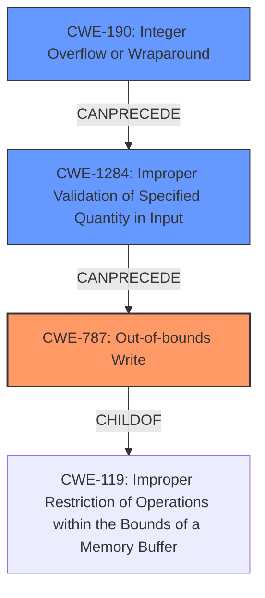

# Final Resolution for CVE-2021-21939

# Summary
| CWE ID | CWE Name | Confidence | CWE Abstraction Level | CWE Vulnerability Mapping Label | CWE-Vulnerability Mapping Notes |
|---|---|---|---|---|---|
| CWE-787 | Out-of-bounds Write | 1.0 | Base | Allowed | Primary CWE |
| CWE-1284 | Improper Validation of Specified Quantity in Input | 0.7 | Base | Allowed | Secondary Candidate, Contributes to root cause |
| CWE-190 | Integer Overflow or Wraparound | 0.6 | Base | Allowed | Secondary Candidate, Potential cause for size calculation |

## Evidence and Confidence

*   **Confidence Score:** 0.9
*   **Evidence Strength:** HIGH

## Relationship Analysis
The primary **CWE-787 (Out-of-bounds Write)** is a child of **CWE-119 (Improper Restriction of Operations within the Bounds of a Memory Buffer)**, providing a hierarchical context. **CWE-1284 (Improper Validation of Specified Quantity in Input)** can precede **CWE-787** because the improper validation of the input size can lead to the out-of-bounds write. **CWE-190 (Integer Overflow or Wraparound)** is included since it could potentially lead to an incorrect size calculation, which then leads to **CWE-787**.

## Vulnerability Chain
The vulnerability chain starts with **CWE-1284 (Improper Validation of Specified Quantity in Input)**, where the input `BytesPerLine` is not validated against the allocated buffer size. This can be caused by **CWE-190 (Integer Overflow or Wraparound)** if the size calculation results in an integer overflow. This leads to **CWE-787 (Out-of-bounds Write)** when the application attempts to write `BytesPerLine` bytes into a smaller buffer.

## Summary of Analysis
The initial analysis correctly identified **CWE-787 (Out-of-bounds Write)** as the primary issue. The criticism highlighted the need for a better understanding of the chain. The original suggestion of **CWE-131 (Incorrect Calculation of Buffer Size)** was not as precise as **CWE-1284 (Improper Validation of Specified Quantity in Input)**, which more accurately reflects the missing size check. The inclusion of **CWE-190 (Integer Overflow or Wraparound)** accounts for the possibility of an integer overflow in the size calculation.

The vulnerability description states: "A heap-based buffer overflow vulnerability exists in the XWD parser functionality of Accusoft ImageGear 19.10. A specially-crafted file can lead to code execution...the root cause involves a missing size check when copying data into a buffer, specifically `dst_buff`. The size of `dst_buff` is calculated but not compared against `BytesPerLine`, allowing for a smaller buffer allocation, causing an overflow when `BytesPerLine` bytes are copied."

This evidence supports the chain:
1.  The size of `dst_buff` is calculated, but potentially incorrectly due to an integer overflow (**CWE-190**).
2.  The calculated size is not validated against `BytesPerLine` (**CWE-1284**).
3.  `BytesPerLine` bytes are copied into `dst_buff`, leading to an out-of-bounds write (**CWE-787**).

The selection of **CWE-787** as the primary CWE is optimal because it directly describes the observable vulnerability. **CWE-1284** and **CWE-190** provide a more comprehensive understanding of the root cause and the conditions that lead to the overflow.