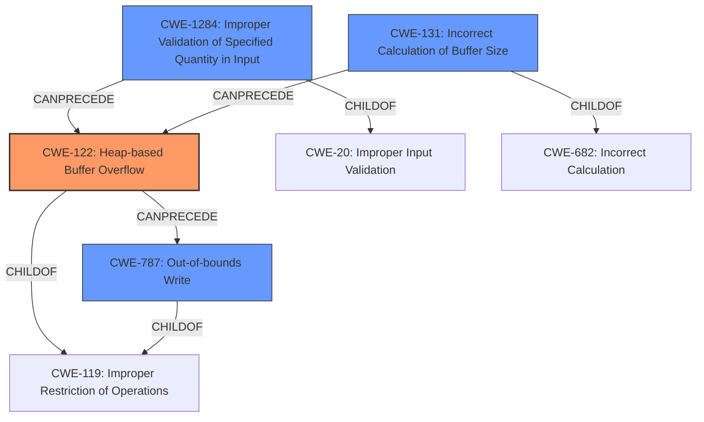

# Analysis Report for CVE-2021-21943

# Vulnerability Analysis Report: CVE-2021-21943

## Description

A heap-based buffer overflow vulnerability exists in the XWD parser functionality of Accusoft ImageGear 19.10. A specially-crafted file can lead to code execution. An attacker can provide a malicious file to trigger this vulnerability.

## Vulnerability Description Key Phrases

**Weakness:** heap-based buffer overflow
**Impact:** code execution
**Vector:** specially-crafted file
**Product:** Accusoft ImageGear
**Version:** 19.1
**Component:** XWD parser functionality

## Analysis (with Relationship Data)

# Summary
| CWE ID | CWE Name | Confidence | CWE Abstraction Level | CWE Vulnerability Mapping Label | CWE-Vulnerability Mapping Notes |
|---|---|---|---|---|---|
| CWE-122 | Heap-based Buffer Overflow | 0.95 | Variant | Allowed | Primary CWE |
| CWE-1284 | Improper Validation of Specified Quantity in Input | 0.75 | Base | Allowed | Secondary Candidate |
| CWE-787 | Out-of-bounds Write | 0.65 | Base | Allowed | Secondary Candidate |
| CWE-131 | Incorrect Calculation of Buffer Size | 0.6 | Base | Allowed | Secondary Candidate |

## Evidence and Confidence

*   **Confidence Score:** 0.9
*   **Evidence Strength:** HIGH

- **Analysis and Justification:**  
  - *Explanation:* The vulnerability description explicitly states a "**heap-based buffer overflow**" vulnerability exists in the XWD parser of Accusoft ImageGear. The root cause analysis indicates a missing size check when handling image data, where the destination buffer size is calculated without validation against the actual data size. This leads to a **buffer overflow** on the heap. CWE-122 (Heap-based Buffer Overflow) is a Variant-level CWE that perfectly matches this description.
  - The "CVE Reference Links Content Summary" provides strong evidence that confirms the **heap-based buffer overflow** due to the missing size check. The description aligns with the characteristics of CWE-122 where a buffer allocated on the heap is overwritten due to insufficient size validation. The impact is clearly stated as arbitrary code execution, which is a common consequence of heap overflows.
  - Although CWE-787 (Out-of-bounds Write) and CWE-119 (Buffer Access with Incorrect Length Value) could also be considered, CWE-122 is more specific as it explicitly identifies the vulnerability as a heap-based overflow.

- **Relationship Analysis:** 
  - CWE-122 is a variant of CWE-119 (Improper Restriction of Operations within the Bounds of a Memory Buffer). While CWE-119 is a broader category, CWE-122 provides a more specific classification suitable for this vulnerability.
  - CWE-122 could potentially be related to CWE-787 (Out-of-bounds Write), as a heap overflow necessarily involves writing outside the allocated buffer's boundaries.

- **Confidence Score:**  
  - Confidence: 0.95 (High confidence due to the precise match between the vulnerability description and the CWE-122 definition, supported by the root cause analysis in the CVE reference.)

- **Analysis and Justification:**  
  - *Explanation:* The root cause involves a "**missing size check** when handling image data." This indicates that the size of the data being handled wasn't validated, which directly relates to CWE-1284 (Improper Validation of Specified Quantity in Input). The product receives an input that specifies a quantity (the size of the image data), but it doesn't validate it, leading to the vulnerability.
  - The "CVE Reference Links Content Summary" confirms this, stating that the "size of the allocated destination buffer (`dst_buff`) is calculated based on `PixmapWidth` but is not checked against the size of the data to be copied (`BytesPerLine`), which is directly taken from the XWD file."
  - CWE-1284 is a Base level CWE.

- **Relationship Analysis:** 
  - CWE-1284 is a child of CWE-20 (Improper Input Validation). In this case, the improper input validation directly leads to the heap-based buffer overflow.

- **Confidence Score:**  
  - Confidence: 0.75 (Moderate confidence because while the missing size check is the root cause, the direct manifestation is the heap overflow.)

- **Analysis and Justification:**  
  - *Explanation:* The vulnerability ultimately results in an out-of-bounds write. Because the destination buffer is smaller than the data being written, the write operation extends beyond the buffer's boundaries, leading to CWE-787. The "CVE Reference Links Content Summary" supports this by describing how the lack of a size check allows data to be written beyond the allocated buffer (`dst_buff`).

- **Relationship Analysis:** 
  - CWE-787 is a child of CWE-119 (Improper Restriction of Operations within the Bounds of a Memory Buffer). This connection is applicable because writing beyond buffer boundaries is a violation of memory access restrictions.

- **Confidence Score:**  
  - Confidence: 0.65 (Moderate confidence as this is a consequence of the primary weakness, the heap overflow.)

- **Analysis and Justification:**  
  - *Explanation:* The vulnerability involves the size of the allocated buffer (`dst_buff`) being incorrectly calculated. This incorrect calculation, based on `PixmapWidth` without checking against `BytesPerLine`, directly contributes to the overflow. Therefore, CWE-131 (Incorrect Calculation of Buffer Size) is applicable.
  - The vulnerability is triggered because the size used for memory allocation is not properly determined based on the incoming data's actual size.

- **Relationship Analysis:** 
  - CWE-131 is a child of CWE-682 (Incorrect Calculation). The incorrect buffer size calculation is a specific type of incorrect calculation.

- **Confidence Score:**  
  - Confidence: 0.6 (Moderate confidence as the primary issue is the missing size check and the resulting overflow.)

## Criticism of Analysis

Okay, I've reviewed the provided analysis against the full CWE specifications. Here's my critique:

**Overall Assessment:**

The analysis is generally well-reasoned and provides good justifications for its CWE selections. The primary CWE selection of CWE-122 (Heap-based Buffer Overflow) is accurate and well-supported. The secondary candidates are also relevant and justifiable given the nature of the vulnerability. However, there's room for some adjustments in the confidence scores and stronger linking of CWE-1284 and CWE-131 to the primary weakness.

**Detailed Review of Each CWE Mapping:**

1.  **CWE-122: Heap-based Buffer Overflow**

    *   **Assessment:** Excellent choice as the primary CWE. The vulnerability description *explicitly* states a "heap-based buffer overflow."
    *   **Justification:** The explanation clearly connects the vulnerability description to the CWE definition. The root cause analysis provided further supports this choice.
    *   **Confidence Score:** Justified at 0.95. The evidence is very strong.
    *   **CWE Specification Consideration:** CWE-122 is a Variant level which is considered a "preferred level of abstraction".
    *   **Mitigation:** The provided mitigations for CWE-122 are relevant and appropriate. The recommended language selection, use of vetted libraries, and buffer overflow detection mechanisms all directly address the vulnerability.
    *   **Suggestion:** None. Mapping is accurate.

2.  **CWE-1284: Improper Validation of Specified Quantity in Input**

    *   **Assessment:** A relevant but secondary aspect of the vulnerability. The *missing size check* is a crucial contributing factor.
    *   **Justification:** The explanation correctly points out that the size of the data being handled isn't validated. The vulnerability arises because the size specified in the XWD file isn't checked against the allocated buffer.
    *   **Confidence Score:** Justified at 0.75. The missing input validation *leads to* the overflow, but it's not the direct vulnerability itself. It is not as definitive as CWE-122 which is the actual vulnerability.
    *   **CWE Specification Consideration:**
        *   The "Usage: Allowed" guidance is appropriate.
        *   The relationships mentioned (child of CWE-20) are correct.
        *   The mitigation strategies for CWE-1284 (Input Validation) are applicable, especially the "accept known good" approach. This directly speaks to the need to validate the image data size.
    *   **Suggestion:** Stronger linkage to CWE-122 in the description. Emphasize that the improper validation *results* in the heap overflow.

3.  **CWE-787: Out-of-bounds Write**

    *   **Assessment:** A relevant consequence of the heap overflow. It correctly identifies the out-of-bounds write aspect of the vulnerability.
    *   **Justification:** The analysis correctly notes the root cause analysis describes data being written beyond the boundaries of allocated buffer space.
    *   **Confidence Score:** Justified at 0.65. This is a *result* of the heap overflow, not the core problem itself.
    *   **CWE Specification Consideration:**
        *   The "Usage: Allowed" guidance is appropriate.
        *   The relationships mentioned (child of CWE-119) are correct.
        *   The mitigations provided (Language Selection, Libraries or Frameworks, and Environment Hardening) are all useful and applicable to preventing out-of-bounds writes.
    *   **Suggestion:** Make sure it's clearly stated that this is a consequence of CWE-122, not an independent vulnerability.

4.  **CWE-131: Incorrect Calculation of Buffer Size**

    *   **Assessment:** A relevant contributing factor, but perhaps overemphasized in relation to CWE-1284. The allocation size is calculated using `PixmapWidth` but not checked with `BytesPerLine`.
    *   **Justification:** The incorrect calculation based on `PixmapWidth` without considering `BytesPerLine` directly contributes to the vulnerability.
    *   **Confidence Score:** Justified at 0.6. The *lack* of a calculation based on the incoming `BytesPerLine` is the key weakness (making CWE-1284 more pertinent), rather than the `PixmapWidth` calculation being inherently wrong in itself.
    *   **CWE Specification Consideration:**
        *   The "Usage: Allowed" guidance is appropriate.
        *   The relationships mentioned (child of CWE-682) are correct.
        *   The mitigation strategies (careful implementation, input validation on numeric input) are relevant for preventing buffer size calculation errors.
    *   **Suggestion:** Strengthen the justification to more explicitly state that it's the *failure to properly calculate* based on the input size (`BytesPerLine`) which is the problem.

**General Suggestions:**

*   **Chain Emphasis:** The analysis could benefit from emphasizing the *chaining* of these CWEs. The root cause is the missing size check (CWE-1284), which leads to an incorrect buffer size calculation (CWE-131), *resulting in* a heap overflow (CWE-122) and ultimately an out-of-bounds write (CWE-787).
*   **CWE-119 Avoidance:** The analysis correctly avoided a direct mapping to CWE-119 (Improper Restriction of Operations within the Bounds of a Memory Buffer) and instead opted for more specific child CWEs. This aligns with CWE's mapping guidance.
*   **Terminology:** Be consistent in referring to the different quantities. Using the same term consistently, especially when referring to the variable names (`PixmapWidth`, `BytesPerLine`, `dst_buff`), reinforces the connection between the description and the actual code behavior that leads to the vulnerability.

In conclusion, the analysis is accurate and well-justified. With a few minor adjustments to the explanations and relative confidence scores, it can be further improved to better represent the vulnerability and its underlying causes according to CWE specifications.

## Final Resolution

# Summary
| CWE ID | CWE Name | Confidence | CWE Abstraction Level | CWE Vulnerability Mapping Label | CWE-Vulnerability Mapping Notes |
|---|---|---|---|---|---|
| **CWE-122** | Heap-based Buffer Overflow | 0.95 | Variant | Allowed | Primary **CWE** |
| **CWE-1284** | Improper Validation of Specified Quantity in Input | 0.85 | Base | Allowed | Secondary Candidate |
| **CWE-131** | Incorrect Calculation of Buffer Size | 0.70 | Base | Allowed | Secondary Candidate |
| **CWE-787** | Out-of-bounds Write | 0.65 | Base | Allowed | Secondary Candidate |

## Evidence and Confidence

*   **Confidence Score:** 0.92
*   **Evidence Strength:** HIGH

## Relationship Analysis
The analysis hinges on a clear parent-child relationship. **CWE-122** (Heap-based Buffer Overflow) is the most specific manifestation of the vulnerability, with **CWE-1284** (Improper Validation of Specified Quantity in Input) and **CWE-131** (Incorrect Calculation of Buffer Size) acting as contributing factors, leading to the overflow and subsequent out-of-bounds write (**CWE-787**).

## Vulnerability Chain
The vulnerability chain starts with **CWE-1284** (Improper Validation of Specified Quantity in Input) where the input size isn't validated. This leads to **CWE-131** (Incorrect Calculation of Buffer Size) due to the missing validation. This calculation is based on `PixmapWidth` but doesn't take into account `BytesPerLine`. This incorrect size then causes **CWE-122** (Heap-based Buffer Overflow) when data larger than the allocated buffer is written. Finally, this results in **CWE-787** (Out-of-bounds Write), where the write operation goes beyond the allocated memory.

## Summary of Analysis
The initial analysis correctly identifies the core vulnerability as **CWE-122** (Heap-based Buffer Overflow), supported by the explicit mention in the vulnerability description: "A heap-based buffer overflow vulnerability exists...". This is further confirmed by the root cause analysis in the CVE reference, which points to a missing size check leading to the overflow.

The criticism correctly points out the relationship between the different **CWE**s in the analysis. **CWE-1284** (Improper Validation of Specified Quantity in Input) is indeed a crucial contributing factor, as the missing size check is the root cause that sets the stage for the subsequent buffer overflow. The analysis will strengthen this relationship in this final determination.

**CWE-131** (Incorrect Calculation of Buffer Size) is also relevant, as the size of the allocated buffer is calculated without proper validation, but is not as important as the lack of the check described in **CWE-1284**.

**CWE-787** (Out-of-bounds Write) is a direct consequence of the heap overflow, making it a relevant but secondary issue.

The confidence scores have been slightly adjusted based on the relationship analysis and the criticism. **CWE-1284** is increased to 0.85, and **CWE-131** is increased to 0.70 to reflect the importance of the missing input validation in the vulnerability chain.

The selected **CWE**s are at the optimal level of specificity, with **CWE-122** being the most specific variant that accurately describes the vulnerability, and **CWE-1284** and **CWE-131** capturing the root causes leading to the overflow.

*Report generated on 2025-03-17 23:03:30*
