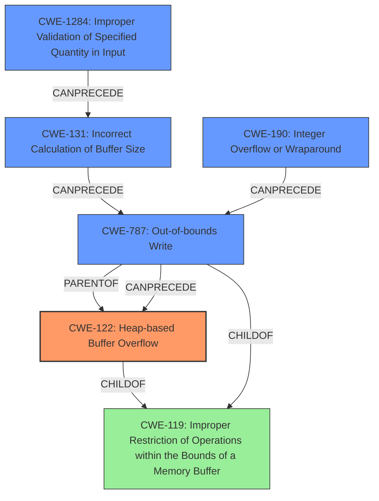

# Final Resolution for CVE-2021-21947

# Summary
| CWE ID | CWE Name | Confidence | CWE Abstraction Level | CWE Vulnerability Mapping Label | CWE-Vulnerability Mapping Notes |
|---|---|---|---|---|---|
| **CWE-122** | **Heap-based Buffer Overflow** | 0.90 | Variant | Allowed | This CWE is a variant of buffer overflow occurring on the heap. Primary CWE |
| **CWE-787** | **Out-of-bounds Write** | 0.80 | Base | Allowed | This CWE describes the direct consequence of the overflow, writing outside the allocated buffer. Secondary Candidate |
| **CWE-1284** | **Improper Validation of Specified Quantity in Input** | 0.70 | Base | Allowed | This CWE explains that the size calculation is not validated and thus leads to the overflow. First step of Chain: CWE-1284 -> CWE-131 -> CWE-787 -> CWE-122. Secondary Candidate |
| **CWE-131** | **Incorrect Calculation of Buffer Size** | 0.60 | Base | Allowed | The incorrect quantity calculation leads to an incorrect buffer calculation and thus leads to the overflow. Second step of Chain: CWE-1284 -> CWE-131 -> CWE-787 -> CWE-122. Secondary Candidate |
| **CWE-190** | **Integer Overflow or Wraparound** | 0.60 | Base | Allowed | The faulty calculation could cause an integer overflow and thus lead to out-of-bounds write. Alternative Chain: CWE-190 -> CWE-787 -> CWE-122. Secondary Candidate |

## Evidence and Confidence

*   **Confidence Score:** 0.85
*   **Evidence Strength:** HIGH

## Relationship Analysis
The primary weakness is a **CWE-122 (Heap-based Buffer Overflow)**, which is a variant of **CWE-119 (Improper Restriction of Operations within the Bounds of a Memory Buffer)**.
The **CWE-787 (Out-of-bounds Write)** describes the direct result of the overflow and is a parent of **CWE-122**.
A potential vulnerability chain starts with **CWE-1284 (Improper Validation of Specified Quantity in Input)**, which can lead to **CWE-131 (Incorrect Calculation of Buffer Size)**, then to **CWE-787**, ultimately causing **CWE-122**. An alternative chain is: **CWE-190 (Integer Overflow or Wraparound)** -> **CWE-787** -> **CWE-122**. These relationships help explain how the initial input leads to a buffer overflow on the heap.

## Vulnerability Chain
The vulnerability chain starts with the lack of input validation **(CWE-1284)** on the SOF3 precision. This missing validation results in an incorrect buffer size calculation **(CWE-131)**, potentially triggered also by an integer overflow **(CWE-190)**. The incorrect size is used to allocate memory, which leads to an out-of-bounds write **(CWE-787)** when writing Huffman coded components. This **out-of-bounds write** corrupts the heap, leading to a **heap-based buffer overflow (CWE-122)**. The initial flaw is the missing input validation, and the final impact is a heap-based buffer overflow, which can lead to arbitrary code execution.

## Summary of Analysis
The initial analysis correctly identified **CWE-122 (Heap-based Buffer Overflow)** as the primary issue, supported by the explicit mention in the vulnerability description: "Two **heap-based buffer overflow** vulnerabilities exist...".

The criticism helped refine the secondary CWEs and highlight potential vulnerability chains. The analysis has been improved by:
*   Increasing the confidence in **CWE-787** and **CWE-1284**.
*   Adding **CWE-131** and **CWE-190** to the secondary CWEs to capture the full vulnerability chain.
*   Explicitly outlining potential chaining relationships between the CWEs.

The selected CWEs are at the optimal level of specificity. **CWE-122** is a Variant, which is a preferred level of abstraction. The other CWEs are Base, which are also preferred. The chains help explain how the vulnerability occurs and where potential mitigations could be applied. The inclusion of **CWE-1284** addresses the **ROOTCAUSE** of the vulnerability, which is the lack of proper input validation.

The evidence provided supports the classification. The vulnerability description mentions the "**heap-based buffer overflow**" and the lack of boundary checks during buffer writes. The relationship analysis and consideration of mitigations further strengthens the classification.