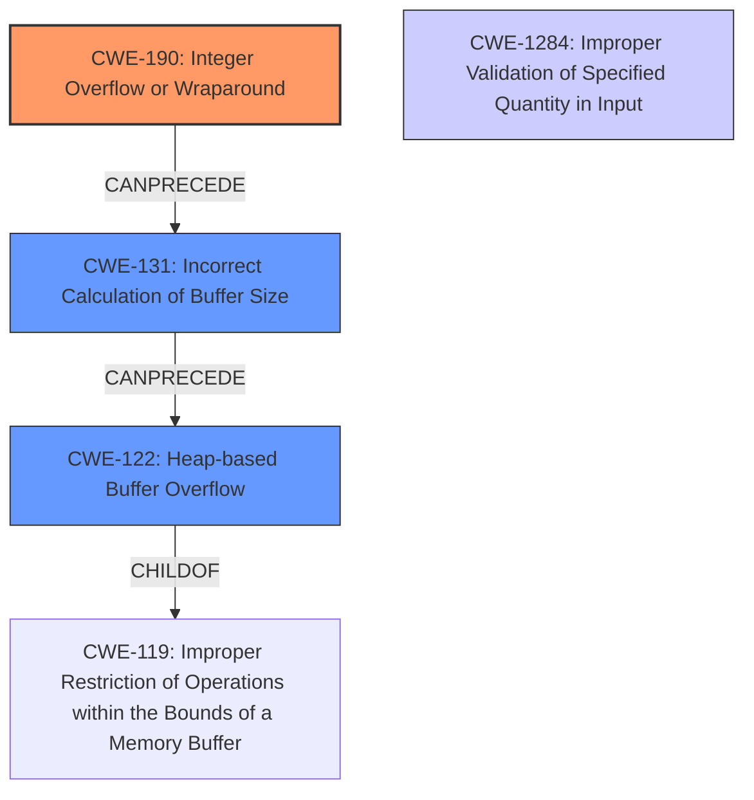

# Analysis Report for CVE-2021-21948

# Vulnerability Analysis Report: CVE-2021-21948

## Description

A heap-based buffer overflow vulnerability exists in the readDatHeadVec functionality of AnyCubic Chitubox AnyCubic Plugin 1.0.0. A specially-crafted GF file can lead to a heap buffer overflow. An attacker can provide a malicious file to trigger this vulnerability.

## Vulnerability Description Key Phrases

**Weakness:** heap-based buffer overflow
**Product:** AnyCubic Chitubox AnyCubic Plugin
**Version:** 1.0.0
**Component:** readDatHeadVec functionality

## Analysis (with Relationship Data)

# Summary
| CWE ID | CWE Name | Confidence | CWE Abstraction Level | CWE Vulnerability Mapping Label | CWE-Vulnerability Mapping Notes |
|---|---|---|---|---|---|
| CWE-190 | Integer Overflow or Wraparound | 0.9 | Base | Primary | Allowed |
| CWE-122 | Heap-based Buffer Overflow | 0.8 | Variant | Secondary | Allowed |
| CWE-131 | Incorrect Calculation of Buffer Size | 0.7 | Base | Secondary | Allowed |

## Evidence and Confidence

*   **Confidence Score:** 0.9
*   **Evidence Strength:** HIGH

- **Analysis and Justification:**  
  - *Explanation:* The vulnerability description clearly states a **heap-based buffer overflow** exists in the AnyCubic Chitubox plugin. The **root cause** is an **integer overflow** in the `GfFile::readDatHeadVec` function, leading to an incorrect buffer size calculation. The CVE Reference Links Content Summary explicitly mentions using 32-bit registers instead of 64-bit registers, causing truncation and an incorrect size calculation. This aligns with CWE-190 (Integer Overflow or Wraparound), as the calculation results in a value smaller than expected, leading to the undersized buffer. The subsequent **heap-based buffer overflow** is a direct consequence of this incorrect size, making CWE-122 (Heap-based Buffer Overflow) a secondary weakness. CWE-131 (Incorrect Calculation of Buffer Size) is also relevant as the integer overflow leads to an incorrect buffer size calculation. All three CWEs are ALLOWED based on MITRE mapping guidance.

  - *Relationship Analysis:* CWE-190 can precede CWE-131 and CWE-122. The integer overflow (CWE-190) leads to an incorrect buffer size calculation (CWE-131), which then causes the heap-based buffer overflow (CWE-122) when the undersized buffer is written to.

- **Confidence Score:**
  - Confidence: 0.9 (Strong evidence from the vulnerability description and CVE reference materials clearly points to integer overflow as the root cause and subsequent buffer overflow.)

## Criticism of Analysis

Okay, I've reviewed the analysis with the full CWE specifications you provided. Here's my critique:

**Overall Assessment:**

The analysis is generally sound and well-reasoned. The primary CWE assignment of CWE-190 (Integer Overflow or Wraparound) is highly appropriate, and the secondary assignments of CWE-122 (Heap-based Buffer Overflow) and CWE-131 (Incorrect Calculation of Buffer Size) are also justified and contribute to a comprehensive understanding of the vulnerability.  The confidence levels are also reasonable.

**Specific Points:**

*   **CWE-190: Integer Overflow or Wraparound (Primary)**
    *   **Strengths:** The justification for selecting CWE-190 is strong. The explanation correctly identifies that the use of smaller registers (32-bit instead of 64-bit) for multiplication leads to a truncated result, which is a classic integer overflow scenario. The analysis also correctly notes that the CVE description supports this root cause. The relationship to buffer overflows is also explained clearly.
    *   **Weaknesses:** None identified.
    *   **Mitigations:** The analysis doesn't explicitly mention any specific mitigations, and since this is more of a static code vulnerability the mitigations are less relevant.
    *   **Recommendation:** None needed

*   **CWE-122: Heap-based Buffer Overflow (Secondary)**
    *   **Strengths:** Appropriately identified as the *direct consequence* of the incorrect buffer size calculation.  The definition clearly states that this is a buffer overflow condition on the heap.
    *   **Weaknesses:** None identified.
    *   **Mitigations:** Again, the analysis doesn't explicitly mention any specific mitigations, and since this is more of a static code vulnerability the mitigations are less relevant.

*   **CWE-131: Incorrect Calculation of Buffer Size (Secondary)**
    *   **Strengths:** Correctly identified as a critical step in the chain of events. It highlights that the integer overflow *directly leads to* an incorrect buffer size.
    *   **Weaknesses:** None identified.
    *   **Mitigations:** Again, the analysis doesn't explicitly mention any specific mitigations, and since this is more of a static code vulnerability the mitigations are less relevant.

**Improvements & Considerations:**

*   **Explicitly Linking CWEs in the Chain:** The analysis already does this, but it could be further emphasized by stating the exact relationship between CWE-190 -> CWE-131 -> CWE-122.  This strengthens the rationale.
*   **Considering other CWEs that were proposed:** There were other CWEs, particularly relating to input validation, that were proposed in the retriever results:
    * **CWE-1284:** Improper Validation of Specified Quantity in Input. The vulnerability description specifies that a specially-crafted file triggers the vulnerability. A good question to ask is whether the size or length fields within the file (the quantity) are being validated. It is implied that validation is not happening.
    * **CWE-193:** Off-by-one Error. The description doesn't contain enough information to determine this.
    * **CWE-126:** Buffer Over-read. The description doesn't contain enough information to determine this.

**Revised Summary Table**

| CWE ID | CWE Name | Confidence | CWE Abstraction Level | CWE Vulnerability Mapping Label | CWE-Vulnerability Mapping Notes |
|---|---|---|---|---|---|
| CWE-190 | Integer Overflow or Wraparound | 0.9 | Base | Primary | Allowed |
| CWE-122 | Heap-based Buffer Overflow | 0.8 | Variant | Secondary | Allowed |
| CWE-131 | Incorrect Calculation of Buffer Size | 0.7 | Base | Secondary | Allowed |
| CWE-1284 | Improper Validation of Specified Quantity in Input | 0.4 | Base | Contributing | Allowed |

**Justification for CWE-1284 Addition:**

While the primary cause is the integer overflow, the vulnerability wouldn't be exploitable if the application performed proper input validation on the size or length fields within the GF file. Since the root cause is an integer overflow, it is not the primary cause of the vulnerability.
The confidence is decreased because the current description doesn't specify that this is the case.

**Conclusion:**

The analysis is strong, with a well-explained chain of events leading to the heap-based buffer overflow. The selection of CWE-190 as the primary cause is accurate, and the secondary CWEs are well-justified.
Adding CWE-1284 may improve the quality of the analysis, but this relies on deeper understanding of the file format.

## Final Resolution

# Summary
| CWE ID | CWE Name | Confidence | CWE Abstraction Level | CWE Vulnerability Mapping Label | CWE-Vulnerability Mapping Notes |
|---|---|---|---|---|---|
| CWE-190 | Integer Overflow or Wraparound | 0.95 | Base | Primary CWE | Allowed |
| CWE-131 | Incorrect Calculation of Buffer Size | 0.85 | Base | Secondary CWE | Allowed |
| CWE-122 | Heap-based Buffer Overflow | 0.8 | Variant | Secondary CWE | Allowed |
| CWE-1284 | Improper Validation of Specified Quantity in Input | 0.5 | Base | Contributing | Allowed |

## Evidence and Confidence

*   **Confidence Score:** 0.9
*   **Evidence Strength:** HIGH

## Relationship Analysis
The analysis hinges on a clear sequence of events: an integer overflow (CWE-190) leads to an incorrect buffer size calculation (CWE-131), which subsequently results in a heap-based buffer overflow (CWE-122). The addition of CWE-1284 acknowledges the lack of input validation, which, if present, could have prevented the exploitation of the integer overflow.

The parent-child relationships are important. For example, CWE-122 (Heap-based Buffer Overflow) is a specific type of buffer overflow, making it a child of the more general CWE-119 (Improper Restriction of Operations within the Bounds of a Memory Buffer). CWE-190 can precede CWE-131, and CWE-131 can precede CWE-122.

## Vulnerability Chain
The vulnerability chain starts with **CWE-190 (Integer Overflow or Wraparound)** in the `GfFile::readDatHeadVec` function. This **root cause** leads to **CWE-131 (Incorrect Calculation of Buffer Size)**, causing an undersized buffer to be allocated. The lack of proper input validation, represented by **CWE-1284 (Improper Validation of Specified Quantity in Input)**, allows a specially crafted GF file to trigger the overflow. Finally, writing data into this undersized buffer results in **CWE-122 (Heap-based Buffer Overflow)**.

## Summary of Analysis
The initial analysis is accurate and well-supported by the vulnerability description and CVE reference materials. The core of the vulnerability lies in the **integer overflow** that results in an undersized buffer, leading to a **heap-based buffer overflow**. The inclusion of **CWE-131 (Incorrect Calculation of Buffer Size)** clarifies the intermediate step between the **integer overflow** and the **buffer overflow**. The addition of **CWE-1284 (Improper Validation of Specified Quantity in Input)** acknowledges that proper input validation could have prevented the exploitation of this vulnerability.

The graph relationships and CWE descriptions strongly support this classification. **CWE-190 (Integer Overflow or Wraparound)** is selected as the primary weakness because the CVE description explicitly mentions using 32-bit registers instead of 64-bit registers, causing truncation and an incorrect size calculation. This direct evidence makes it the most appropriate primary CWE. All selected CWEs are at appropriate levels of abstraction (Base and Variant).

The selection of **CWE-190 (Integer Overflow or Wraparound)**, **CWE-131 (Incorrect Calculation of Buffer Size)**, **CWE-122 (Heap-based Buffer Overflow)**, and **CWE-1284 (Improper Validation of Specified Quantity in Input)** provides the optimal level of specificity for understanding and mitigating this vulnerability.

*Report generated on 2025-03-17 23:05:12*
