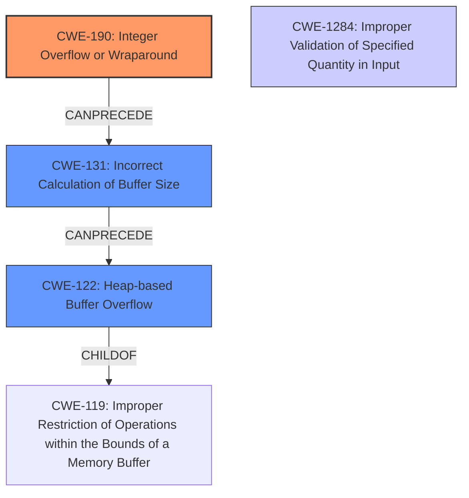

# Final Resolution for CVE-2021-21948

# Summary
| CWE ID | CWE Name | Confidence | CWE Abstraction Level | CWE Vulnerability Mapping Label | CWE-Vulnerability Mapping Notes |
|---|---|---|---|---|---|
| CWE-190 | Integer Overflow or Wraparound | 0.95 | Base | Primary CWE | Allowed |
| CWE-131 | Incorrect Calculation of Buffer Size | 0.85 | Base | Secondary CWE | Allowed |
| CWE-122 | Heap-based Buffer Overflow | 0.8 | Variant | Secondary CWE | Allowed |
| CWE-1284 | Improper Validation of Specified Quantity in Input | 0.5 | Base | Contributing | Allowed |

## Evidence and Confidence

*   **Confidence Score:** 0.9
*   **Evidence Strength:** HIGH

## Relationship Analysis
The analysis hinges on a clear sequence of events: an integer overflow (CWE-190) leads to an incorrect buffer size calculation (CWE-131), which subsequently results in a heap-based buffer overflow (CWE-122). The addition of CWE-1284 acknowledges the lack of input validation, which, if present, could have prevented the exploitation of the integer overflow.

The parent-child relationships are important. For example, CWE-122 (Heap-based Buffer Overflow) is a specific type of buffer overflow, making it a child of the more general CWE-119 (Improper Restriction of Operations within the Bounds of a Memory Buffer). CWE-190 can precede CWE-131, and CWE-131 can precede CWE-122.

## Vulnerability Chain
The vulnerability chain starts with **CWE-190 (Integer Overflow or Wraparound)** in the `GfFile::readDatHeadVec` function. This **root cause** leads to **CWE-131 (Incorrect Calculation of Buffer Size)**, causing an undersized buffer to be allocated. The lack of proper input validation, represented by **CWE-1284 (Improper Validation of Specified Quantity in Input)**, allows a specially crafted GF file to trigger the overflow. Finally, writing data into this undersized buffer results in **CWE-122 (Heap-based Buffer Overflow)**.

## Summary of Analysis
The initial analysis is accurate and well-supported by the vulnerability description and CVE reference materials. The core of the vulnerability lies in the **integer overflow** that results in an undersized buffer, leading to a **heap-based buffer overflow**. The inclusion of **CWE-131 (Incorrect Calculation of Buffer Size)** clarifies the intermediate step between the **integer overflow** and the **buffer overflow**. The addition of **CWE-1284 (Improper Validation of Specified Quantity in Input)** acknowledges that proper input validation could have prevented the exploitation of this vulnerability.

The graph relationships and CWE descriptions strongly support this classification. **CWE-190 (Integer Overflow or Wraparound)** is selected as the primary weakness because the CVE description explicitly mentions using 32-bit registers instead of 64-bit registers, causing truncation and an incorrect size calculation. This direct evidence makes it the most appropriate primary CWE. All selected CWEs are at appropriate levels of abstraction (Base and Variant).

The selection of **CWE-190 (Integer Overflow or Wraparound)**, **CWE-131 (Incorrect Calculation of Buffer Size)**, **CWE-122 (Heap-based Buffer Overflow)**, and **CWE-1284 (Improper Validation of Specified Quantity in Input)** provides the optimal level of specificity for understanding and mitigating this vulnerability.