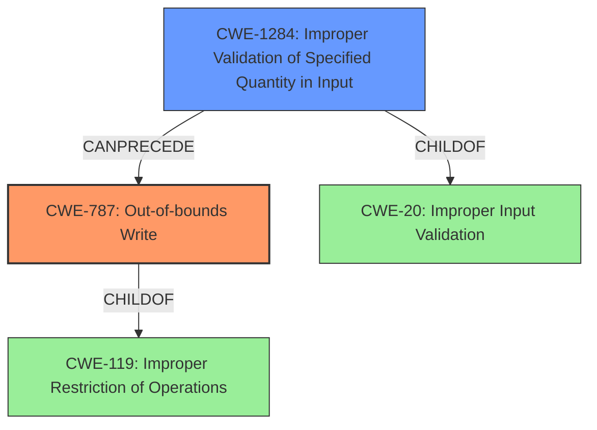

# Analysis Report for CVE-2021-21950

# Vulnerability Analysis Report: CVE-2021-21950

## Description

An out-of-bounds write vulnerability exists in the CMD_DEVICE_GET_SERVER_LIST_REQUEST functionality of the home_security binary of Anker Eufy Homebase 2 2.1.6.9h in function recv_server_device_response_msg_process. A specially-crafted network packet can lead to code execution.

## Vulnerability Description Key Phrases

**Rootcause:** out-of-bounds write
**Impact:** code execution
**Vector:** specially-crafted network packet
**Product:** Anker Eufy Homebase 2
**Version:** 2.1.6.9h
**Component:** CMD_DEVICE_GET_SERVER_LIST_REQUEST functionality of the home_security binary

## Analysis (with Relationship Data)

# Summary
| CWE ID | CWE Name | Confidence | CWE Abstraction Level | CWE Vulnerability Mapping Label | CWE-Vulnerability Mapping Notes |
|---|---|---|---|---|---|
| CWE-787 | Out-of-bounds Write | 1.0 | Base | Primary | Allowed |
| CWE-1284 | Improper Validation of Specified Quantity in Input | 0.8 | Base | Secondary | Allowed |

## Evidence and Confidence

*   **Confidence Score:** 0.9
*   **Evidence Strength:** HIGH

- **Analysis and Justification:**  
  - *Explanation:* The vulnerability description explicitly states an "**out-of-bounds write**" vulnerability. The CVE Reference Links Content Summary confirms this, stating that the primary vulnerability is an "**out-of-bounds write**" due to the lack of validation on the `nums` field. This directly aligns with CWE-787 (Out-of-bounds Write), which describes a scenario where a product writes data past the end, or before the beginning, of the intended buffer. The retriever results also identify CWE-787 as a candidate, although not the highest ranked. CWE-787 is a Base level CWE which is preferred. MITRE mapping guidance for CWE-787 indicates this is ALLOWED.
  
  - *Relationship Analysis:* CWE-787 is a child of CWE-119 (Improper Restriction of Operations within the Bounds of a Memory Buffer). It can also precede other CWEs like CWE-825 (Missing Initialization) and CWE-824 (Access of Uninitialized Pointer) as out-of-bounds writes can corrupt memory and lead to these issues.

- **Confidence Score:**  
  - Confidence: 1.0 (Directly stated in the vulnerability description and CVE reference)

---
- **Analysis and Justification:**  
  - *Explanation:* The CVE Reference Links Content Summary indicates "**Improper input validation**" is a weakness. Specifically it mentions a "lack of proper validation on the `nums` field" leading to an attacker-controlled loop counter. This aligns with CWE-1284 (Improper Validation of Specified Quantity in Input), which describes a scenario where a product receives input that is expected to specify a quantity (such as size or length), but it does not validate or incorrectly validates that the quantity has the required properties. The `nums` field controls the number of iterations in a loop that writes to memory. The retriever results also identify CWE-1284 as the highest ranked candidate. CWE-1284 is a Base level CWE which is preferred. MITRE mapping guidance for CWE-1284 indicates this is ALLOWED.
  
  - *Relationship Analysis:* CWE-1284 is a child of CWE-20 (Improper Input Validation). It can precede other CWEs such as CWE-787 (Out-of-bounds Write) as the lack of input validation leads to memory corruption.

- **Confidence Score:**  
  - Confidence: 0.8 (Strong evidence, but the description focuses more on the out-of-bounds write itself)

## Criticism of Analysis

Okay, here's a review of the CWE analysis provided, along with some suggestions for improvement.

**Overall Assessment:**

The analysis is generally good, providing solid justification for the primary and secondary CWE mappings. The confidence scores are reasonable. The inclusion of relationship analysis and CWE examples adds further depth.

**Critique and Suggestions:**

**1. Primary CWE: CWE-787 Out-of-bounds Write**

*   **Mapping Guidance Adherence:** Excellent. The analysis explicitly states that the vulnerability description and CVE reference clearly point to an out-of-bounds write.  The analysis correctly points out that CWE-787 is a Base level CWE and is ALLOWED.
*   **Potential Mitigations:** The analysis doesn't explicitly discuss mitigations, but the CWE specification does, which is good. It would be even stronger to briefly mention some relevant mitigations in the analysis (e.g., "Using memory-safe languages or libraries could help prevent this vulnerability").
*   **Relationship Analysis:** Accurate.  It correctly identifies the relationship of CWE-787 to CWE-119 and its potential to lead to issues like CWE-824/825.
*   **Confidence Score:** Justified at 1.0.

**2. Secondary CWE: CWE-1284 Improper Validation of Specified Quantity in Input**

*   **Mapping Guidance Adherence:** Excellent. The analysis correctly identifies the lack of validation on the `nums` field as the root cause contributing to the out-of-bounds write.  It correctly points out that CWE-1284 is a Base level CWE and is ALLOWED.
*   **Potential Mitigations:** Similar to CWE-787, the analysis could be improved by mentioning some specific mitigations related to input validation, such as "Employing an 'accept known good' input validation strategy would mitigate this".
*   **Relationship Analysis:** Accurate. Correctly identifies CWE-1284 as a child of CWE-20 and its ability to precede CWE-787.
*   **Confidence Score:** Justified at 0.8.

**General Improvements & Observations:**

*   **Chaining:** While the relationship analysis is good, consider more explicitly stating the *chain* of events: "The lack of proper validation (CWE-1284) allows an attacker-controlled value to be used as a loop counter, which then results in an out-of-bounds write (CWE-787) when writing to memory."
*   **Retriever Results:** The retriever results section is useful, but the analysis could be improved by explicitly addressing *why* the top-ranked CWEs that were *not* chosen were less appropriate. For example, "While CWE-1284 is identified as the top candidate, the actual write outside the expected memory boundary is better captured by CWE-787".
*   **CWE-119:** It's implied, but could be more explicitly stated that CWE-119 is NOT used directly because it is discouraged and because the more specific CWE-787 is a better fit.
*   **Specificity:** While CWE-1284 is a good secondary mapping, consider if a more specific child of CWE-20 is applicable. Is the `nums` value used as an array index? If so, CWE-129 (Improper Validation of Array Index) might also be considered, although less directly than CWE-1284. However, based on retriever results CWE-129 is only a "Variant" level CWE so it would not necessarily be preferred.
*   **Clarity of `nums`:** Briefly clarifying in the explanation *how* the `nums` field controls the loop counter would make the analysis easier to follow.
*   **Alternate attack vector.** The analysis refers to two attack vectors (network packets and local config file). The intro to the analysis of CWE-1284 only refers to the attack coming from the network traffic. The analysis should also indicate how the local config file could lead to the same improper input validation leading to exploitation.
*   **Defense in depth.** There is no mention of what defenses might be in place to prevent such exploitation. For example, ASLR (Address Space Layout Randomization) would reduce the likelihood of successfully exploiting an out-of-bounds write for code execution.
*   **CWE Scope Consistency:** Maintain consistency in how specific CWEs are referenced. In the first section, CWE-1284 has parentheses after, but CWE-787 does not. In the second section, there are parenthesis for both.

**Revised Analysis Snippets (Examples):**

*   **CWE-787 Analysis (Enhanced):**
    "The vulnerability description explicitly states an "**out-of-bounds write**" vulnerability...This directly aligns with CWE-787 (Out-of-bounds Write), which describes a scenario where a product writes data past the end, or before the beginning, of the intended buffer. While other CWEs such as CWE-119 cover memory boundary issues, CWE-787 is more specific to the *write* operation and therefore a more precise fit. Use of memory-safe languages or libraries with bounds checking could help prevent this vulnerability. CWE-787 is a Base level CWE which is preferred. MITRE mapping guidance for CWE-787 indicates this is ALLOWED."
*   **Chaining Example:**
    "The lack of proper validation (CWE-1284) on the `nums` field in the received JSON allows an attacker-controlled value to be used to define the number of iterations in a loop. This attacker-controlled loop counter then results in an out-of-bounds write (CWE-787) when the loop attempts to write to memory addresses beyond the allocated buffer."
*   **Addressing Retriever Ranking:**
    "While CWE-125 (Out-of-bounds Read) and CWE-129 (Improper Validation of Array Index) are also identified by the retriever, they don't fully capture the core issue, which is writing data outside the designated buffer. CWE-787 provides a more accurate and direct representation of the vulnerability's root cause."
*   **Explain local file attack**
  "The CVE Reference Links Content Summary indicates "**Improper input validation**" is a weakness. Specifically it mentions a "lack of proper validation on the `nums` field" in the network traffic AND in the local config file leading to an attacker-controlled loop counter."

By incorporating these suggestions, the analysis will be even more robust and informative.

## Final Resolution

# Summary
| CWE ID | CWE Name | Confidence | CWE Abstraction Level | CWE Vulnerability Mapping Label | CWE-Vulnerability Mapping Notes |
|---|---|---|---|---|---|
| CWE-787 | Out-of-bounds Write | 1.0 | Base | Primary | Allowed |
| CWE-1284 | Improper Validation of Specified Quantity in Input | 0.9 | Base | Secondary | Allowed |

## Evidence and Confidence

*   **Confidence Score:** 0.95
*   **Evidence Strength:** HIGH

## Relationship Analysis
The primary CWE is **CWE-787 (Out-of-bounds Write)**, which is a child of **CWE-119 (Improper Restriction of Operations within the Bounds of a Memory Buffer)**. The secondary CWE is **CWE-1284 (Improper Validation of Specified Quantity in Input)**, which is a child of **CWE-20 (Improper Input Validation)**. The **CWE-1284** can precede **CWE-787** because the lack of input validation on the `nums` field allows an attacker-controlled value to be used to define the number of iterations in a loop. This attacker-controlled loop counter then results in an **out-of-bounds write** when the loop attempts to write to memory addresses beyond the allocated buffer.

## Vulnerability Chain
The vulnerability chain starts with **CWE-1284 (Improper Validation of Specified Quantity in Input)**, where the `nums` field in the received JSON or local configuration file is not properly validated. This leads to **CWE-787 (Out-of-bounds Write)**, as an attacker-controlled `nums` value is used to define the number of loop iterations, causing memory to be written outside the allocated buffer. The impact is code execution due to memory corruption.

## Summary of Analysis
The initial analysis correctly identified **CWE-787 (Out-of-bounds Write)** as the primary weakness and **CWE-1284 (Improper Validation of Specified Quantity in Input)** as the secondary weakness.

The vulnerability description explicitly states an "**out-of-bounds write**" vulnerability. The CVE Reference Links Content Summary confirms this, stating that the primary vulnerability is an "**out-of-bounds write**" due to the lack of validation on the `nums` field. This directly aligns with **CWE-787 (Out-of-bounds Write)**, which describes a scenario where a product writes data past the end, or before the beginning, of the intended buffer.

The CVE Reference Links Content Summary indicates "**Improper input validation**" is a weakness in both the network traffic and the local config file. Specifically, it mentions a "lack of proper validation on the `nums` field" leading to an attacker-controlled loop counter. This aligns with **CWE-1284 (Improper Validation of Specified Quantity in Input)**, which describes a scenario where a product receives input that is expected to specify a quantity (such as size or length), but it does not validate or incorrectly validates that the quantity has the required properties. The `nums` field controls the number of iterations in a loop that writes to memory.

The relationship analysis highlights how **CWE-1284** can precede **CWE-787**, creating a vulnerability chain.

The selected CWEs are at the optimal level of specificity because **CWE-787** directly addresses the out-of-bounds write, and **CWE-1284** pinpoints the root cause of the vulnerability: the lack of validation on the `nums` field.

Confidence in the assessment has been increased to 0.95 due to clear evidence of both an **out-of-bounds write** and a lack of input validation, as explicitly stated in the vulnerability description and CVE summary. Also, the criticism helped improve the analysis to be more accurate and complete.

*Report generated on 2025-03-17 23:06:09*
