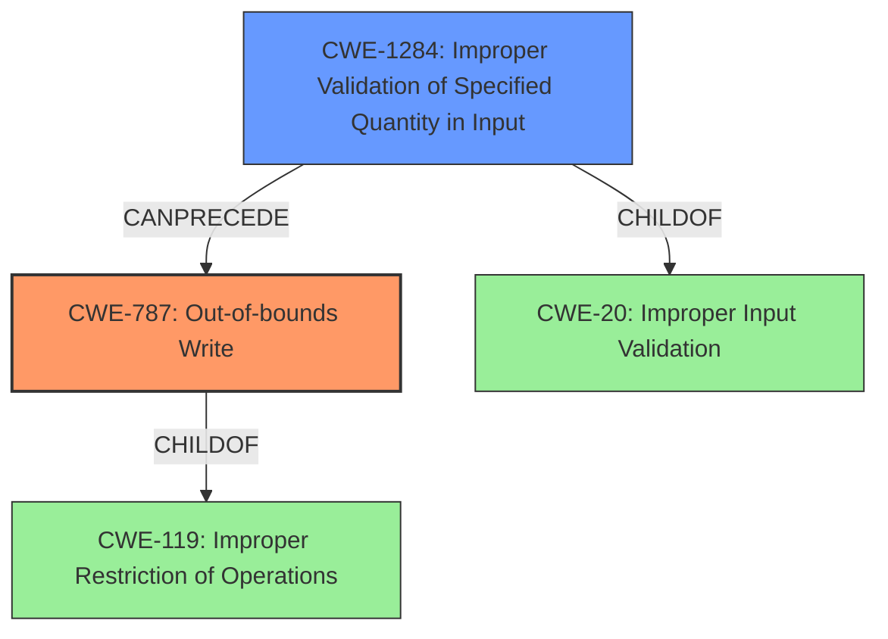

# Final Resolution for CVE-2021-21950

# Summary
| CWE ID | CWE Name | Confidence | CWE Abstraction Level | CWE Vulnerability Mapping Label | CWE-Vulnerability Mapping Notes |
|---|---|---|---|---|---|
| CWE-787 | Out-of-bounds Write | 1.0 | Base | Primary | Allowed |
| CWE-1284 | Improper Validation of Specified Quantity in Input | 0.9 | Base | Secondary | Allowed |

## Evidence and Confidence

*   **Confidence Score:** 0.95
*   **Evidence Strength:** HIGH

## Relationship Analysis
The primary CWE is **CWE-787 (Out-of-bounds Write)**, which is a child of **CWE-119 (Improper Restriction of Operations within the Bounds of a Memory Buffer)**. The secondary CWE is **CWE-1284 (Improper Validation of Specified Quantity in Input)**, which is a child of **CWE-20 (Improper Input Validation)**. The **CWE-1284** can precede **CWE-787** because the lack of input validation on the `nums` field allows an attacker-controlled value to be used to define the number of iterations in a loop. This attacker-controlled loop counter then results in an **out-of-bounds write** when the loop attempts to write to memory addresses beyond the allocated buffer.

## Vulnerability Chain
The vulnerability chain starts with **CWE-1284 (Improper Validation of Specified Quantity in Input)**, where the `nums` field in the received JSON or local configuration file is not properly validated. This leads to **CWE-787 (Out-of-bounds Write)**, as an attacker-controlled `nums` value is used to define the number of loop iterations, causing memory to be written outside the allocated buffer. The impact is code execution due to memory corruption.

## Summary of Analysis
The initial analysis correctly identified **CWE-787 (Out-of-bounds Write)** as the primary weakness and **CWE-1284 (Improper Validation of Specified Quantity in Input)** as the secondary weakness.

The vulnerability description explicitly states an "**out-of-bounds write**" vulnerability. The CVE Reference Links Content Summary confirms this, stating that the primary vulnerability is an "**out-of-bounds write**" due to the lack of validation on the `nums` field. This directly aligns with **CWE-787 (Out-of-bounds Write)**, which describes a scenario where a product writes data past the end, or before the beginning, of the intended buffer.

The CVE Reference Links Content Summary indicates "**Improper input validation**" is a weakness in both the network traffic and the local config file. Specifically, it mentions a "lack of proper validation on the `nums` field" leading to an attacker-controlled loop counter. This aligns with **CWE-1284 (Improper Validation of Specified Quantity in Input)**, which describes a scenario where a product receives input that is expected to specify a quantity (such as size or length), but it does not validate or incorrectly validates that the quantity has the required properties. The `nums` field controls the number of iterations in a loop that writes to memory.

The relationship analysis highlights how **CWE-1284** can precede **CWE-787**, creating a vulnerability chain.

The selected CWEs are at the optimal level of specificity because **CWE-787** directly addresses the out-of-bounds write, and **CWE-1284** pinpoints the root cause of the vulnerability: the lack of validation on the `nums` field.

Confidence in the assessment has been increased to 0.95 due to clear evidence of both an **out-of-bounds write** and a lack of input validation, as explicitly stated in the vulnerability description and CVE summary. Also, the criticism helped improve the analysis to be more accurate and complete.