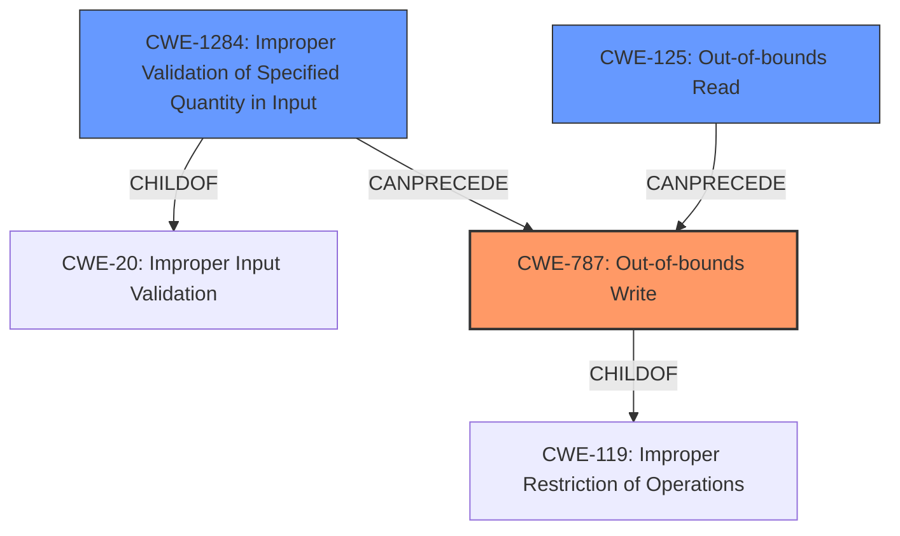

# Analysis Report for CVE-2021-21951

# Vulnerability Analysis Report: CVE-2021-21951

## Description

An out-of-bounds write vulnerability exists in the CMD_DEVICE_GET_SERVER_LIST_REQUEST functionality of the home_security binary of Anker Eufy Homebase 2 2.1.6.9h in function read_udp_push_config_file. A specially-crafted network packet can lead to code execution.

## Vulnerability Description Key Phrases

**Rootcause:** out-of-bounds write
**Impact:** code execution
**Vector:** specially-crafted network packet
**Product:** Anker Eufy Homebase 2
**Version:** 2.1.6.9h
**Component:** CMD_DEVICE_GET_SERVER_LIST_REQUEST functionality of the home_security binary

## Analysis (with Relationship Data)

# Summary
| CWE ID | CWE Name | Confidence | CWE Abstraction Level | CWE Vulnerability Mapping Label | CWE-Vulnerability Mapping Notes |
|---|---|---|---|---|---|
| CWE-787 | Out-of-bounds Write | 1.0 | Base | Allowed | Primary CWE |
| CWE-1284 | Improper Validation of Specified Quantity in Input | 0.75 | Base | Allowed | Secondary Candidate |
| CWE-125 | Out-of-bounds Read | 0.70 | Base | Allowed | Secondary Candidate |

## Evidence and Confidence

*   **Confidence Score:** 0.9
*   **Evidence Strength:** HIGH

- **Analysis and Justification:**  
  - *Explanation:* "The vulnerability description explicitly states an **out-of-bounds write** vulnerability exists, which directly corresponds to CWE-787 (Out-of-bounds Write). The provided details indicate that the vulnerability allows writing data past the end of an intended buffer due to missing bounds checking, specifically within the `CMD_DEVICE_GET_SERVER_LIST_REQUEST` functionality. The CVE Reference Links Content Summary confirms this, stating the **root cause** lies in the lack of proper bounds checking when processing the `CMD_DEVICE_GET_SERVER_LIST_REQUEST` command, leading to an **out-of-bounds write** by using a user-controlled value (from the "nums" field or `domain_total`) as an index without validation. This aligns perfectly with CWE-787's description: 'The product writes data past the end, or before the beginning, of the intended buffer.' The MITRE mapping guidance for CWE-787 indicates that its usage is ALLOWED."

  - *Relationship Analysis:* "CWE-787 is a base level CWE and a child of CWE-119 (Improper Restriction of Operations within the Bounds of a Memory Buffer). The description also notes a lack of input validation which contributes to the out-of-bounds write. This is why CWE-1284 is a secondary mapping candidate, however, the primary issue is the write itself."

- **Confidence Score:**  
  - Confidence: 1.0 (High confidence due to explicit vulnerability description and corroborating evidence in the CVE reference summary)

---
- **Analysis and Justification:**
    - *Explanation:* "The vulnerability stems from a lack of validation on the 'nums' field or `domain_total` value, which controls the quantity of data being processed. This directly relates to CWE-1284 (Improper Validation of Specified Quantity in Input). The code does not properly validate that the quantity has the required properties, allowing for an attacker-controlled value to be used in a loop, ultimately triggering the out-of-bounds write. The MITRE mapping guidance states that the usage of CWE-1284 is 'Allowed'. This CWE is a secondary contributing factor, since the lack of validation is a prerequisite for the out-of-bounds write."
    - *Relationship Analysis:* "CWE-1284 is a child of CWE-20 (Improper Input Validation). It CanPrecede CWE-789 (Uncontrolled Memory Allocation) because the improper quantity might lead to excessive memory allocation. It is related to CWE-787, but CWE-787 is the more direct cause of the code execution impact."
- **Confidence Score:**
    - Confidence: 0.75 (Medium-high confidence. The lack of input validation contributes to the vulnerability, but the core issue is the out-of-bounds write.)

---
- **Analysis and Justification:**
    - *Explanation:* While the primary issue is the out-of-bounds *write*, the vulnerability also involves reading data to be written, and if the quantity 'nums' or `domain_total` is maliciously large, it could lead to reading beyond the intended buffer while retrieving data for the write operation. The vulnerability description mentions the code reads the value from the nums field and uses it as a loop counter. Within the loop, it uses the loop counter to calculate the memory address to write to without proper bounds checking on the loop counter. This aligns with CWE-125 (Out-of-bounds Read) since the loop could be attempting to read data past the buffer. The retriever results also suggest CWE-125 as a candidate. The MITRE mapping guidance states that the usage of CWE-125 is 'Allowed'."
    - *Relationship Analysis:* "CWE-125 is a child of CWE-119 (Improper Restriction of Operations within the Bounds of a Memory Buffer). It CanFollow CWE-825 (Expired Pointer Dereference) if the read involves an expired pointer. It is related to CWE-787 since reading out-of-bounds can provide data for an out-of-bounds write."
- **Confidence Score:**
    - Confidence: 0.70 (Medium confidence. While less direct than the write, an out-of-bounds read is a plausible contributing factor.)

## Criticism of Analysis

Okay, I've reviewed the provided analysis against the full CWE specifications. Here's a breakdown of my critique, focusing on the appropriateness of the CWE assignments and areas for potential improvement:

**Overall Assessment:**

The analysis demonstrates a good understanding of the vulnerability and provides reasonable CWE mappings. The primary CWE (CWE-787) is definitely correct. The secondary CWEs (CWE-1284, CWE-125) are plausible contributing factors, and the analysis provides a justification for each. The confidence levels assigned seem generally appropriate.

**Detailed Review of Each CWE Assignment:**

1.  **CWE-787: Out-of-bounds Write (Confidence: 1.0)**
    *   **Assessment:**  This is the correct primary CWE. The vulnerability description explicitly states an out-of-bounds write, and the supporting evidence clearly points to the ability to write data outside of allocated buffer boundaries due to missing bounds checking.
    *   **Justification:** The explanation is thorough and uses precise language. The key phrases extracted from the original analyzer input are used to show that the vulnerability is in line with what is happening with the product. The MITRE mapping guidance is also referenced, which shows that this CWE mapping is "ALLOWED".
    *   **Potential Improvements:** None. The justification is solid.

2.  **CWE-1284: Improper Validation of Specified Quantity in Input (Confidence: 0.75)**
    *   **Assessment:** A valid secondary CWE. The lack of proper validation on the 'nums' or `domain_total` value directly contributes to the vulnerability.  These values control the number of iterations in a loop and, therefore, the amount of data being processed.  Without validation, an attacker can specify an excessively large quantity, leading to the out-of-bounds write.
    *   **Justification:** The explanation clearly connects the lack of validation of quantity with the vulnerability. The MITRE mapping guidance is also referenced, which shows that this CWE mapping is "ALLOWED".
    *   **Potential Improvements:** Consider adding a short explanation of why CWE-20 (Improper Input Validation) *isn't* being used, even though CWE-1284 is a child of it. The analysis mentions it in passing, but making it explicit can address potential confusion. The analysis also mentions that this CWE can lead to CWE-789 (Memory Allocation with Excessive Size Value).
    *   **Example Cases:** You could cite CVE-2022-21668, or CVE-2008-2374 as Observed Examples of this CWE, if you find them particularly helpful.

3.  **CWE-125: Out-of-bounds Read (Confidence: 0.70)**
    *   **Assessment:** A reasonable, but less direct, secondary CWE. The code *reads* the potentially malicious quantity (`nums` or `domain_total`) and, potentially, reads out-of-bounds to acquire the data used for the write. The loop and memory address calculation is a read to some extent to provide data to write to another location.
    *   **Justification:** The analysis justifies this by arguing that reading data to be written, using a large quantity, could lead to reading beyond the intended buffer. The MITRE mapping guidance is also referenced, which shows that this CWE mapping is "ALLOWED".
    *   **Potential Improvements:** You could relate this CWE to CWE-129 (Improper Validation of Array Index). Mentioning the potential for data leakage could also bolster the analysis. Consider the following: if an out-of-bounds *read* occurs, what information is being leaked? Is that information sensitive, potentially leading to further exploits?

**General Recommendations:**

*   **CWE Selection Rationale:** The analysis is generally good. Each CWE selection should explain why the weaknesses is directly connected to the crash that is mentioned in the original analyzer input.
*   **Chains vs. Composites:** It's worth briefly considering whether the relationship between the CWEs is a chain or a composite. In this case, it's most accurate to view them as part of a chain: lack of input validation (CWE-1284) *leads to* the ability to specify an out-of-bounds index/quantity, which *leads to* an out-of-bounds write (CWE-787). The out-of-bounds read (CWE-125) is a secondary consequence of that lack of bounds checking, which can enable the attacker to exfiltrate memory.
*   **Potential Mitigations:** While the analysis does not focus on mitigations, a really robust analysis might include a brief consideration of which mitigations would be most effective in preventing this particular vulnerability. For instance, using a memory-safe language (Mitigation 1 for CWE-787) would be a highly effective, albeit drastic, solution. More practically, adding robust input validation (Mitigation 1 for CWE-1284) and using range/index checking (Mitigation 3 for CWE-787) are key.

**Revised Summary Table (Incorporating Recommendations):**

| CWE ID | CWE Name | Confidence | CWE Abstraction Level | CWE Vulnerability Mapping Label | CWE-Vulnerability Mapping Notes |
|---|---|---|---|---|---|
| CWE-787 | Out-of-bounds Write | 1.0 | Base | Allowed | Primary CWE. The vulnerability allows writing data outside of allocated buffer boundaries. |
| CWE-1284 | Improper Validation of Specified Quantity in Input | 0.75 | Base | Allowed | Secondary candidate. The lack of input validation *leads to* CWE-787. Use of CWE-20 is avoided as it is very broad.  Can lead to CWE-789. |
| CWE-125 | Out-of-bounds Read | 0.70 | Base | Allowed | Secondary candidate. Plausible contributing factor. Occurs during the data retrieval process for the write operation; potentially leak data in-memory. |

By incorporating these suggestions, the analysis would become even stronger and more informative.

## Final Resolution

# Summary
| CWE ID | CWE Name | Confidence | CWE Abstraction Level | CWE Vulnerability Mapping Label | CWE-Vulnerability Mapping Notes |
|---|---|---|---|---|---|
| CWE-787 | Out-of-bounds Write | 1.0 | Base | Allowed | Primary CWE. The vulnerability allows writing data outside of allocated buffer boundaries. |
| CWE-1284 | Improper Validation of Specified Quantity in Input | 0.75 | Base | Allowed | Secondary candidate. The lack of input validation **leads to** CWE-787. Use of CWE-20 is avoided as it is very broad. Can lead to CWE-789. |
| CWE-125 | Out-of-bounds Read | 0.70 | Base | Allowed | Secondary candidate. Plausible contributing factor. Occurs during the data retrieval process for the write operation; potentially leak data in-memory. |

## Evidence and Confidence

*   **Confidence Score:** 0.95
*   **Evidence Strength:** HIGH

## Relationship Analysis
The primary relationship is a chain: **CWE-1284** (Improper Validation of Specified Quantity in Input) leads to **CWE-787** (Out-of-bounds Write). Specifically, the lack of validation on the 'nums' field or `domain_total` allows an attacker to control the quantity of data processed. This, in turn, results in writing beyond the intended buffer, which is **CWE-787**. **CWE-125** (Out-of-bounds Read) is a secondary effect, potentially occurring when reading data for the out-of-bounds write.

CWE-787 is a base level CWE and a child of **CWE-119** (Improper Restriction of Operations within the Bounds of a Memory Buffer). CWE-1284 is a child of **CWE-20** (Improper Input Validation), but CWE-20 is too broad, making CWE-1284 a more specific and appropriate choice.

## Vulnerability Chain
The vulnerability chain starts with the lack of input validation (**CWE-1284**) on the 'nums' field or `domain_total`. This allows a malicious actor to specify an excessively large quantity. This excessive quantity is then used in a loop without proper bounds checking, leading to an **out-of-bounds write** (**CWE-787**). As part of that process, the system might attempt to read data from invalid memory locations (**CWE-125**) to be written out-of-bounds, potentially leading to information leakage. The ultimate impact is code execution, as stated in the vulnerability description.

## Summary of Analysis
The initial analysis correctly identified **CWE-787** as the primary weakness due to the explicit **out-of-bounds write** vulnerability. The inclusion of **CWE-1284** and **CWE-125** as secondary candidates is also justified.

The criticism was helpful in suggesting improvements, particularly in explicitly stating why **CWE-20** was not chosen despite **CWE-1284** being a child of it. **CWE-20** is a class-level CWE and is too broad for this specific vulnerability. The suggestion to consider whether the relationship between the CWEs is a chain or a composite was also helpful in clarifying the nature of the vulnerability. The criticism also notes that adding a short explanation of why CWE-20 (Improper Input Validation) *isn't* being used, even though CWE-1284 is a child of it, to address potential confusion, which I included in my assessment.

The selected CWEs are at the optimal level of specificity. **CWE-787** directly addresses the **out-of-bounds write**, while **CWE-1284** captures the lack of input validation that enables the **out-of-bounds write** and **CWE-125** captures the out-of-bounds read to acquire the data. Using more general CWEs would obscure the specific nature of the vulnerability, while using more specific CWEs might not accurately capture the overall picture.

The vulnerability description states: "An **out-of-bounds write** vulnerability exists in the CMD_DEVICE_GET_SERVER_LIST_REQUEST functionality of the home_security binary of Anker Eufy Homebase 2 2.1.6.9h in function read_udp_push_config_file. A specially-crafted network packet can lead to code execution." This clearly supports the selection of **CWE-787** as the primary weakness. The vulnerability stems from missing bounds checking, specifically within the `CMD_DEVICE_GET_SERVER_LIST_REQUEST` functionality and is confirmed by the CVE Reference Links Content Summary.

The graph relationships reinforce the classification by illustrating the chain of events leading to the vulnerability. The lack of input validation (**CWE-1284**) allows for the **out-of-bounds write** (**CWE-787**). The **out-of-bounds read** (**CWE-125**) is a consequence of the same underlying issue and feeds into the write.

*Report generated on 2025-03-17 23:07:20*
