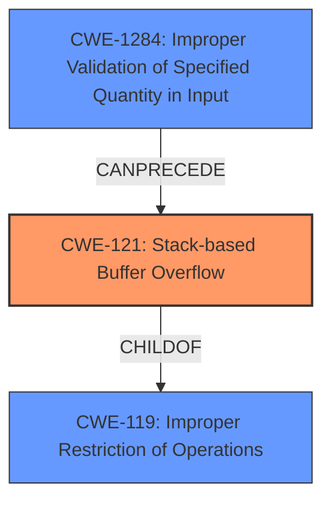

# Final Resolution for CVE-2021-21961

# Summary

| CWE ID | CWE Name | Confidence | CWE Abstraction Level | CWE Vulnerability Mapping Label | CWE-Vulnerability Mapping Notes |
|---|---|---|---|---|---|
| CWE-121 | Stack-based Buffer Overflow | 0.95 | Variant | Primary CWE | Allowed |
| CWE-1284 | Improper Validation of Specified Quantity in Input | 0.75 | Base | Secondary Candidate | Allowed |

## Evidence and Confidence

*   **Confidence Score:** 0.90
*   **Evidence Strength:** HIGH

## Relationship Analysis

The primary relationship influencing the decision is the hierarchical relationship where CWE-121 is a variant of CWE-119 (Improper Restriction of Operations within the Bounds of a Memory Buffer). This specificity makes CWE-121 a more appropriate choice than the more general CWE-119. The chain relationship involves CWE-1284 (Improper Validation of Specified Quantity in Input) preceding CWE-121, as the lack of input validation directly leads to the stack-based buffer overflow.

## Vulnerability Chain

The vulnerability chain starts with the **ROOTCAUSE** of **CWE-1284 (Improper Validation of Specified Quantity in Input)**, where the length field from the network packet is not validated. This leads to **CWE-121 (Stack-based Buffer Overflow)**, as the unvalidated length is used to copy data into a stack buffer, exceeding its boundaries. The final impact is remote code execution.

## Summary of Analysis

The initial analysis and the criticism both agree that **CWE-121 (Stack-based Buffer Overflow)** is the most appropriate primary CWE. The evidence is strong, as the vulnerability description explicitly mentions a "stack-based buffer overflow," and the CVE reference confirms the lack of bounds checking when copying data to a stack buffer. This directly aligns with the definition of CWE-121. The analysis also correctly identifies **CWE-1284 (Improper Validation of Specified Quantity in Input)** as a secondary contributing factor, representing the failure to validate the size of the input before copying it to the buffer.

The graph relationships support this decision, as CWE-121 is a specific variant of CWE-119, and CWE-1284 can precede CWE-121 in a vulnerability chain. The selection of CWEs is at the optimal level of specificity, as CWE-121 identifies the buffer location (stack), and CWE-1284 pinpoints the root cause (improper input validation).

The criticism suggests considering **CWE-787 (Out-of-bounds Write)** as an alternative. However, CWE-121 is more precise because the vulnerability description explicitly states that the overflow occurs on the stack. If the location of the buffer was not known, CWE-787 would be a more appropriate choice. However, since the stack location *is* known, CWE-121 provides higher specificity.

The final decision is based on a comprehensive evaluation of the vulnerability description, CVE reference, CWE definitions, relationship analysis, and mapping guidance. The selected CWEs accurately represent the **ROOTCAUSE** and impact of the vulnerability, and the confidence level is high due to the strong evidence and clear relationships between the weaknesses.