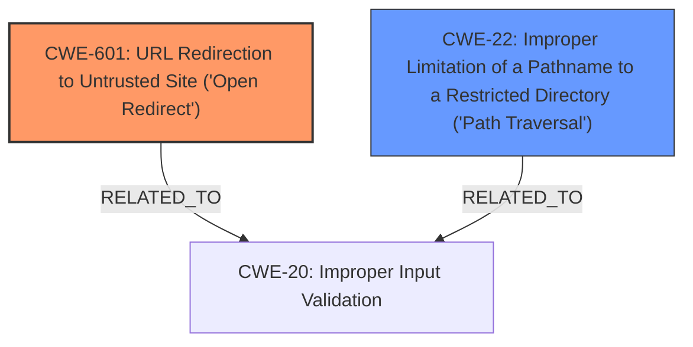

# Final Resolution for CVE-2021-22036

# Summary
| CWE ID | CWE Name | Confidence | CWE Abstraction Level | CWE Vulnerability Mapping Label | CWE-Vulnerability Mapping Notes |
|---|---|---|---|---|---|
| CWE-601 | URL Redirection to Untrusted Site ('Open Redirect') | 1.0 | Base | Primary | Allowed. The vulnerability description explicitly states an open redirect due to improper path handling, leading to redirection to an attacker-controlled domain. |
| CWE-22 | Improper Limitation of a Pathname to a Restricted Directory ('Path Traversal') | 0.6 | Base | Secondary | Allowed. The "improper path handling" could potentially allow path traversal, although the primary issue is the open redirect. |

## Evidence and Confidence

*   **Confidence Score:** 0.9
*   **Evidence Strength:** HIGH

## Relationship Analysis
The primary relationship considered was the potential for **CWE-22 (Improper Limitation of a Pathname to a Restricted Directory ('Path Traversal'))** to be a contributing factor due to the stated "improper path handling." While **CWE-22** could be present, it is secondary to the **CWE-601 (URL Redirection to Untrusted Site ('Open Redirect'))**. The hierarchical relationships of other considered CWEs (like **CWE-497**, **CWE-918**, **CWE-212**, **CWE-201**, **CWE-73**) were not relevant as they were deemed potential impacts or not directly related to the root cause based on the evidence.

## Vulnerability Chain
The vulnerability chain starts with a user clicking a malicious link containing an attacker-controlled URL. Due to **improper path handling** in vRealize Orchestrator, the user is redirected to the attacker's site (**CWE-601**). If **CWE-22** is also present, the attacker could potentially manipulate the path to access restricted directories. The attacker's site can then attempt to steal credentials or other sensitive information. The root cause is **improper path handling** leading to an open redirect, with the potential consequence of sensitive information disclosure.

## Summary of Analysis
The initial analysis and criticism both agree on **CWE-601** as the primary weakness due to the explicit mention of "open redirect" in the vulnerability description. The criticism also supports the inclusion of **CWE-22** as a secondary weakness due to "improper path handling," although its importance is less than **CWE-601**. The evidence from the vulnerability description and CVE reference materials strongly supports this classification. The graph relationships confirm that **CWE-601** and **CWE-22** are the most relevant **CWEs**, with potential relationships to **CWE-20 (Improper Input Validation)**. The selected CWEs are at the optimal level of specificity, providing a clear and accurate representation of the vulnerability.
The vulnerability description states "VMware vRealize Orchestrator ((8.x prior to 8.6) contains an open redirect vulnerability due to improper path handling." This is the primary evidence for **CWE-601** and the rationale for including **CWE-22** as a secondary weakness.