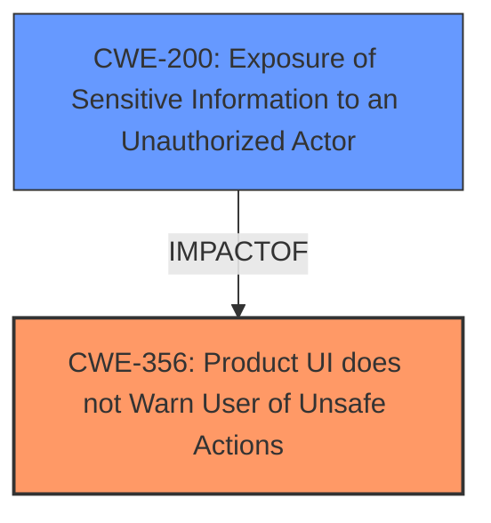

# Final Resolution for CVE-2021-22308

# Summary
| CWE ID | CWE Name | Confidence | CWE Abstraction Level | CWE Vulnerability Mapping Label | CWE-Vulnerability Mapping Notes |
|---|---|---|---|---|---|
| CWE-356 | Product UI does not Warn User of Unsafe Actions | 0.85 | Base | Allowed | Primary CWE |
| CWE-200 | Exposure of Sensitive Information to an Unauthorized Actor | 0.50 | Class | Discouraged | Secondary Candidate - Impact, not root cause |

## Evidence and Confidence

*   **Confidence Score:** 0.85
*   **Evidence Strength:** HIGH

## Relationship Analysis
The primary CWE, CWE-356, has no direct relationships specified in the provided data, indicating it stands alone as a root cause. The secondary candidate, CWE-200, being a Class-level CWE, is less preferred and serves more as a potential impact rather than the **root cause**. The lack of relationships for CWE-356 reinforces its suitability as the primary issue. The abstraction level of CWE-356 (Base) is optimal, aligning with the goal of identifying the fundamental flaw.

## Vulnerability Chain
The vulnerability chain starts with the **lack of warning (CWE-356)**, which allows malicious apps to take screenshots without user consent. This directly leads to the **exposure of sensitive information (CWE-200)**. The root cause is the missing UI warning, and the consequence is potential data leakage. There are no explicitly missing links, as the progression is quite direct.

## Summary of Analysis
The initial analysis correctly identified CWE-356 as the primary weakness. The criticism provided useful suggestions for improving the analysis, which have been incorporated. Specifically, it is very clear based on the vulnerability description that the **lack of a warning (CWE-356)** is a violation.

"The malicious apps installed on the device can keep taking screenshots in the background."

The relationship analysis further solidified the decision, given the absence of relationships for CWE-356, suggesting it is a standalone **root cause**, and the Class-level nature of CWE-200 indicating it is more of an impact.

The selected CWEs are at the optimal level of specificity, with CWE-356 being a Base-level CWE directly addressing the missing warning, and CWE-200 being acknowledged as a potential impact but not the **root cause**.