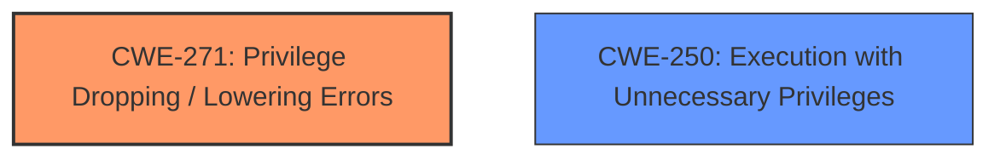

# Final Resolution for CVE-2021-22326

# Summary
| CWE ID | CWE Name | Confidence | CWE Abstraction Level | CWE Vulnerability Mapping Label | CWE-Vulnerability Mapping Notes |
|---|---|---|---|---|---|
| CWE-271 | Privilege Dropping / Lowering Errors | 0.80 | Class | Primary | Allowed-with-Review |
| CWE-250 | Execution with Unnecessary Privileges | 0.60 | Base | Secondary | Allowed |

## Evidence and Confidence

*   **Confidence Score:** 0.75
*   **Evidence Strength:** MEDIUM

## Relationship Analysis
The primary relationship influencing the decision is the hierarchical one. CWE-271 is a Class, suggesting a more specific child might be optimal, but no direct, more specific child is evident from the description. CWE-250 offers a secondary insight, related to excessive privileges, which could amplify the impact of the privilege dropping error. There are no strong chain relationships indicated. The PeerOf relationships with other privilege-related CWEs (e.g., CWE-273, CWE-280) were considered but deemed less directly relevant. The abstraction levels influenced the consideration, favoring Base level CWE-250 as a secondary concern, and acknowledging the desire for a more specific child of CWE-271 if one existed.

## Vulnerability Chain
The vulnerability chain starts with the **ROOTCAUSE** being a **CWE-271: Privilege Dropping / Lowering Errors**. The consequence is that the system may not properly restrict the privileges of a component, potentially leaving it with excessive privileges. This leads to **CWE-250: Execution with Unnecessary Privileges**, which amplifies the impact, allowing local attackers to gain Kernel space read/write capability.

## Summary of Analysis
The initial analysis correctly identified CWE-271 as the primary weakness due to the direct mention of "Privilege Dropping / Lowering Errors" in the vulnerability description. The criticism suggested considering CWE-267 and CWE-273. CWE-267 was considered, but the description of the vulnerability doesn't necessarily imply that the privileges themselves allow unsafe actions, just that the dropping/lowering process is flawed. CWE-273 is a child of CWE-271 and focuses on improper checks *after* dropping privileges; while this is a possibility, the initial description is still best captured by CWE-271 at this stage.

The inclusion of CWE-250 as a secondary weakness is also well-justified, as the ability to gain Kernel space read/write capability suggests the component was running with higher privileges than necessary.

The graph relationships influenced the decision by highlighting the need for a more specific classification than the Class-level CWE-271, but without sufficient detail to identify a suitable child, it remains the most appropriate primary CWE. The Base level of CWE-250 makes it a good secondary candidate.

The final decision is based on a combination of direct evidence from the vulnerability description ("Privilege Dropping / Lowering Errors") and reasonable inference based on the described impact (Kernel space read/write capability). The confidence scores reflect the directness of the match and the degree of inference required. The selected CWEs are at the optimal level of specificity given the available evidence.