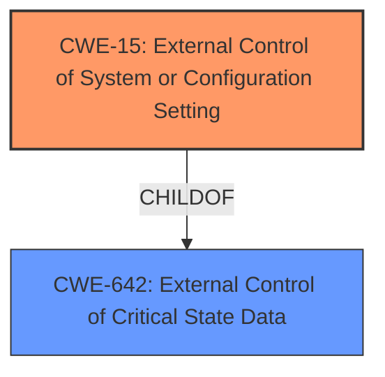

# Analysis Report for CVE-2021-22385

# Vulnerability Analysis Report: CVE-2021-22385

## Description

A component of the Huawei smartphone has a External Control of System or Configuration Setting vulnerability. Local attackers may exploit this vulnerability to cause Kernel Code Execution.

## Vulnerability Description Key Phrases

**Weakness:** External Control of System or Configuration Setting vulnerability
**Impact:** Kernel Code Execution
**Attacker:** Local attackers
**Product:** Huawei smartphone

## Analysis (with Relationship Data)

```markdown
# Summary
| CWE ID | CWE Name | Confidence | CWE Abstraction Level | CWE Vulnerability Mapping Label | CWE-Vulnerability Mapping Notes |
|---|---|---|---|---|---|
| CWE-15 | External Control of System or Configuration Setting | 0.85 | Base | Allowed | Primary CWE |

## Evidence and Confidence

*   **Confidence Score:** 0.85
*   **Evidence Strength:** HIGH

- **Analysis and Justification:**  
  - *Explanation:* The vulnerability description explicitly states "External Control of System or Configuration Setting vulnerability". This directly aligns with the definition of CWE-15, which describes a weakness where the product allows external control over system or configuration settings. The "CVE Reference Links Content Summary" mentions that the vulnerability lies in the NFC-based connection authentication process, leading to a bypass when exploited. This indicates that an attacker can potentially manipulate system configurations related to NFC authentication. The fact that this leads to Kernel Code Execution indicates a critical configuration is being controlled externally. This confirms the relevance of CWE-15. The MITRE mapping guidance for CWE-15 allows its use as it is a Base level CWE.
  
  - *Relationship Analysis:* While CWE-15 is a base level CWE, exploring its relationships reveals that it can be a root cause for other weaknesses, such as privilege escalation or information disclosure. No specific relationship is highlighted as essential in this case, but CWE-15 is a good fit as the root cause.

- **Confidence Score:**  
  - *Example:* Confidence: 0.85 (High evidence from technical description and CVE reference materials)
```

## Criticism of Analysis

Okay, here's a detailed review of the provided CWE analysis, considering the full CWE specifications:

**Overall Assessment:**

The analysis is generally sound and arrives at a reasonable primary CWE mapping. The confidence score of 0.85 is justified based on the explicit mention of "External Control of System or Configuration Setting vulnerability" in the vulnerability description. The justification is also clear and well articulated. However, there are a few areas where the analysis could be strengthened by considering alternative CWEs and exploring the relationships between them in more detail. Also, there are several copies of CWE-15 in the database section.

**Detailed Critique:**

**1. Primary CWE: CWE-15 (External Control of System or Configuration Setting)**

*   **Strengths:**
    *   The direct match with the vulnerability description's phrase makes this a strong candidate.
    *   The justification correctly identifies that the NFC authentication process is being manipulated, indicating control over a system setting.
    *   The explanation of why this control is significant (leading to Kernel Code Execution) adds weight to the mapping.
    *   The analysis properly notes that CWE-15 is a Base level CWE, following the mapping guidance.
*   **Areas for Improvement:**
    *   The analysis could benefit from a more detailed explanation of *which* system setting is being controlled. The more specific the setting, the better. Is it a specific flag, a cryptographic parameter, or something else?
    *   While the analysis mentions relationships, it doesn't fully explore them. Consider the relationship between CWE-15 and its children, particularly how the exploitation of this vulnerability may cause more specific privilege escalation, information disclosure.
    *   Consider the potential mitigations. Are the suggested mitigations in the CWE specification (separation of privilege, restricting user-provided data) relevant to the specific NFC authentication issue? If so, mention them explicitly.

**2. Consideration of Alternative CWEs:**

The retriever results provide some alternative CWEs that should be considered:

*   **CWE-73 (External Control of File Name or Path):** This is less likely in this case as the vulnerability deals with the authentication process, which doesn't typically involve file path manipulation directly.

*   **CWE-125 (Out-of-bounds Read):** This is very unlikely. There is no indication of a memory read error.

*   **CWE-22 (Improper Limitation of a Pathname to a Restricted Directory ('Path Traversal')):**  As with CWE-73, this doesn't seem applicable unless the NFC authentication process somehow uses externally controlled file paths, which isn't explicitly stated.

*   **CWE-94 (Improper Control of Generation of Code ('Code Injection')):** This is unlikely. This CWE deals with the dynamic generation of code, which is not evident here.

*   **CWE-321 (Use of Hard-coded Cryptographic Key):** This is possible, but not probable. If the NFC authentication process relies on a hard-coded key that can be bypassed, this would be relevant. The analysis needs more information to determine if a hard-coded key is involved.

*   **CWE-642 (External Control of Critical State Data):** CWE-15 is a child of CWE-642. This CWE is broader and can encompass different ways in which an attacker can modify data to get more permissions.

*   **CWE-269 (Improper Privilege Management):** This is a Class CWE and is discouraged. However, if the external control directly leads to an attacker gaining elevated privileges, exploring the more specific children of CWE-269 might be useful.

*   **CWE-20 (Improper Input Validation):** This is a Class CWE and is discouraged. However, improper validation in NFC authentication may lead to bypass which can be mapped here.

*   **CWE-284 (Improper Access Control):** This is a Pillar CWE and is discouraged. The root cause is not insufficient access control.

**3. Specific Comments and Suggestions:**

*   **Evidence Strength:** The assessment of "HIGH" evidence strength is appropriate given the explicit language in the vulnerability description.
*   **Mitigation Discussion:**  The analysis should explicitly relate the suggested mitigations for CWE-15 (separation of privilege, limiting untrusted data) to the *specific* context of the NFC authentication bypass.  How would separation of privilege help in this scenario? How can user-provided data be restricted to prevent manipulation of NFC settings?
*   **Relationships Discussion:**  Expand the discussion of relationships. For example, explain that successful exploitation of CWE-15 could lead to privilege escalation. Also, if any of the other CWEs are possible (like CWE-321), discuss how they might relate to CWE-15 (e.g., CWE-15 might enable the use of a hard-coded key).
*   **Known Examples:** Include relevant known examples for all potential CWEs considered.
*   **CWE Database Section:** Remove the duplicate copies of CWE-15.

**Revised Summary Table (Example):**

| CWE ID | CWE Name | Confidence | CWE Abstraction Level | CWE Vulnerability Mapping Label | CWE-Vulnerability Mapping Notes |
|---|---|---|---|---|---|
| CWE-15 | External Control of System or Configuration Setting | 0.85 | Base | Allowed | Primary CWE |
| CWE-321 | Use of Hard-coded Cryptographic Key | 0.30 | Variant | Allowed |  Consider if NFC authentication involves a hard-coded key that is exposed by the vulnerability. |

**In summary,** the analysis is a good starting point but can be improved by:

*   Providing more specific details about the affected system setting.
*   Further exploring the relationships between CWE-15 and other potentially relevant CWEs.
*   Explicitly connecting the suggested mitigations to the specific vulnerability context.
*   Removing duplicate information in the document.

## Final Resolution

# Summary 
| CWE ID | CWE Name | Confidence | CWE Abstraction Level | CWE Vulnerability Mapping Label | CWE-Vulnerability Mapping Notes |
|---|---|---|---|---|---|
| CWE-15 | External Control of System or Configuration Setting | 0.85 | Base | Allowed | Primary CWE |
| CWE-642 | External Control of Critical State Data | 0.4 | Class | Allowed-with-Review | Secondary Candidate; Explore if the configuration setting is considered critical state data. |

## Evidence and Confidence

*   **Confidence Score:** 0.8
*   **Evidence Strength:** MEDIUM

## Relationship Analysis
The primary relationship impacting the decision is the parent-child relationship between CWE-642 and CWE-15, where CWE-15 is a child of CWE-642. Given that CWE-15 directly matches the description and is at the base level, it is preferred. However, CWE-642 is considered as a secondary candidate to capture the broader aspect of controlling critical state data.



## Vulnerability Chain
The vulnerability chain starts with the **WEAKNESS** where an external actor can control a system or configuration setting (**ROOTCAUSE**: CWE-15). This leads to the ability to bypass NFC-based connection authentication. The consequence is Kernel Code Execution, which is the impact.

## Summary of Analysis
The initial analysis correctly identified CWE-15 as the primary **WEAKNESS**. The vulnerability description explicitly mentions "External Control of System or Configuration Setting vulnerability," which directly aligns with the definition of CWE-15.

The criticism suggested exploring alternative CWEs and providing more specific details. While several alternatives were considered, none matched the description as directly as CWE-15. However, CWE-642 ("External Control of Critical State Data") was considered as a secondary candidate because CWE-15 is a child of CWE-642, and it captures the broader aspect of controlling critical state data.

The decision to stick with CWE-15 as the primary CWE is based on its direct match with the provided description and its Base level of abstraction, which is preferred according to MITRE mapping guidance. While the specific system setting being controlled isn't explicitly detailed, the fact that manipulating it leads to Kernel Code Execution strongly suggests its critical nature, justifying the secondary consideration of CWE-642. The evidence, while strong in its directness, could be enhanced with more detailed technical specifics. This is why the overall confidence is slightly reduced to 0.8 despite the high confidence in CWE-15.

Evidence: "A component of the Huawei smartphone has a External Control of System or Configuration Setting vulnerability. Local attackers may exploit this vulnerability to cause Kernel Code Execution."


*Report generated on 2025-03-17 00:22:02*
