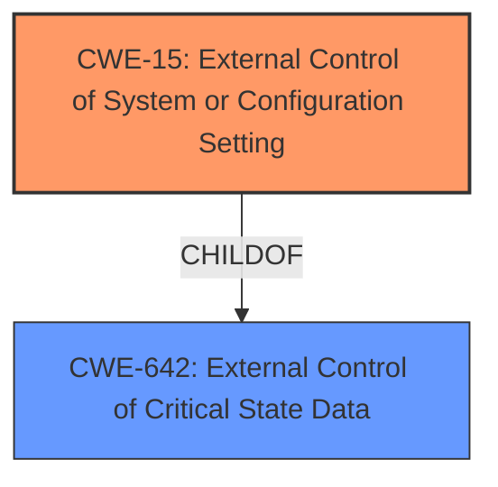

# Final Resolution for CVE-2021-22385

# Summary 
| CWE ID | CWE Name | Confidence | CWE Abstraction Level | CWE Vulnerability Mapping Label | CWE-Vulnerability Mapping Notes |
|---|---|---|---|---|---|
| CWE-15 | External Control of System or Configuration Setting | 0.85 | Base | Allowed | Primary CWE |
| CWE-642 | External Control of Critical State Data | 0.4 | Class | Allowed-with-Review | Secondary Candidate; Explore if the configuration setting is considered critical state data. |

## Evidence and Confidence

*   **Confidence Score:** 0.8
*   **Evidence Strength:** MEDIUM

## Relationship Analysis
The primary relationship impacting the decision is the parent-child relationship between CWE-642 and CWE-15, where CWE-15 is a child of CWE-642. Given that CWE-15 directly matches the description and is at the base level, it is preferred. However, CWE-642 is considered as a secondary candidate to capture the broader aspect of controlling critical state data.

## Vulnerability Chain
The vulnerability chain starts with the **WEAKNESS** where an external actor can control a system or configuration setting (**ROOTCAUSE**: CWE-15). This leads to the ability to bypass NFC-based connection authentication. The consequence is Kernel Code Execution, which is the impact.

## Summary of Analysis
The initial analysis correctly identified CWE-15 as the primary **WEAKNESS**. The vulnerability description explicitly mentions "External Control of System or Configuration Setting vulnerability," which directly aligns with the definition of CWE-15.

The criticism suggested exploring alternative CWEs and providing more specific details. While several alternatives were considered, none matched the description as directly as CWE-15. However, CWE-642 ("External Control of Critical State Data") was considered as a secondary candidate because CWE-15 is a child of CWE-642, and it captures the broader aspect of controlling critical state data.

The decision to stick with CWE-15 as the primary CWE is based on its direct match with the provided description and its Base level of abstraction, which is preferred according to MITRE mapping guidance. While the specific system setting being controlled isn't explicitly detailed, the fact that manipulating it leads to Kernel Code Execution strongly suggests its critical nature, justifying the secondary consideration of CWE-642. The evidence, while strong in its directness, could be enhanced with more detailed technical specifics. This is why the overall confidence is slightly reduced to 0.8 despite the high confidence in CWE-15.

Evidence: "A component of the Huawei smartphone has a External Control of System or Configuration Setting vulnerability. Local attackers may exploit this vulnerability to cause Kernel Code Execution."