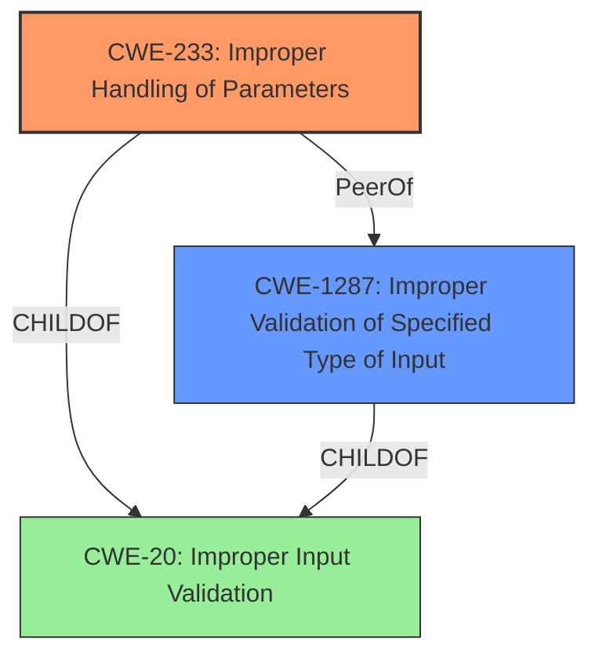

# Final Resolution for CVE-2021-22400

# Summary
| CWE ID | CWE Name | Confidence | CWE Abstraction Level | CWE Vulnerability Mapping Label | CWE-Vulnerability Mapping Notes |
|---|---|---|---|---|---|
| CWE-233 | Improper Handling of Parameters | 0.90 | Base | Allowed | The primary weakness is the lack of parameter validation leading to a crash. The malicious application exploits this by modifying the value of a vulnerable parameter, causing a crash. |
| CWE-1287 | Improper Validation of Specified Type of Input | 0.75 | Base | Allowed | Secondary candidate: The parameter is expected to be an integer, but is not validated to be one. |

## Evidence and Confidence

*   **Confidence Score:** 0.85
*   **Evidence Strength:** HIGH

## Relationship Analysis
The primary weakness is mapped to CWE-233, which is at the Base level of abstraction. The secondary weakness is mapped to CWE-1287, which is also at the Base level of abstraction. This provides an adequate level of specificity. There are no direct parent-child relationships between these two CWEs, but both are related to the general problem of input validation.

## Vulnerability Chain
The vulnerability chain starts with a **lack of parameter validation** (**CWE-233**). This allows a malicious application to modify specific parameters. If the application expects a parameter to be of a specific type (e.g., integer) and does not validate the type, then an attacker can provide a parameter of the wrong type, leading to a system crash (**CWE-1287**). The root cause is the **lack of input validation**, leading to a system crash.

## Summary of Analysis
The initial analysis correctly identified **CWE-233** (Improper Handling of Parameters) as the primary weakness. The criticism correctly pointed out that **CWE-20** (Improper Input Validation) is too broad and suggested more specific alternatives. Based on the vulnerability description, it is possible that the parameter is expected to be an integer but is not validated to be one. In this case, **CWE-1287** (Improper Validation of Specified Type of Input) is the most appropriate secondary mapping.

The vulnerability description explicitly states an "**insufficient input validation** vulnerability due to the **lack of parameter validation**."

I am updating the report by replacing **CWE-20** with **CWE-1287** and increasing the confidence score to 0.85. This provides a more accurate and specific classification of the vulnerability. The selected CWEs are at the optimal level of specificity because they directly address the weaknesses described in the vulnerability report.