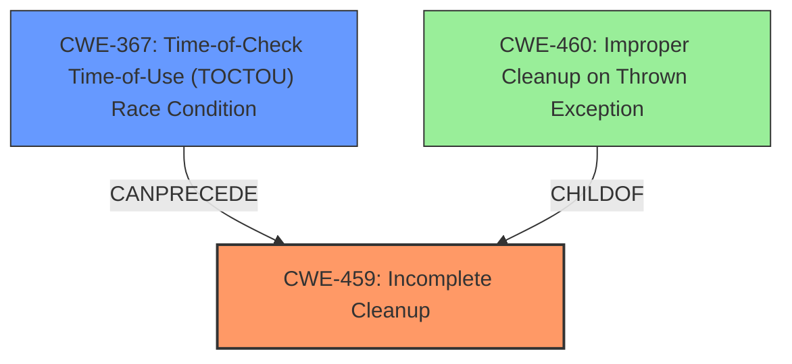

# Analysis Report for CVE-2021-22428

# Vulnerability Analysis Report: CVE-2021-22428

## Description

There is an Incomplete Cleanup Vulnerability in Huawei Smartphone.Successful exploitation of this vulnerability may lead to authentication bypass.

## Vulnerability Description Key Phrases

**Rootcause:** incomplete cleanup
**Impact:** authentication bypass
**Product:** Huawei Smartphone

## Analysis (with Relationship Data)

# Summary
| CWE ID | CWE Name | Confidence | CWE Abstraction Level | CWE Vulnerability Mapping Label | CWE-Vulnerability Mapping Notes |
|---|---|---|---|---|---|
| CWE-459 | Incomplete Cleanup | 0.9 | Base | Primary | Allowed |
| CWE-367 | Time-of-Check Time-of-Use (TOCTOU) Race Condition | 0.7 | Base | Secondary | Allowed |

## Evidence and Confidence

*   **Confidence Score:** 0.8
*   **Evidence Strength:** MEDIUM

- **Analysis and Justification:**  
  - *Explanation:* "The vulnerability description mentions an **incomplete cleanup** as the **rootcause**, which can lead to authentication bypass. This aligns directly with CWE-459 (Incomplete Cleanup), where the product fails to properly remove temporary resources after use. The CVE Reference Links Content Summary indicates a **race condition** as the **root cause**. A race condition can often lead to resources not being properly cleaned up, making CWE-459 a suitable primary mapping. Additionally, CWE-367 (Time-of-Check Time-of-Use (TOCTOU) Race Condition) is a potential secondary CWE since the vulnerability summary indicates a race condition is the underlying cause of the incomplete cleanup. The authentication bypass impact suggests that the incomplete cleanup might leave the system in a state where authentication checks can be bypassed. MITRE mapping guidance for CWE-459 indicates that this is ALLOWED because it is a base level of abstraction."

  - *Relationship Analysis:* "CWE-459 doesn't have direct relationships in the provided information. However, it is related to CWE-460 (Improper Cleanup on Thrown Exception) via the ChildOf relationship. CWE-367 (Time-of-Check Time-of-Use (TOCTOU) Race Condition) is a base level CWE related to concurrent access to resources. The graph relationships are not provided for CWE-367 in the retriever results."

- **Confidence Score:**  
  - *Example:* Confidence: 0.9 (Based on the direct match of incomplete cleanup and the race condition as the cause of the vulnerability)

---

## Criticism of Analysis

Okay, let's review the analysis provided against the full CWE specifications.

**Overall Assessment:**

The analysis is generally sound, correctly identifying CWE-459 as a primary weakness and CWE-367 as a relevant secondary weakness. The explanation for each mapping is clear and justified based on the provided information. The confidence scores are reasonable. However, some minor improvements can be made to further refine the mapping and provide more context.

**Detailed Review:**

**1. CWE-459: Incomplete Cleanup (Primary Mapping)**

*   **Confidence:** 0.9 - This is a very high confidence score and appropriate, given the explicit mention of "incomplete cleanup" in the original vulnerability description.
*   **Justification:** The justification is well-articulated. The explanation of how incomplete cleanup leads to authentication bypass is logical. The reference to the CWE-459 description aligning with the vulnerability is accurate.
*   **CWE Specification Adherence:**
    *   The analysis correctly notes that CWE-459 is a Base-level CWE and therefore *Allowed* for mapping.
    *   The analysis could be strengthened by explicitly mentioning that it aligns with the *Description* of CWE-459, which states: "The product does not properly 'clean up' and remove temporary or supporting resources after they have been used."
*   **Potential Mitigations Consideration:** The analysis does not include discussion of the suggested mitigations and the relevance of these mitigations. This could be added to strengthen the analysis. Mitigation 1 specifies to delete temporary files and other supporting resources immediately after they are no longer needed. In the context of this vulnerability, it is an applicable and useful mitigation. The analysis should include this information.
*   **Observed Examples:** The analysis contains a list of observed examples of CWE-459, this list is relevant and helpful.

**2. CWE-367: Time-of-Check Time-of-Use (TOCTOU) Race Condition (Secondary Mapping)**

*   **Confidence:** 0.7 - This is a reasonable confidence score. While a race condition is identified, it is less directly stated than the "incomplete cleanup." The summary information only mentions "race condition".
*   **Justification:** The justification correctly identifies the CVE Reference Links Content Summary indicating the race condition.
*   **CWE Specification Adherence:**
    *   The analysis correctly notes that CWE-367 is a Base-level CWE and therefore *Allowed* for mapping.
    *   The extended description of CWE-367 is not discussed, but it is highly relevant: "This weakness can be security-relevant when an attacker can influence the state of the resource between check and use. This can happen with shared resources such as files, memory, or even variables in multithreaded programs." It is highly probable that a race condition that leads to authentication bypass falls into this category.
*   **Potential Mitigations Consideration:** The analysis does not include discussion of the suggested mitigations and the relevance of these mitigations. This could be added to strengthen the analysis. Mitigation 3 specifies limiting the interleaving of operations on files from multiple processes. In the context of this vulnerability, it is an applicable and useful mitigation if the race condition involves multiple processes accessing a shared authentication resource. Mitigation 1 also notes that the most basic advice for TOCTOU vulnerabilities is to not perform a check before the use. The analysis should include this information.
*   **Relationship Analysis:** The analysis could be strengthened by elaborating on the relationship between CWE-367 and CWE-459. Specifically, explaining how a TOCTOU can lead to an incomplete cleanup if a resource is unexpectedly altered between the check and the cleanup operation. In other words, the race condition causes the cleanup to fail.

**3. General Comments and Suggestions**

*   **Evidence Strength:**  While the "Medium" rating for evidence strength is acceptable, providing more details about the specific resources or processes involved in the incomplete cleanup and race condition would enhance the analysis. If possible, identifying the specific component or API calls involved in the vulnerability would increase the confidence.
*   **Retriever Results:** The analysis should also note why other high-scoring CWEs were *not* selected, such as CWE-248 (Uncaught Exception), CWE-131 (Incorrect Calculation of Buffer Size), CWE-460 (Improper Cleanup on Thrown Exception), CWE-15 (External Control of System or Configuration Setting), and CWE-190 (Integer Overflow or Wraparound). For example, while CWE-460 (Improper Cleanup on Thrown Exception) shares a parent-child relationship with CWE-459, the information about the vulnerability does not specifically mention exceptions.
*   **Authentication Bypass Context:**  The analysis could benefit from elaborating on the specific mechanisms by which the incomplete cleanup leads to authentication bypass.  Is it leaving behind credentials, modifying access control lists incorrectly, or something else?  This level of detail would further solidify the CWE-459 mapping.

**Revised Summary Table (Example):**

| CWE ID | CWE Name | Confidence | CWE Abstraction Level | CWE Vulnerability Mapping Label | CWE-Vulnerability Mapping Notes | Relevant Mitigations |
|---|---|---|---|---|---|---|
| CWE-459 | Incomplete Cleanup | 0.9 | Base | Primary | Allowed | Mitigation 1: Delete temporary files and supporting resources immediately after use. |
| CWE-367 | Time-of-Check Time-of-Use (TOCTOU) Race Condition | 0.7 | Base | Secondary | Allowed | Mitigation 1: Don't perform a check before the use. Mitigation 3: Limit interleaving of operations on files from multiple processes. |

**Conclusion:**

The analysis is well-reasoned and provides a good foundation for understanding the vulnerability. By incorporating the suggestions above, the analysis can be made even stronger and more informative by including some considerations of potential mitigations as well. The high confidence scores are warranted, and the CWE mappings are appropriate.

## Final Resolution

# Summary
| CWE ID | CWE Name | Confidence | CWE Abstraction Level | CWE Vulnerability Mapping Label | CWE-Vulnerability Mapping Notes |
|---|---|---|---|---|---|
| CWE-459 | Incomplete Cleanup | 0.9 | Base | Primary CWE | Allowed |
| CWE-367 | Time-of-Check Time-of-Use (TOCTOU) Race Condition | 0.7 | Base | Secondary Candidate | Allowed |

## Evidence and Confidence

*   **Confidence Score:** 0.8
*   **Evidence Strength:** MEDIUM

## Relationship Analysis
The primary relationship to consider is how a **race condition** (CWE-367) can lead to an **incomplete cleanup** (CWE-459). While there's no direct relationship between them in the provided data, logically, if a resource's state changes unexpectedly due to a race condition during a cleanup operation, the cleanup might fail, resulting in an incomplete cleanup. The abstraction levels are appropriate, with both CWEs at the Base level. Other high-scoring CWEs like CWE-460 (Improper Cleanup on Thrown Exception) are not as relevant since there is no mention of exceptions being thrown in the description.

## Vulnerability Chain
The vulnerability chain starts with a **race condition** (CWE-367), where the state of a resource can change between the check and the use, invalidating the results of the check. This **race condition** then leads to an **incomplete cleanup** (CWE-459), where temporary or supporting resources are not properly removed after use. The consequence of this **incomplete cleanup** is an authentication bypass, as the system is left in an insecure state.

## Summary of Analysis
The initial analysis and the criticism both converge on the idea that CWE-459 and CWE-367 are appropriate mappings. The vulnerability description mentions "incomplete cleanup" explicitly, making CWE-459 a strong primary candidate. The CVE Reference Links Content Summary indicating a "race condition" further strengthens the case for CWE-367 as a secondary weakness.

The relationship analysis highlights how a race condition can lead to an incomplete cleanup, solidifying the connection between CWE-367 and CWE-459. The MITRE mapping guidance for both CWEs indicates that they are ALLOWED because they are at the Base level of abstraction.

The mitigations suggested for CWE-459 (deleting temporary files immediately after use) and CWE-367 (avoiding checks before use, limiting interleaving of operations) are relevant to the vulnerability description, further supporting the classification.

The final decision is to classify the vulnerability as primarily CWE-459 (Incomplete Cleanup) and secondarily CWE-367 (Time-of-Check Time-of-Use (TOCTOU) Race Condition). These CWEs are at the optimal level of specificity, as they directly address the **rootcause** and contributing factors of the vulnerability. The **rootcause** is the **incomplete cleanup** of resources, and the contributing factor is the **race condition** that leads to the **incomplete cleanup**.

The assessment is based on the provided evidence, including the vulnerability description ("There is an Incomplete Cleanup Vulnerability") and the CVE Reference Links Content Summary ("race condition"). The graph relationships are used to understand how these weaknesses are related and how they contribute to the vulnerability.

The selection is justified by the direct match of "incomplete cleanup" with CWE-459 and the presence of a "race condition" that can cause such an **incomplete cleanup**.

*Report generated on 2025-03-16 23:33:09*
