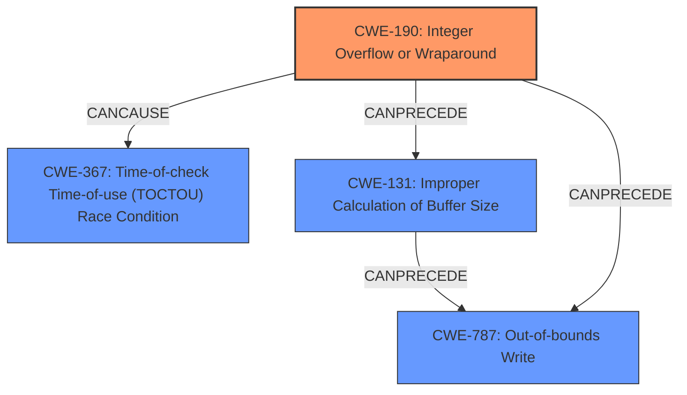

# Analysis Report for CVE-2021-22437

# Vulnerability Analysis Report: CVE-2021-22437

## Description

There is a software integer overflow leading to a TOCTOU condition in smartphones. Successful exploitation of this vulnerability may cause random address access.

## Vulnerability Description Key Phrases

**Rootcause:** software integer overflow
**Weakness:** TOCTOU condition
**Impact:** random address access
**Product:** smartphones

## Analysis (with Relationship Data)

# Summary
| CWE ID | CWE Name | Confidence | CWE Abstraction Level | CWE Vulnerability Mapping Label | CWE-Vulnerability Mapping Notes |
|---|---|---|---|---|---|
| CWE-190 | Integer Overflow or Wraparound | 0.95 | Base | Primary | Allowed |
| CWE-367 | Time-of-check Time-of-use (TOCTOU) Race Condition | 0.85 | Base | Secondary | Allowed |

## Evidence and Confidence

*   **Confidence Score:** 0.90
*   **Evidence Strength:** HIGH

- **Analysis and Justification:**  
  - *Explanation:* The vulnerability description clearly states a "**software integer overflow**" as the root cause. CWE-190 (Integer Overflow or Wraparound) directly addresses this weakness, where a calculation produces a value exceeding the maximum allowable integer, leading to unexpected behavior. The "CVE Reference Links Content Summary" also explicitly mentions "**Integer overflow**" as a weakness. Additionally, the description mentions a "**TOCTOU condition**," indicating a race condition where the state of a resource changes between the check and use. This aligns with CWE-367 (Time-of-check Time-of-use (TOCTOU) Race Condition). The impact, "random address access," suggests the potential for out-of-bounds memory operations due to the integer overflow and subsequent race condition. CWE-190 is selected as the primary CWE because it's the root cause, and CWE-367 is selected as a secondary weakness stemming from the overflow.

  - *Relationship Analysis:* CWE-190 doesn't have direct relationships to CWE-367, but integer overflows can often lead to unexpected program states that manifest as race conditions. The graph relationships suggest that CWE-190 can precede out-of-bounds access (like CWE-125 or CWE-787), which is consistent with the "random address access" impact.

- **Confidence Score:**  
  - Confidence: 0.95 (High confidence due to direct mention of integer overflow and TOCTOU condition in the vulnerability description and CVE reference.)
---

## Criticism of Analysis

Okay, here's a detailed review of the provided analysis, using the full CWE specifications and focusing on the mapping guidance and mitigations.

**Analysis to Review:**

**Summary**
| CWE ID | CWE Name | Confidence | CWE Abstraction Level | CWE Vulnerability Mapping Label | CWE-Vulnerability Mapping Notes |
|---|---|---|---|---|---|
| CWE-190 | Integer Overflow or Wraparound | 0.95 | Base | Primary | Allowed |
| CWE-367 | Time-of-check Time-of-use (TOCTOU) Race Condition | 0.85 | Base | Secondary | Allowed |

**Evidence and Confidence**

*   **Confidence Score:** 0.90
*   **Evidence Strength:** HIGH

- **Analysis and Justification:**
  - *Explanation:* The vulnerability description clearly states a "**software integer overflow**" as the root cause. CWE-190 (Integer Overflow or Wraparound) directly addresses this weakness, where a calculation produces a value exceeding the maximum allowable integer, leading to unexpected behavior. The "CVE Reference Links Content Summary" also explicitly mentions "**Integer overflow**" as a weakness. Additionally, the description mentions a "**TOCTOU condition**," indicating a race condition where the state of a resource changes between the check and use. This aligns with CWE-367 (Time-of-check Time-of-use (TOCTOU) Race Condition). The impact, "random address access," suggests the potential for out-of-bounds memory operations due to the integer overflow and subsequent race condition. CWE-190 is selected as the primary CWE because it's the root cause, and CWE-367 is selected as a secondary weakness stemming from the overflow.

  - *Relationship Analysis:* CWE-190 doesn't have direct relationships to CWE-367, but integer overflows can often lead to unexpected program states that manifest as race conditions. The graph relationships suggest that CWE-190 can precede out-of-bounds access (like CWE-125 or CWE-787), which is consistent with the "random address access" impact.

- **Confidence Score:**
  - Confidence: 0.95 (High confidence due to direct mention of integer overflow and TOCTOU condition in the vulnerability description and CVE reference.)

**Critique:**

The overall analysis is good, and the justifications are well-reasoned. The high confidence level is appropriate given the explicit mentions of the weaknesses in the input.  Here's a breakdown of areas where the analysis is strong and where it could be improved, along with considerations based on the complete CWE specifications.

**Strengths:**

*   **Clear Justification:** The reasoning behind selecting CWE-190 and CWE-367 is well articulated, directly referencing the vulnerability description and the CVE summary.
*   **Appropriate Abstraction Level:** Both CWEs are at the Base level, which aligns with the CWE's mapping guidance, especially for root cause analysis.
*   **Relationship Analysis:** The explanation of how CWE-190 can lead to the TOCTOU condition is helpful and realistic.
*   **Confidence Level:** The 0.95 confidence level is justified given the direct evidence of the integer overflow and TOCTOU condition from the description.

**Areas for Improvement and Further Considerations:**

1.  **Impact and Potential CWE Chain:**
    *   While "random address access" is a good start, the analysis could explore specific CWEs related to the *consequence* of that access.  CWE-787 (Out-of-bounds Write) and CWE-125 (Out-of-bounds Read) are the most likely candidates.  The *actual* impact depends on *whether* the program *writes* to the address or only *reads* from it.  If the attacker can control the value written to the arbitrary address, then it could become a write-what-where condition (CWE-123).
    *   The analysis *hints* at this, but a more explicit chain could be constructed.  For example:  `CWE-190 -> Incorrect Calculation -> CWE-787` or `CWE-190 -> Incorrect Calculation -> CWE-125`.   The "Incorrect Calculation" part would likely be described more precisely with CWE-131.
    *   Consider the potential for CWE-680, Integer Overflow to Buffer Overflow. This is a COMPOUND CWE, and it seems appropriate here.  The chain would be: CWE-680.  CWE-190 is the starting point.
    *   **Mitigation Considerations:**  Addressing the buffer overflow (CWE-787) or out-of-bounds read (CWE-125) directly can sometimes be more effective than solely focusing on the integer overflow. The mitigations in CWE-787 like using memory-safe languages or compiler-based buffer overflow detection mechanisms should be taken into account.

2.  **TOCTOU Condition Details:**
    *   While the analysis identifies CWE-367, it's somewhat vague about *what* resource is being checked and used, and how the attacker can influence it.  What specific data is being checked that is then changing that is giving access to the random address?  The stronger the explanation, the higher the confidence can be.
    *   The provided CWE specifications mention that the interfering code sequence could be trusted or untrusted. If the interfering code sequence is trusted (another part of the application), the analysis could be strengthened by identifying how the shared resource is being accessed and modified by that trusted sequence.  If the interfering code is untrusted, then how can the attacker influence the state to trigger this race condition?
    *   The CWE-367 mitigation mentions "limiting the interleaving of operations." It could also be "not performing a check before the use" if it doesn't resolve the execution of a function on a resource whose state and identity cannot be assured.

3.  **Potential Role of Input Validation:**
    *   Given the root cause of the integer overflow, it's worth considering CWE-20 (Improper Input Validation) or one of its more specific children like CWE-1284 (Improper Validation of Specified Quantity in Input). Is the integer value that's overflowing coming from an untrusted source (e.g., user input, network data)? If so, lack of proper validation of that input is a contributing factor.  However, note that CWE's mapping guidance *discourages* the use of CWE-20 directly.
    *   If CWE-20 or one of its children is relevant, include this in the analysis and consider the mitigations for it.  The mitigations for CWE-20 and its children include using an "accept known good" strategy and validating the full range of acceptable values.

4.  **Alternative Numeric Type Conversion Errors:**
    * Consider numeric type conversion issues. Is the integer overflow related to a signed to unsigned conversion or an incorrect conversion between data types.
        * **CWE-195: Signed to Unsigned Conversion Error:** The product uses a signed primitive and performs a cast to an unsigned primitive, which can produce an unexpected value.
        * **CWE-681: Incorrect Conversion between Numeric Types:** When converting from one data type to another, such as long to integer, data can be omitted or translated in a way that produces unexpected values.

5.  **Relationship Clarification:**
    *   While the analysis states that CWE-190 doesn't have a *direct* relationship to CWE-367, it acknowledges that integer overflows *can* lead to race conditions. It may be helpful to clarify this connection further. Integer overflows can corrupt memory, which then leads to unpredictable behavior that *manifests* as a race condition if multiple threads/processes are involved. Therefore, the *actual cause* of the race condition is the corrupted memory state, and the *trigger* is the concurrent access.
    *   Consider CWE-362: Concurrent Execution using Shared Resource with Improper Synchronization.

**Revised Analysis Snippets (Illustrative):**

*   **Impact and Potential CWE Chain:** "The 'random address access' impact suggests the possibility of out-of-bounds memory operations. This could manifest as CWE-787 (Out-of-bounds Write) if data is being written to the arbitrary address or as CWE-125 (Out-of-bounds Read) if data is being read. The chain of events could be modeled as CWE-190 -> CWE-131 (Incorrect Calculation of Buffer Size) -> CWE-787. Furthermore, it is possible to write arbitrary values to the arbitrary address using CWE-123."

*   **TOCTOU Condition Details:** "The TOCTOU condition (CWE-367) likely arises because the integer overflow affects a size or offset value used in memory access. One thread or process may check if a certain memory region is within bounds based on the pre-overflow value, but before that memory is accessed, another thread or process changes a related value (e.g. increasing the offset) that then violates the original check, allowing the memory read to occur out of bounds. The details of the check and use requires further investigation."

*   **Potential Role of Input Validation:** "The integer value that leads to the overflow may be derived from user input. If so, this suggests a potential issue with CWE-20 (Improper Input Validation), specifically CWE-1284 (Improper Validation of

## Final Resolution

# Summary
| CWE ID | CWE Name | Confidence | CWE Abstraction Level | CWE Vulnerability Mapping Label | CWE-Vulnerability Mapping Notes |
|---|---|---|---|---|---|
| CWE-190 | Integer Overflow or Wraparound | 0.95 | Base | Primary | Allowed |
| CWE-367 | Time-of-check Time-of-use (TOCTOU) Race Condition | 0.85 | Secondary | Allowed |
| CWE-787 | Out-of-bounds Write | 0.70 | Secondary | Allowed |
| CWE-131 | Improper Calculation of Buffer Size | 0.60 | Secondary | Allowed |

## Evidence and Confidence

*   **Confidence Score:** 0.88
*   **Evidence Strength:** MEDIUM

## Relationship Analysis
The primary weakness is **CWE-190 (Integer Overflow or Wraparound)**, a Base level CWE, which can lead to **CWE-367 (TOCTOU Race Condition)** when concurrent access to a shared resource is involved. The integer overflow can result in an incorrect buffer size calculation (**CWE-131**), potentially leading to an out-of-bounds write (**CWE-787**). The **CWE-190** can precede **CWE-787** directly or via **CWE-131**. **CWE-367** is related to timing issues and concurrent access, which is a consequence of the unexpected state caused by the integer overflow.

## Vulnerability Chain
The vulnerability chain starts with **CWE-190 (Integer Overflow or Wraparound)**, leading to an incorrect calculation of a buffer size (**CWE-131**). This incorrect size calculation can then lead to an out-of-bounds write (**CWE-787**). The concurrent access to the shared resource, which is impacted by the integer overflow, can lead to a TOCTOU race condition (**CWE-367**), where the state of the resource changes between the check and use. The final impact is random address access, which could result in information disclosure, code execution, or denial of service.

## Summary of Analysis
The initial analysis correctly identified **CWE-190 (Integer Overflow or Wraparound)** as the primary **ROOTCAUSE** and **CWE-367 (TOCTOU Race Condition)** as a secondary weakness. However, the analysis can be improved by considering the consequences of the integer overflow more explicitly. The "random address access" impact suggests potential out-of-bounds memory operations, which are best represented by **CWE-787 (Out-of-bounds Write)** and **CWE-131 (Improper Calculation of Buffer Size)**.

The vulnerability description states: "There is a software integer overflow leading to a TOCTOU condition in smartphones. Successful exploitation of this vulnerability may cause random address access." This statement directly supports the selection of **CWE-190** and **CWE-367**.

The relationship analysis shows that **CWE-190** can precede **CWE-787** through an improper calculation of buffer size (**CWE-131**). This indirect relationship provides additional support for including **CWE-787** in the analysis. The **CWE-367** relates to the concurrent execution environment and timing issues, which are a consequence of the **WEAKNESS**.

The selected CWEs are at the optimal level of specificity because they directly address the **ROOTCAUSE** and consequences of the vulnerability, as described in the vulnerability description. **CWE-190** is a Base level CWE and provides a clear description of the integer overflow. **CWE-367**, **CWE-787**, and **CWE-131** are also Base level CWEs and provide specific details about the race condition, out-of-bounds write, and buffer size calculation, respectively.

*Report generated on 2025-03-17 23:11:14*
