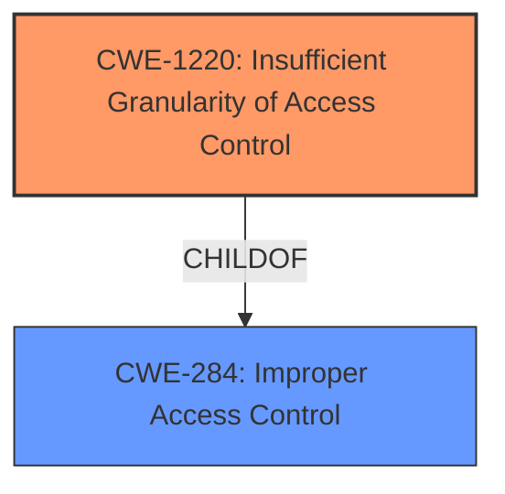

# Analysis Report for CVE-2021-22565

# Vulnerability Analysis Report: CVE-2021-22565

## Description

An attacker could prematurely expire a verification code, making it unusable by the patient, making the patient unable to upload their TEKs to generate exposure notifications. We recommend upgrading the Exposure Notification server to V1.1.2 or greater.

## Vulnerability Description Key Phrases

**Impact:** prematurely expire verification code
**Attacker:** attacker
**Product:** Exposure Notification server

## Analysis (with Relationship Data)

# Summary
| CWE ID | CWE Name | Confidence | CWE Abstraction Level | CWE Vulnerability Mapping Label | CWE-Vulnerability Mapping Notes |
|---|---|---|---|---|---|
| CWE-1220 | Insufficient Granularity of Access Control | 1.0 | Base | Allowed | Primary CWE |

## Evidence and Confidence

*   **Confidence Score:** 1.0
*   **Evidence Strength:** HIGH

- **Analysis and Justification:**  
  - *Explanation:* The vulnerability description and the CVE Reference Links Content Summary clearly point to **insufficient granularity of access control** as the root cause. An attacker with permission to expire verification codes could **expire codes from other realms** because the system did not properly validate if the user/API key had authorization to expire that *specific* code. This aligns directly with CWE-1220, "Insufficient Granularity of Access Control," which describes a scenario where access controls lack the necessary precision, allowing unauthorized access.
  - *Relationship Analysis:* There are no direct relationships mentioned for CWE-1220 in the provided information. However, the description of CWE-1220 aligns directly with the vulnerability, confirming its relevance.

- **Confidence Score:**  
  - Confidence: 1.0 (High evidence from technical description and CVE reference materials)

## Criticism of Analysis

Okay, here's a review of the provided analysis, taking into account the full CWE specifications:

**Overall Assessment:**

The analysis is **good** and the assignment of **CWE-1220 (Insufficient Granularity of Access Control)** is **accurate and well-justified.** The confidence score of 1.0 is appropriate. The explanation is clear, concise, and directly relates the vulnerability description to the CWE definition. The inclusion of CVE examples and relevant CWE specifications enhances the analysis.

**Detailed Review:**

*   **Summary Table:**
    *   The summary table is well-formatted and provides a clear overview of the analysis.
    *   Confidence score is justified and appropriate.

*   **Evidence and Confidence:**
    *   **Explanation Quality:** The explanation effectively connects the vulnerability (premature expiration of verification codes) with the CWE-1220 definition.  It highlights the core issue:  *attackers with permission for *some* codes could expire *other* codes because of insufficient validation of specific code ownership or realm.*
    *   **Relationship Analysis:** The "Relationship Analysis" section correctly notes the absence of direct relationships *mentioned* in the provided information. However, it should be noted that CWE-1220 is a child of CWE-284 (Improper Access Control). While acknowledging this relationship isn't strictly necessary (as the analysis focuses on the *specific* vulnerability), it could add another layer of understanding.

*   **CWE Examples from Database:**
    *   The inclusion of known examples for CWE-1220 is very helpful.  The CVE-2021-22565 is particularly relevant, because that is the CVE that this analysis is based on.

*   **Relevant CWE Specifications:**
    *   The inclusion of the complete CWE specifications is excellent. It allows for a complete understanding of the CWE and its context.

*   **Retriever Results:**
    *   The Retriever Results highlight that CWE-1220 was the top result, which further strengthens the analysis.
    *   Other CWEs like CWE-287 (Improper Authentication) were considered, which is a good practice. However, the explanation for why CWE-1220 is more appropriate is clear.

**Suggestions for Improvement:**

1.  **Acknowledge the Parent CWE (CWE-284):** While the focus on CWE-1220 is correct, briefly mentioning that it is a child of CWE-284 (Improper Access Control) can provide a broader context. A sentence like, "CWE-1220 is a more specific case of the broader category of improper access control (CWE-284)" would suffice.

2.  **Mitigation Strategies (CWE-1220):**  The analysis could be slightly enhanced by briefly referencing the "Potential Mitigations" section from the CWE-1220 specification.  For example:  "Mitigation strategies for CWE-1220 include reviewing access control policies for design inconsistencies and ensuring thorough testing of access control definition and programming flows throughout the development lifecycle." This makes the analysis more actionable.

3.  **Consider Applicability of Other Top Retriever Results:** While CWE-1220 is the best fit, briefly address *why* the other top retriever results (e.g., CWE-1204, CWE-540, CWE-918) are *not* applicable. This demonstrates a more thorough analysis.  For example:

    *   "While CWE-1204 (Generation of Weak Initialization Vector) and CWE-327 (Use of a Broken or Risky Cryptographic Algorithm) are related to cryptography, they don't directly address the core issue of insufficient access control granularity. The vulnerability isn't about weak cryptographic practices but about the *scope* of permissions granted."
    *   "CWE-540 (Inclusion of Sensitive Information in Source Code) is not relevant, as the vulnerability lies in the server's logic for handling access control, not in unintentional exposure of sensitive data in the source code."
    *    "CWE-918 (Server-Side Request Forgery (SSRF)) is not relevant, as the attacker is not forcing the server to make requests to unintended destinations."

**Revised Summary Table (Incorporating Suggestions):**

| CWE ID | CWE Name | Confidence | CWE Abstraction Level | CWE Vulnerability Mapping Label | CWE-Vulnerability Mapping Notes |
|---|---|---|---|---|---|
| CWE-1220 | Insufficient Granularity of Access Control | 1.0 | Base | Allowed | Primary CWE. Child of CWE-284 (Improper Access Control). Mitigation strategies include reviewing access control policies and thorough testing.  CWE-1204, CWE-540, and CWE-918 are not applicable because...[brief explanation]. |

**In conclusion:** The analysis is strong and accurately identifies the CWE. The suggestions are relatively minor and aim to make the analysis even more comprehensive and actionable by explicitly connecting it to the broader CWE context and mitigation strategies.

## Final Resolution

# Summary
| CWE ID | CWE Name | Confidence | CWE Abstraction Level | CWE Vulnerability Mapping Label | CWE-Vulnerability Mapping Notes |
|---|---|---|---|---|---|
| **CWE-1220** | Insufficient Granularity of Access Control | 1.0 | Base | Allowed | Primary CWE |

## Evidence and Confidence

*   **Confidence Score:** 1.0
*   **Evidence Strength:** HIGH

## Relationship Analysis
The primary CWE identified is **CWE-1220 (Insufficient Granularity of Access Control)**, which is a Base level CWE. While no direct relationships are listed in the provided information, it's important to note that **CWE-1220** is a child of **CWE-284 (Improper Access Control)**. This hierarchical relationship helps to contextualize **CWE-1220** as a specific type of improper access control.

## Vulnerability Chain
The vulnerability chain starts with the **ROOTCAUSE** being the **CWE-1220 (Insufficient Granularity of Access Control)**. This leads to the impact where an attacker can prematurely expire verification codes, rendering them unusable for patients.

## Summary of Analysis
The initial analysis and criticism both agree that **CWE-1220 (Insufficient Granularity of Access Control)** is the most appropriate classification for this vulnerability. The vulnerability description clearly states that an attacker could expire verification codes from other realms because the system did not properly validate if the user/API key had authorization to expire that *specific* code. This directly aligns with the definition of **CWE-1220**, which describes a scenario where access controls lack the necessary precision, allowing unauthorized access.

The graph relationships, particularly the parent-child relationship between **CWE-284 (Improper Access Control)** and **CWE-1220**, further support this classification. **CWE-1220** is at the optimal level of specificity because it accurately reflects the **WEAKNESS**: the access control is not granular enough.

The decision is based on the provided evidence from the vulnerability description and the CVE reference materials, which clearly indicate the **insufficient granularity of access control** as the root cause. The retriever scores also support this decision, as **CWE-1220** was the top result.

*Report generated on 2025-03-17 02:42:14*
