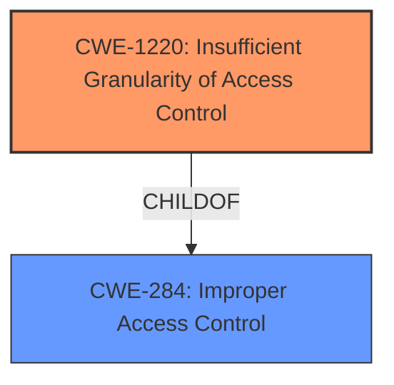

# Final Resolution for CVE-2021-22565

# Summary
| CWE ID | CWE Name | Confidence | CWE Abstraction Level | CWE Vulnerability Mapping Label | CWE-Vulnerability Mapping Notes |
|---|---|---|---|---|---|
| **CWE-1220** | Insufficient Granularity of Access Control | 1.0 | Base | Allowed | Primary CWE |

## Evidence and Confidence

*   **Confidence Score:** 1.0
*   **Evidence Strength:** HIGH

## Relationship Analysis
The primary CWE identified is **CWE-1220 (Insufficient Granularity of Access Control)**, which is a Base level CWE. While no direct relationships are listed in the provided information, it's important to note that **CWE-1220** is a child of **CWE-284 (Improper Access Control)**. This hierarchical relationship helps to contextualize **CWE-1220** as a specific type of improper access control.

## Vulnerability Chain
The vulnerability chain starts with the **ROOTCAUSE** being the **CWE-1220 (Insufficient Granularity of Access Control)**. This leads to the impact where an attacker can prematurely expire verification codes, rendering them unusable for patients.

## Summary of Analysis
The initial analysis and criticism both agree that **CWE-1220 (Insufficient Granularity of Access Control)** is the most appropriate classification for this vulnerability. The vulnerability description clearly states that an attacker could expire verification codes from other realms because the system did not properly validate if the user/API key had authorization to expire that *specific* code. This directly aligns with the definition of **CWE-1220**, which describes a scenario where access controls lack the necessary precision, allowing unauthorized access.

The graph relationships, particularly the parent-child relationship between **CWE-284 (Improper Access Control)** and **CWE-1220**, further support this classification. **CWE-1220** is at the optimal level of specificity because it accurately reflects the **WEAKNESS**: the access control is not granular enough.

The decision is based on the provided evidence from the vulnerability description and the CVE reference materials, which clearly indicate the **insufficient granularity of access control** as the root cause. The retriever scores also support this decision, as **CWE-1220** was the top result.