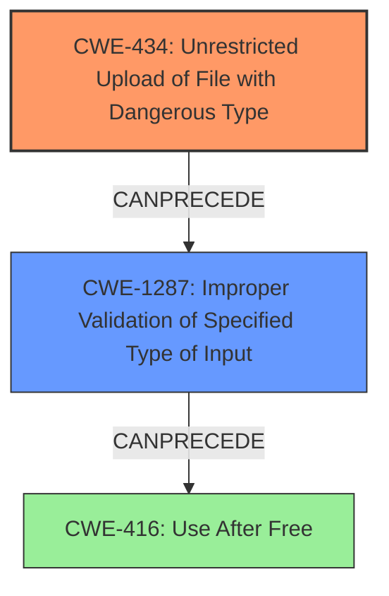

# Final Resolution for CVE-2021-22697

# Summary

| CWE ID | CWE Name | Confidence | CWE Abstraction Level | CWE Vulnerability Mapping Label | CWE-Vulnerability Mapping Notes |
|---|---|---|---|---|---|
| **CWE-434** | **Unrestricted Upload of File with Dangerous Type** | 1.0 | Base | Allowed | Primary CWE |
| **CWE-1287** | **Improper Validation of Specified Type of Input** | 0.8 | Base | Allowed | Secondary CWE - More specific than CWE-20. Lack of validation of file type allows dangerous SSD files to be uploaded. |
| **CWE-416** | **Use After Free** | 0.75 | Variant | Allowed | Tertiary CWE - Consequence of improper file parsing after upload, leading to RCE. |

## Evidence and Confidence

*   **Confidence Score:** 0.9
*   **Evidence Strength:** HIGH

## Relationship Analysis
The primary relationship impacting the decision is the chain of events: **CWE-434** (upload of a malicious file) *precedes* **CWE-1287** (improper validation of the file type) which *precedes* **CWE-416** (use-after-free). **CWE-1287** is a child of **CWE-20**, making it a more specific classification for the validation issue.

## Vulnerability Chain
The vulnerability chain starts with the unrestricted upload of a malicious file (**CWE-434**). This is followed by a failure to properly validate the file type (**CWE-1287**), which allows the malicious file to be processed. The improper parsing of the file leads to a use-after-free condition (**CWE-416**), ultimately resulting in remote code execution.

## Summary of Analysis
The initial analysis correctly identified **CWE-434** as the primary **ROOTCAUSE**. The criticism helped refine the analysis by suggesting **CWE-1287** as a more specific secondary weakness related to input validation. The vulnerability description states: "A **CWE-434 Unrestricted Upload of File with Dangerous Type** vulnerability exists...that could allow a use-after-free condition...when a malicious SSD file is uploaded and improperly parsed."

The graph relationships highlight the chain of events leading to the vulnerability. **CWE-434** enables the upload, **CWE-1287** fails to prevent processing of the malicious file, and **CWE-416** is a consequence of the improper handling. Selecting **CWE-1287** provides a more precise understanding of the validation **WEAKNESS**.

The selected CWEs are at the optimal level of specificity. **CWE-434** identifies the unrestricted upload, **CWE-1287** pinpoints the type of input validation failure, and **CWE-416** captures the resulting memory corruption. This combination provides a clear and comprehensive picture of the vulnerability.