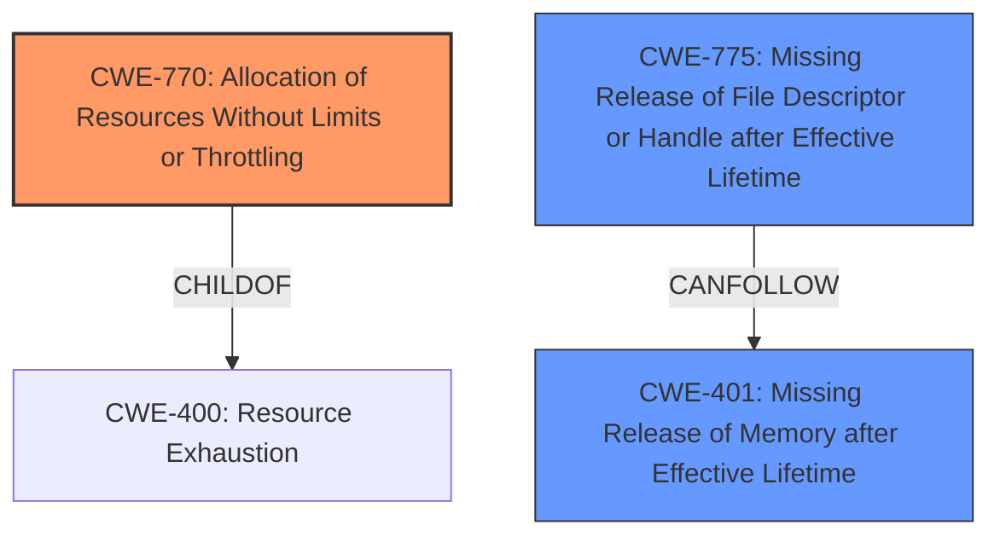

# Final Resolution for CVE-2021-22883

# Summary
| CWE ID | CWE Name | Confidence | CWE Abstraction Level | CWE Vulnerability Mapping Label | CWE-Vulnerability Mapping Notes |
|---|---|---|---|---|---|
| CWE-770 | Allocation of Resources Without Limits or Throttling | 0.9 | Base | Allowed | Primary CWE |
| CWE-775 | Missing Release of File Descriptor or Handle after Effective Lifetime | 0.6 | Variant | Allowed | Secondary Candidate |
| CWE-401 | Missing Release of Memory after Effective Lifetime | 0.5 | Variant | Allowed | Secondary Candidate |

## Evidence and Confidence

*   **Confidence Score:** 0.8
*   **Evidence Strength:** HIGH

## Relationship Analysis
The primary weakness is the lack of limits on resource allocation (**CWE-770**), which can lead to the exhaustion of file descriptors. The missing release of file descriptors (**CWE-775**) exacerbates this issue but is not the root cause. The connection to memory exhaustion (**CWE-401**) is conditional and depends on the system configuration (no file descriptor limits).

## Vulnerability Chain
The vulnerability chain starts with **CWE-770 (Allocation of Resources Without Limits or Throttling)**, allowing an attacker to allocate excessive file descriptors. This leads to **CWE-775 (Missing Release of File Descriptor or Handle after Effective Lifetime)**, exacerbating the resource exhaustion. Finally, if no file descriptor limits are configured, this can result in **CWE-401 (Missing Release of Memory after Effective Lifetime)** as the system attempts to handle the excessive connections, leading to memory exhaustion and denial of service.

## Summary of Analysis
Based on the vulnerability description, the primary **ROOTCAUSE** is the lack of resource limits, specifically file descriptors. The description explicitly states that "too many connection attempts with an unknownProtocol are established. This leads to a **leak of file descriptors**." This directly aligns with **CWE-770 (Allocation of Resources Without Limits or Throttling)**, which is at the Base level of abstraction.

The criticism correctly points out that while **CWE-775 (Missing Release of File Descriptor or Handle after Effective Lifetime)** contributes to the issue, it is not the primary **WEAKNESS**. The core issue is the lack of limits on allocating descriptors. Therefore, I agree with lowering the confidence score for **CWE-775** to 0.6.

The connection to **CWE-401 (Missing Release of Memory after Effective Lifetime)** is conditional and depends on the system configuration (no file descriptor limits). Therefore, I agree with lowering the confidence score for **CWE-401** to 0.5.

The relationship analysis helped clarify the roles of each CWE in the vulnerability chain. **CWE-770** enables the attack, **CWE-775** exacerbates it, and **CWE-401** is a potential consequence under specific conditions.

The selected CWEs are at the optimal level of specificity. **CWE-770** is a Base-level CWE, providing a general description of the resource allocation issue. **CWE-775** and **CWE-401** are Variant-level CWEs, providing more specific details about the file descriptor leak and memory exhaustion, respectively.

The final determination is based on the provided evidence and the relationship analysis, with the confidence scores reflecting the relative significance of each CWE in the vulnerability chain.