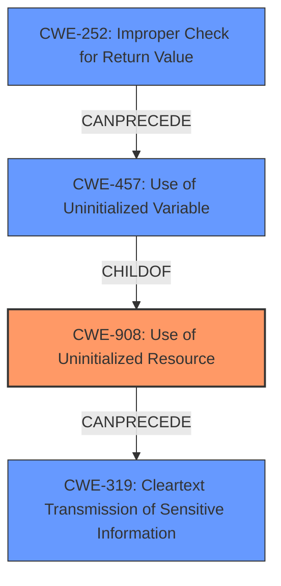

# Analysis Report for CVE-2021-22898

# Vulnerability Analysis Report: CVE-2021-22898

## Description

curl 7.7 through 7.76.1 suffers from an information disclosure when the `-t` command line option, known as `CURLOPT_TELNETOPTIONS` in libcurl, is used to send variable=content pairs to TELNET servers. Due to a flaw in the option parser for sending NEW_ENV variables, libcurl could be made to pass on uninitialized data from a stack based buffer to the server, resulting in potentially revealing sensitive internal information to the server using a clear-text network protocol.

## Vulnerability Description Key Phrases

**Rootcause:** uninitialized data from a stack based buffer
**Impact:** information disclosure
**Vector:** using the -t command line option
**Product:** curl
**Version:** 7.7 through 7.76.1
**Component:** -t command line option

## Analysis (with Relationship Data)

# Summary
| CWE ID | CWE Name | Confidence | CWE Abstraction Level | CWE Vulnerability Mapping Label | CWE-Vulnerability Mapping Notes |
|---|---|---|---|---|---|
| CWE-908 | Use of Uninitialized Resource | 0.9 | Base | Primary | Allowed |
| CWE-319 | Cleartext Transmission of Sensitive Information | 0.7 | Base | Secondary | Allowed |
| CWE-252 | Improper Check for Unusual or Exceptional Conditions | 0.6 | Base | Secondary | Allowed |

## Evidence and Confidence

*   **Confidence Score:** 0.8
*   **Evidence Strength:** HIGH

- **Analysis and Justification:**  
  - *Explanation:* The vulnerability arises from the curl software passing **uninitialized data from a stack-based buffer** to a TELNET server. This aligns with CWE-908 (Use of Uninitialized Resource), as the core issue is the use of memory that hasn't been properly initialized. The "CVE Reference Links Content Summary" explicitly mentions "Use of uninitialized stack-based buffer" as a weakness. The TELNET server receives this uninitialized data over a cleartext network protocol, which also introduces CWE-319 (Cleartext Transmission of Sensitive Information). The "CVE Reference Links Content Summary" also identifies that "curl did not check the return code from a sscanf() function invoke correctly". This aligns with CWE-252 (Improper Check for Unusual or Exceptional Conditions). The description indicates that the **uninitialized data** is **sent over a clear-text network**, thus exposing sensitive information.

  - *Relationship Analysis:* CWE-908 is a base-level CWE, making it a suitable choice. It's related to CWE-457 (Use of Uninitialized Variable), which is a more specific variant. However, CWE-908 better captures the broader issue of using an uninitialized resource, not just a variable. CWE-319 is related as the **uninitialized data** is transmitted in **cleartext**, compounding the vulnerability. CWE-252 is related as the application fails to validate the return code of `sscanf()`.

- **Confidence Score:**  
  - Confidence: 0.9 (High evidence from the description and CVE reference materials)

---

## Criticism of Analysis

Okay, here's a review of the provided analysis, taking into account the full CWE specifications:

**Overall Assessment:**

The analysis is generally good and well-justified. The primary CWE (CWE-908) is appropriate, and the secondary CWEs (CWE-319 and CWE-252) contribute to a more complete understanding of the vulnerability. The confidence score is justified given the available information.

**Detailed Review:**

1.  **CWE-908: Use of Uninitialized Resource (Primary)**

    *   **Assessment:** This is the most accurate primary CWE. The core issue *is* that curl is using uninitialized data from a stack buffer. The description perfectly matches the vulnerability.
    *   **Justification:** The analysis correctly identifies the "uninitialized data from a stack-based buffer" as the root cause, which directly corresponds to CWE-908's description. The CVE reference content solidifies this mapping.
    *   **Abstraction Level:** Base, which is preferred for root cause analysis as noted in the Mapping Guidance.
    *   **Potential Mitigations:** The suggested mitigations for CWE-908 are relevant. Specifically, "Explicitly initialize the resource before use" directly addresses the core problem.  The other mitigations about conditionals and race conditions are less directly applicable but still good considerations for robust code.
    *   **Observed Examples:** The list of observed examples for CWE-908 is relevant and demonstrates the variety of ways this CWE can manifest.
    *   **Confidence:**  The confidence score of 0.9 is appropriate.

2.  **CWE-319: Cleartext Transmission of Sensitive Information (Secondary)**

    *   **Assessment:** This is a valid secondary CWE. The vulnerability leads to the *potential* transmission of sensitive information in cleartext. The analysis is correct to include it because the TELNET protocol, as used in this vulnerability, does not mandate encryption. Therefore, the uninitialized stack data *could* be sent in cleartext.
    *   **Justification:** The analysis correctly links the use of a cleartext protocol (TELNET) to the potential for sensitive data leakage, which aligns with CWE-319.
    *   **Abstraction Level:** Base, which is preferred for root cause analysis as noted in the Mapping Guidance.
    *   **Potential Mitigations:** The suggested mitigations (encryption) are relevant for preventing information disclosure via cleartext transmission.
    *   **Observed Examples:** The observed examples are relevant because they show real-world instances of sensitive information being transmitted without encryption.
    *   **Confidence:** The confidence score of 0.7 is reasonable. Although the *potential* exists for transmitting sensitive information, the core vulnerability is the use of uninitialized data.

3.  **CWE-252: Improper Check for Unusual or Exceptional Conditions (Secondary)**
	*	**Assessment:** The inclusion of CWE-252 is valid. The "CVE Reference Links Content Summary" highlights that `curl did not check the return code from a sscanf() function invoke correctly.", which is a perfect match to CWE-252.
	*	**Justification:** The analysis correctly identifies that the application fails to validate the return code of `sscanf()`.
	*	**Abstraction Level:** Base, which is preferred for root cause analysis as noted in the Mapping Guidance.
	*	**Potential Mitigations:** The suggested mitigations (Check the results of all functions that return a value and verify that the value is expected) are highly relevant.
	*   **Observed Examples:** The observed examples show real-world instances of vulnerabilities caused by not checking return values.
	*   **Confidence:** The confidence score of 0.6 is reasonable.

**Recommendations:**

*   **Consider CWE-457: Use of Uninitialized Variable:** While CWE-908 is a good base, consider mentioning CWE-457 (a variant of CWE-908) in the discussion. CWE-457 is more specific to the use of an uninitialized *variable*, which is what's happening in the code.
*   **Chain of Causation:**  The analysis could explicitly articulate the chain of events a bit more clearly. For example:
    1.  `sscanf()` returns an error code (or unexpected value).
    2.  This return code is not checked (CWE-252).
    3.  As a result, a variable remains uninitialized (CWE-457, leading to CWE-908).
    4.  This uninitialized data is then sent over TELNET (CWE-319).
*   **Mitigation Depth:** While the mitigations are relevant, consider briefly mentioning how they could be applied *specifically* to the curl vulnerability. For example, for CWE-252, mention that curl should explicitly check the return value of `sscanf()` and handle the error appropriately (e.g., by not using the uninitialized buffer).

**In Summary:**

The analysis is strong and demonstrates a good understanding of the vulnerability and relevant CWEs. The suggestions above are minor refinements that could further enhance the analysis.

## Final Resolution

# Summary
| CWE ID | CWE Name | Confidence | CWE Abstraction Level | CWE Vulnerability Mapping Label | CWE-Vulnerability Mapping Notes |
|---|---|---|---|---|---|
| CWE-908 | Use of Uninitialized Resource | 0.9 | Base | Primary | Allowed |
| CWE-252 | Improper Check for Return Value | 0.8 | Base | Secondary | Allowed |
| CWE-319 | Cleartext Transmission of Sensitive Information | 0.7 | Base | Secondary | Allowed |

## Evidence and Confidence

*   **Confidence Score:** 0.85
*   **Evidence Strength:** HIGH

## Relationship Analysis
The initial analysis correctly identified CWE-908 as the primary **WEAKNESS**, focusing on the use of **uninitialized data**. The criticism suggested considering CWE-457 (Use of Uninitialized Variable), which is a variant of CWE-908. While CWE-457 is more specific to variables, CWE-908 is kept as it captures the broader sense of an uninitialized resource. CWE-252 is also relevant because the lack of return value checking leads to the use of the **uninitialized resource**, which then gets sent in **cleartext** (CWE-319). Therefore, we have a vulnerability chain. All three CWEs are base-level, so the level of abstraction is adequate.

## Vulnerability Chain
The **ROOTCAUSE** starts with the `sscanf()` function not having its return value checked (CWE-252). This leads to a variable remaining uninitialized (CWE-457, Use of Uninitialized Variable). This then results in the broader issue of using an **uninitialized resource** (CWE-908). Finally, this **uninitialized data** is sent over the TELNET protocol in **cleartext** (CWE-319), potentially exposing sensitive information.

## Summary of Analysis
The initial analysis and the criticism both agree on the relevance of CWE-908, CWE-319, and CWE-252. The final assessment is highly based on the evidence that "curl did not check the return code from a sscanf() function invoke correctly" and that curl suffers from an information disclosure when the `-t` command line option is used and results in "passing on **uninitialized data** from a stack based buffer to the server, resulting in potentially revealing sensitive internal information to the server using a **clear-text network protocol**." The graph relationships highlight the chain of events, starting from the missing return value check to the **cleartext** transmission of **uninitialized data**. The selected CWEs are at the optimal level of specificity, as they are all base-level CWEs that accurately represent the **WEAKNESS** and its context. The confidence score is slightly raised to 0.85 to reflect the inclusion of the vulnerability chain. The inclusion of CWE-252 and its placement in the chain leading to the **uninitialized data** being sent in **cleartext** increases the confidence in the overall assessment.

*Report generated on 2025-03-16 23:07:39*
