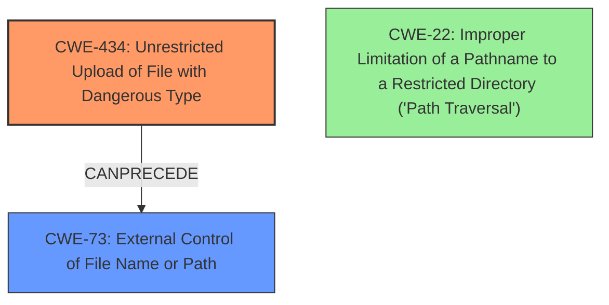

# Final Resolution for CVE-2021-22900

# Summary
| CWE ID  | CWE Name                                                      | Confidence | CWE Abstraction Level | CWE Vulnerability Mapping Label | CWE-Vulnerability Mapping Notes |
| :-------- | :------------------------------------------------------------ | :--------- | :-------------------- | :------------------------------ | :------------------------------ |
| CWE-434 | Unrestricted Upload of File with Dangerous Type             | 0.95       | Base                  | Primary CWE                   | Allowed                       |
| CWE-73  | External Control of File Name or Path             | 0.75       | Base                  | Secondary                       | Allowed                       |

## Evidence and Confidence

*   **Confidence Score:** 0.85
*   **Evidence Strength:** MEDIUM

## Relationship Analysis
The primary relationship influencing the change from CWE-22 to CWE-73 is a peer relationship and the fact that CWE-73 better represents the vulnerability.
- Parent-child hierarchical relationships: N/A
- Chain relationships showing progression of vulnerability: CWE-434 CanPrecede CWE-73
- Peer relationships that offered alternative classifications: CWE-73 is a better fit than CWE-22
- How abstraction levels influenced your selection: All CWEs are Base or Variant

## Vulnerability Chain
The vulnerability chain starts with an **Unrestricted Upload of File with Dangerous Type (CWE-434)**. The attacker uploads a maliciously crafted archive. Because the application allows user input to control or influence the file names used in filesystem operations **(CWE-73)**, the attacker can influence where the file is written. The consequence is a file write vulnerability.

## Summary of Analysis
The initial analysis correctly identified **CWE-434 (Unrestricted Upload of File with Dangerous Type)** as the primary **ROOTCAUSE**. The criticism correctly pointed out that **CWE-22 (Improper Limitation of a Pathname to a Restricted Directory ('Path Traversal'))** was not as strong as another candidate. "The justification relies on the *potential* for overwriting arbitrary files, but there's no concrete evidence in the vulnerability description that the attacker can control the *path* where the file is written." I agree with this assessment.

The criticism recommended **CWE-73 (External Control of File Name or Path)** as a stronger candidate, stating "The vulnerability allows the attacker to control the filename of the uploaded archive. The file write operation is then performed by the product, but the product is using an externally controlled filename/path (even if it's only the final part of the path)." I agree that this is a better fit.

The vulnerability description mentions "file write" via a maliciously crafted archive upload.

The **CWE-434 (Unrestricted Upload of File with Dangerous Type)** and **CWE-73 (External Control of File Name or Path)** are at the optimal level of specificity, as they are both Base level CWEs.