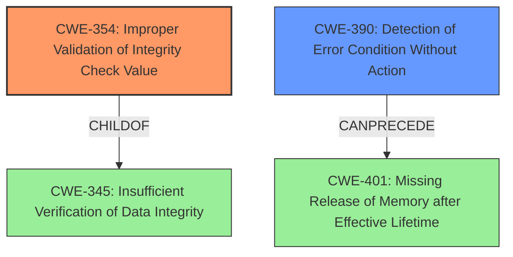

# Final Resolution for CVE-2021-22922

# Summary
| CWE ID | CWE Name | Confidence | CWE Abstraction Level | CWE Vulnerability Mapping Label | CWE-Vulnerability Mapping Notes |
|---|---|---|---|---|---|
| CWE-354 | Improper Validation of Integrity Check Value | 0.95 | Base | Primary | Allowed |
| CWE-390 | Detection of Error Condition Without Action | 0.70 | Base | Secondary | Allowed |

## Evidence and Confidence

*   **Confidence Score:** 0.95
*   **Evidence Strength:** HIGH

## Relationship Analysis
The primary CWE, CWE-354 (**Improper Validation of Integrity Check Value**), is a base level weakness, which is preferred. It is related to CWE-345 (**Insufficient Verification of Data Integrity**), which is a parent. The secondary CWE, CWE-390 (**Detection of Error Condition Without Action**), can precede CWE-401 (**Uncontrolled Resource Consumption**) because ignoring the error condition could lead to resource exhaustion if the malicious content is processed further. The retriever did not produce any other highly relevant results.

## Vulnerability Chain
The vulnerability chain starts with the lack of proper integrity validation (**CWE-354**) of downloaded content. This leads to the detection of an error condition (hash mismatch), but no action is taken (**CWE-390**). The consequence is the storage of potentially malicious content on disk. A missing link could be that if the malicious content is then processed, it could lead to resource consumption (**CWE-401**).

## Summary of Analysis
The initial analysis and criticism are both strong and agree on the primary and secondary CWEs. The vulnerability description clearly states that the hash of the downloaded file is not properly validated, which directly aligns with **CWE-354 (Improper Validation of Integrity Check Value)**. The description also indicates that a hash mismatch is detected but ignored, which corresponds to **CWE-390 (Detection of Error Condition Without Action)**.

The graph relationships support the selection. CWE-354 is at the Base level, and CWE-390 can potentially lead to other issues such as CWE-401 if the malicious content is processed.

The selected CWEs are at the optimal level of specificity. While there are child CWEs of CWE-354 related to cryptographic signatures (e.g., CWE-347), the description refers to a general integrity check.

The final decision is to keep CWE-354 as the primary CWE and CWE-390 as the secondary CWE, as they accurately represent the **rootcause** and contributing factor of the vulnerability.