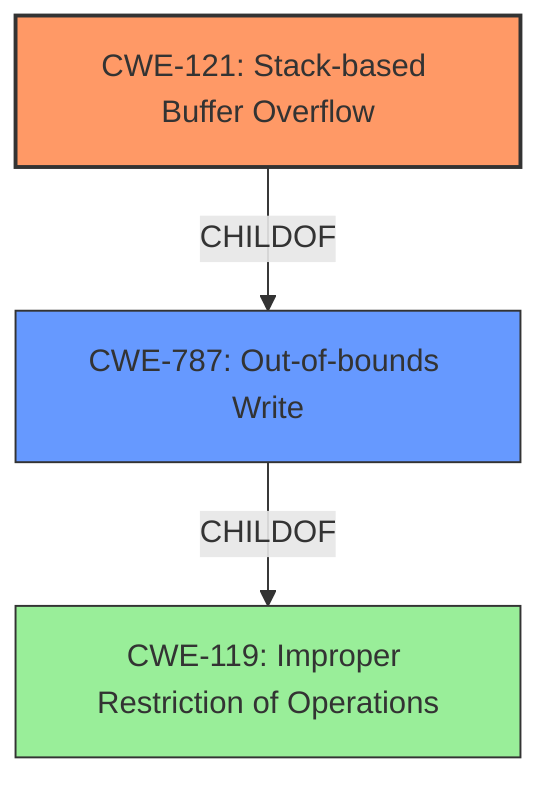

# Final Resolution for CVE-2021-23138

# Summary
| CWE ID | CWE Name | Confidence | CWE Abstraction Level | CWE Vulnerability Mapping Label | CWE-Vulnerability Mapping Notes |
|---|---|---|---|---|---|
| CWE-121 | Stack-based Buffer Overflow | 1.0 | Variant | Allowed | Primary CWE. Mitigations include compiler-based protection, stack canaries, and ASLR. |
| CWE-787 | Out-of-bounds Write | 0.7 | Base | Allowed | Secondary Candidate, underlying mechanism. Mitigations include input validation, bounds checking, and safe memory management functions. |

## Evidence and Confidence

*   **Confidence Score:** 0.95
*   **Evidence Strength:** HIGH

## Relationship Analysis
The primary relationship influencing the decision is the parent-child relationship between CWE-787 (**Out-of-bounds Write**) and CWE-121 (**Stack-based Buffer Overflow**). CWE-121 is a Variant of CWE-787, indicating a more specific type of out-of-bounds write that occurs on the stack. While CWE-787 accurately describes the out-of-bounds write, CWE-121 provides greater specificity due to the stack allocation, aligning well with the vulnerability description. No chain relationships were identified as critical to the primary classification.

## Vulnerability Chain
The vulnerability chain begins with the **ROOTCAUSE** which is likely an **unvalidated input** or a **buffer copy without checking size**. This lack of validation leads to the weakness: CWE-121 **Stack-based Buffer Overflow**. The consequence of this overflow is the ability for an attacker to remotely execute code.

## Summary of Analysis
The initial analysis correctly identified CWE-121 (**Stack-based Buffer Overflow**) as the primary CWE and CWE-787 (**Out-of-bounds Write**) as a secondary candidate.

The vulnerability description explicitly mentions "stack-based buffer overflow," providing strong evidence for CWE-121. The CVE Reference Links Content Summary further validates this, mentioning **CWE-121: Stack-based Buffer Overflow** as the weakness.

The decision to classify CWE-121 as the primary CWE is based on its specificity. As a Variant of CWE-787, it provides a more precise description of the vulnerability's location (the stack). CWE-787, while still applicable, is a broader categorization.

The choice of CWE-121 is also supported by the mapping guidance, which recommends using the most specific CWE available. The evidence from the vulnerability description and the relationship analysis both support this choice.
I have decided to keep CWE-121 as the primary and CWE-787 as the secondary because the vulnerability is explicitly described as a "stack-based buffer overflow," indicating that the overflow occurs on the stack. This makes CWE-121 a more specific and accurate classification than CWE-787, which is a more general term for out-of-bounds writes.