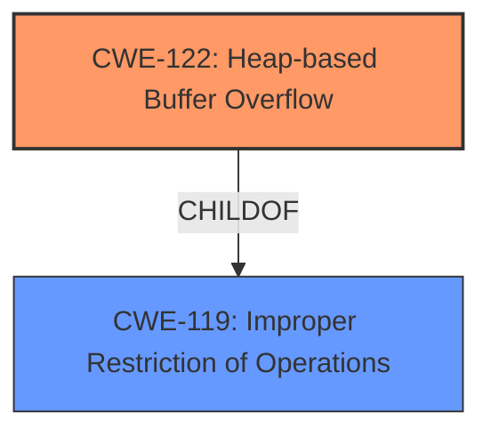

# Final Resolution for CVE-2021-23157

# Summary
| CWE ID | CWE Name | Confidence | CWE Abstraction Level | CWE Vulnerability Mapping Label | CWE-Vulnerability Mapping Notes |
|---|---|---|---|---|---|
| CWE-122 | Heap-based Buffer Overflow | 0.95 | Variant | Allowed | Primary CWE |

## Evidence and Confidence

*   **Confidence Score:** 0.95
*   **Evidence Strength:** HIGH

## Relationship Analysis
The primary relationship that influenced the decision was the parent-child relationship between CWE-119 (**CWE-119: Improper Restriction of Operations within the Bounds of a Memory Buffer**) and CWE-122 (**CWE-122: Heap-based Buffer Overflow**). CWE-122 is a variant of CWE-119, making it more specific and appropriate given the vulnerability description explicitly mentions a heap-based overflow. The abstraction level played a key role as CWE-122, being a Variant, offers a more precise classification than the broader Base-level CWE-119.

## Vulnerability Chain
The vulnerability chain begins with the **ROOTCAUSE** being a **heap-based buffer overflow** (CWE-122). This leads to an out-of-bounds write on the heap, potentially allowing an attacker to overwrite critical data structures or inject malicious code. The final impact is remote code execution, as stated in the vulnerability description. There are no missing links in the chain based on the provided information.

## Summary of Analysis
The initial analysis correctly identified CWE-122 (**CWE-122: Heap-based Buffer Overflow**) as the primary weakness. The criticism provided suggestions for improvement, such as discussing why other retriever results are not a good fit and mentioning mitigation strategies. The analysis is based on the evidence from the vulnerability description, which explicitly mentions a "heap-based buffer overflow." The graph relationships confirmed that CWE-122 is the most specific and appropriate classification, as it is a variant of the more general CWE-119 (**CWE-119: Improper Restriction of Operations within the Bounds of a Memory Buffer**). The MITRE mapping guidance for CWE-122 indicates that it is ALLOWED. The selected CWE is at the optimal level of specificity because it accurately reflects the vulnerability's description and provides a clear understanding of the **ROOTCAUSE**.