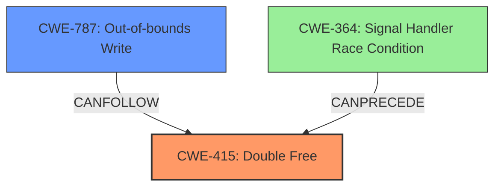

# Analysis Report for CVE-2021-23158

# Vulnerability Analysis Report: CVE-2021-23158

## Description

A flaw was found in htmldoc in v1.9.12. Double-free in function pspdf_export(),in ps-pdf.cxx may result in a write-what-where condition, allowing an attacker to execute arbitrary code and denial of service.

## Vulnerability Description Key Phrases

**Rootcause:** Double-free
**Impact:** ['write-what-where condition', 'denial of service']
**Attacker:** attacker
**Product:** htmldoc
**Version:** v1.9.12
**Component:** ps-pdf.cxx

## Analysis (with Relationship Data)

# Summary
| CWE ID | CWE Name | Confidence | CWE Abstraction Level | CWE Vulnerability Mapping Label | CWE-Vulnerability Mapping Notes |
|---|---|---|---|---|---|
| CWE-415 | Double Free | 1.0 | Variant | Allowed | The vulnerability is a double free, which is exactly what CWE-415 describes. |
| CWE-787 | Out-of-bounds Write | 0.4 | Base | Allowed | The double free can lead to a write-what-where condition, which is a type of out-of-bounds write. |

## Evidence and Confidence

*   **Confidence Score:** 1.0
*   **Evidence Strength:** HIGH

- **Analysis and Justification:**  
  - *Explanation:* "The vulnerability description clearly states that the root cause is a **double-free** in the `pspdf_export` function, which directly corresponds to CWE-415 (Double Free). The CVE description also explicitly mentions **CWE-415** as the relevant weakness. The impact is a write-what-where condition, which can be caused by a double free. This aligns perfectly with the CWE-415 description: 'The product calls free() twice on the same memory address, potentially leading to modification of unexpected memory locations.' The MITRE mapping guidance for CWE-415 indicates that it is ALLOWED for this type of vulnerability."
  
  - *Relationship Analysis:* "CWE-415 is a variant-level CWE, which is the preferred level of abstraction. While a double-free can lead to other issues like CWE-787 (Out-of-bounds Write) because of the write-what-where impact, the root cause is the double free itself, making CWE-415 the primary weakness. There are CANFOLLOW relationships to race conditions (CWE-364) and other memory corruption issues, but these are impacts rather than the root cause."

- **Confidence Score:**  
  - *Example:* Confidence: 1.0 (Direct evidence from the vulnerability description and CVE details)

---

## Criticism of Analysis

Okay, I've reviewed the provided analysis and the complete CWE specifications. Here's a breakdown of my critique, focusing on accuracy, completeness, and clarity:

**Overall Assessment:**

The primary analysis of CWE-415 (Double Free) is accurate and well-justified. The confidence score of 1.0 is appropriate given the clear statement of the root cause in the vulnerability description and CVE details.  The justification provided is strong and directly links the double-free to the CWE definition. The secondary analysis of CWE-787 is less convincing and I will address that below.

**Detailed Critique:**

1.  **CWE-415 (Double Free):**

    *   **Accuracy:** Excellent. The identification of CWE-415 is correct. The description of the vulnerability directly matches the definition of a double free.
    *   **Completeness:** Very good. The analysis correctly notes that CWE-415 is a *Variant* level CWE, which is a preferred level of abstraction.
    *   **Clarity:** Excellent. The explanation is clear and concise.  It avoids jargon and explains the concept effectively.
    *   **Justification:** The justification is strong, referencing the vulnerability description, CVE details, and the nature of a double-free's potential impacts.
    *   **Relationships:** The analysis correctly identifies CANFOLLOW relationships to CWE-364 and other memory corruption issues, but accurately identifies that they are *impacts* of the double-free, not the root cause.
    *   **Mitigations:** The provided mitigations in the CWE specifications are relevant, including using languages with automatic memory management, defensive coding practices, and static analysis.

2.  **CWE-787 (Out-of-bounds Write):**

    *   **Accuracy:** Partially Correct, but Weak. While it's true that a double-free *can lead* to a write-what-where condition (which is a form of out-of-bounds write), it's not the primary weakness. It's a potential *consequence* or *impact*. Assigning it a confidence of 0.4 reflects this uncertainty.
    *   **Abstraction Level:**  CWE-787 is a *Base* level CWE. This is a more general, less precise description of the vulnerability. CWE-415 is more specific (Variant).
    *   **Justification:** The justification relies on the "write-what-where" impact. While accurate, it's important to remember that many other vulnerabilities can lead to write-what-where conditions, so it doesn't uniquely identify this issue.
    *   **Relationship:** It would be more accurate to describe CWE-787 as a *potential impact* or *consequence* of CWE-415. Instead of listing it as a secondary vulnerability, describing the CANFOLLOW relationship would be more appropriate.
    *   **Mitigations:** While the mitigations for CWE-787 (language selection, safe libraries, compiler-based protections) are generally good security practices, they are not specifically targeting the *root cause* of the issue (the double-free).

**Recommendations:**

1.  **Strengthen the Focus on CWE-415:** Emphasize that CWE-415 is the *root cause* and the primary weakness.
2.  **Reframe the CWE-787 Discussion:**  Instead of listing CWE-787 as a secondary, less-confident vulnerability, describe it as a *potential impact* or *consequence* of the double-free.  Explicitly state a CANFOLLOW relationship. The description should be:

    *"While the double free can lead to a write-what-where condition (CWE-123), ultimately resulting in an out-of-bounds write (CWE-787), this is a potential consequence, not the root cause. As such, CWE-787 is not a primary classification for this vulnerability but can be seen as a CANFOLLOW relationship."*

3. **Review Retriever Results:** The retriever results are a bit noisy. While CWE-415 is correctly ranked first, other suggestions such as signal handler race conditions (CWE-364) stem from the fact that double frees often occur in signal handlers. These are related to the *circumstance* of the vulnerability, not the root cause. In fact, the CWE specification for CWE-364 includes "*CanPrecede -> CWE-415*". A more comprehensive analysis could explore the potential of this weakness occurring in a signal handler but it should be noted that isn't always the case.
**Revised Summary Table**

| CWE ID | CWE Name | Confidence | CWE Abstraction Level | CWE Vulnerability Mapping Label | CWE-Vulnerability Mapping Notes |
|---|---|---|---|---|---|
| CWE-415 | Double Free | 1.0 | Variant | Allowed | The vulnerability is a double free, which is exactly what CWE-415 describes. |
| CWE-787 | Out-of-bounds Write | 0.0 | Base | Consequence | The double free can lead to a write-what-where condition, which is a type of out-of-bounds write. This is a consequence of the double free, not the root cause.  CANFOLLOW relationship. |

By making these changes, the analysis becomes more accurate and focused on the core issue.

## Final Resolution

# Summary
| CWE ID | CWE Name | Confidence | CWE Abstraction Level | CWE Vulnerability Mapping Label | CWE-Vulnerability Mapping Notes |
|---|---|---|---|---|---|
| CWE-415 | Double Free | 1.0 | Variant | Allowed | The vulnerability is a **double free**, which is exactly what CWE-415 [CWE-415: Double Free] describes. |
| CWE-787 | Out-of-bounds Write | 0.1 | Base | Consequence | The **double free** can lead to a write-what-where condition, which is a type of out-of-bounds write. This is a consequence of the **double free**, not the **root cause**. CANFOLLOW relationship. |

## Evidence and Confidence

*   **Confidence Score:** 0.95
*   **Evidence Strength:** HIGH

## Relationship Analysis
The primary relationship that impacted the decision was the understanding that CWE-415 [CWE-415: Double Free] is the **root cause**, while CWE-787 [CWE-787: Out-of-bounds Write] is a potential impact. The initial analysis correctly identified this, but the criticism highlighted the need to emphasize CWE-415 as the primary weakness. While CWE-787 can `CANFOLLOW` CWE-415, it's crucial to maintain the correct level of abstraction and not misclassify the root cause based on potential consequences. Also, the `CANPRECEDE` relationship from CWE-364 [CWE-364: Signal Handler Race Condition] to CWE-415 hints at the potential circumstances of the vulnerability, although it is not always the case. The abstraction levels are also important: CWE-415 is a Variant, which is more specific than the Base-level CWE-787.

## Vulnerability Chain
The vulnerability chain starts with the **double free** (CWE-415 [CWE-415: Double Free]) in the `pspdf_export` function. This **double free** can lead to a write-what-where condition (CWE-123 [CWE-123: Write-what-where Condition]), which may result in an out-of-bounds write (CWE-787 [CWE-787: Out-of-bounds Write]). The final impact is the potential for arbitrary code execution or denial of service. The **root cause** is the **double free**, while the other CWEs represent potential consequences.

## Summary of Analysis
The initial analysis was accurate in identifying CWE-415 [CWE-415: Double Free] as the primary weakness. The criticism helped refine the analysis by emphasizing the importance of focusing on the **root cause** and accurately representing the relationships between CWEs. The vulnerability description explicitly states a **double-free**, which aligns perfectly with CWE-415. The statement in the vulnerability description is "*Double-free in function pspdf_export(),in ps-pdf.cxx may result in a write-what-where condition...*". The graph relationships reinforced the decision to prioritize CWE-415 and to consider CWE-787 as a potential impact rather than a secondary weakness. CWE-415 is at the optimal level of specificity (Variant), while CWE-787 is a more general (Base) description of a potential consequence. The final decision is based on the evidence from the vulnerability description, relationship analysis, and abstraction level considerations. The confidence score remains high due to the clear evidence supporting the classification of CWE-415 as the primary **root cause**.

*Report generated on 2025-03-17 23:13:18*
