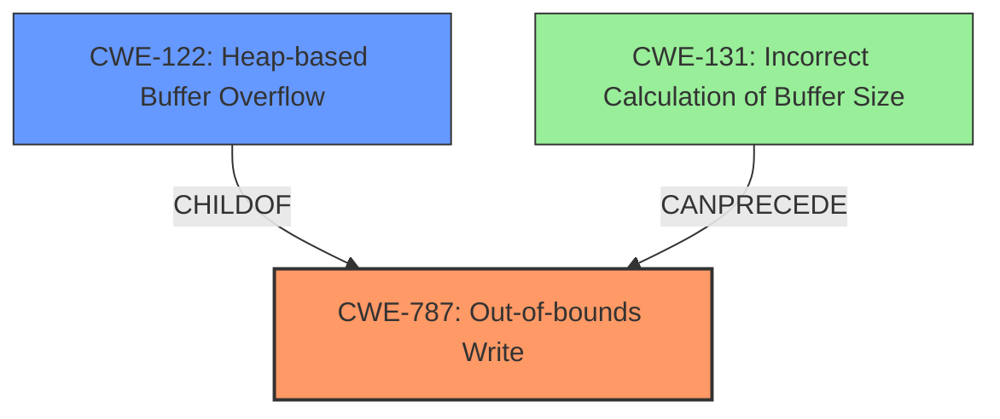

# Final Resolution for CVE-2021-23165

# Summary
| CWE ID | CWE Name | Confidence | CWE Abstraction Level | CWE Vulnerability Mapping Label | CWE-Vulnerability Mapping Notes |
|---|---|---|---|---|---|
| CWE-787 | Out-of-bounds Write | 0.95 | Base | Allowed | Primary CWE. The vulnerability leads to writing data past the end of the intended buffer. |
| CWE-122 | Heap-based Buffer Overflow | 0.85 | Variant | Allowed |  Secondary CWE. The **heap buffer overflow** occurs because the buffer is allocated on the heap. |
| CWE-131 | Incorrect Calculation of Buffer Size | 0.60 | Base | Allowed | Tertiary CWE. The buffer size may have been calculated incorrectly, leading to insufficient space. |

## Evidence and Confidence

*   **Confidence Score:** 0.85
*   **Evidence Strength:** MEDIUM

## Relationship Analysis
The primary relationship is that CWE-122 is a child of CWE-787, providing more specific information about the location of the buffer. CWE-131 **CanPrecede** CWE-787, if the size of the buffer was calculated incorrectly, leading to insufficient space and a subsequent out-of-bounds write.

## Vulnerability Chain
The vulnerability chain starts with a potential **incorrect calculation of buffer size** (CWE-131). This leads to a buffer being allocated with insufficient space. Subsequently, when data is written to the buffer, it overflows (CWE-787), specifically on the heap (CWE-122), leading to potential arbitrary code execution or denial of service.
  - The initial **flaw** is a missing or incorrect boundary check in `pspdf_prepare_outpages()`.
  - This results in a **heap buffer overflow** (CWE-122), which is a specific instance of an **out-of-bounds write** (CWE-787).
  - The consequence is the potential to **execute arbitrary code** or cause a **denial of service**.

## Summary of Analysis
The initial analysis correctly identified CWE-787 and CWE-122. The confidence in CWE-122 has been raised to 0.85 based on the explicit mention of "heap buffer overflow" in the vulnerability description.

The criticism raised the important point of considering the root cause of the missing boundary check. Specifically, the analysis now includes CWE-131 (Incorrect Calculation of Buffer Size) as a contributing factor with a confidence of 0.60. This is based on the possibility that the buffer size calculation in `pspdf_prepare_outpages()` was flawed, leading to the **buffer overflow**. While there is no direct evidence for this in the vulnerability description, it is a plausible contributing factor.

The decision to include CWE-131 is influenced by:
  - The high retriever score for CWE-131.
  - The **CanPrecede** relationship between CWE-131 and CWE-787.

The selected CWEs are at the optimal level of specificity because:
  - CWE-787 is a base-level CWE that accurately describes the out-of-bounds write.
  - CWE-122 is a variant-level CWE that provides specific context about the location of the overflow on the heap.
  - CWE-131 is a base-level CWE that represents a plausible root cause related to incorrect buffer size calculation.