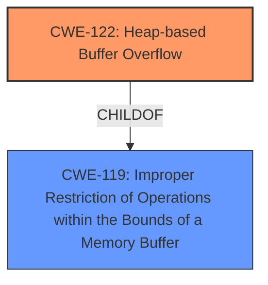

# Analysis Report for CVE-2021-23169

# Vulnerability Analysis Report: CVE-2021-23169

## Description

A heap-buffer overflow was found in the copyIntoFrameBuffer function of OpenEXR in versions before 3.0.1. An attacker could use this flaw to execute arbitrary code with the permissions of the user running the application compiled against OpenEXR.

## Vulnerability Description Key Phrases

**Rootcause:** heap-buffer overflow
**Impact:** execute arbitrary code
**Attacker:** attacker
**Product:** OpenEXR
**Version:** before 3.0.1
**Component:** copyIntoFrameBuffer function

## Analysis (with Relationship Data)

# Summary
| CWE ID | CWE Name | Confidence | CWE Abstraction Level | CWE Vulnerability Mapping Label | CWE-Vulnerability Mapping Notes |
|---|---|---|---|---|---|
| CWE-122 | Heap-based Buffer Overflow | 0.95 | Variant | Allowed | Primary CWE |
| CWE-119 | Improper Restriction of Operations within the Bounds of a Memory Buffer | 0.65 | Class | Allowed | Secondary CWE |

## Evidence and Confidence

*   **Confidence Score:** 0.90
*   **Evidence Strength:** HIGH

- **Analysis and Justification:**  
  - *Explanation:* The vulnerability description explicitly states a "**heap-buffer overflow**" in the `copyIntoFrameBuffer` function of OpenEXR. The CVE Reference Links Content Summary confirms this, stating "**Heap-buffer-overflow** in the `Imf_2_5::copyIntoFrameBuffer` function" and listing "**Heap-buffer-overflow**" as a weakness. CWE-122 (Heap-based Buffer Overflow) directly addresses this vulnerability type. The description aligns perfectly with CWE-122's definition: "A heap overflow condition is a buffer overflow, where the buffer that can be overwritten is allocated in the heap portion of memory, generally meaning that the buffer was allocated using a routine such as malloc()." The impact is code execution, which is a common consequence of heap overflows.
  - *Relationship Analysis:* CWE-122 is a Variant of CWE-119 (Improper Restriction of Operations within the Bounds of a Memory Buffer). While CWE-119 is a broader category, CWE-122 is more specific to heap-based overflows, making it a more accurate classification in this case.

- **Confidence Score:**
  - Confidence: 0.95 (High confidence due to the explicit mention of "heap-buffer overflow" in both the vulnerability description and the CVE reference summary).

---

- **Analysis and Justification:**  
  - *Explanation:* CWE-119 (Improper Restriction of Operations within the Bounds of a Memory Buffer) is a broader class of buffer overflow vulnerabilities. Since the vulnerability is a heap-based buffer overflow, CWE-122, a variant of CWE-119, is a more precise classification. While CWE-122 is primary, CWE-119 represents the general class of weakness and is included to show the hierarchical relationship and general root cause. The root cause is the lack of proper bounds checking when writing data to the heap-allocated buffer, leading to out-of-bounds write.
  - *Relationship Analysis:* CWE-119 is a parent of CWE-122. Including CWE-119 highlights the general class to which the more specific CWE-122 belongs.

- **Confidence Score:**
  - Confidence: 0.65 (Medium confidence. While clearly related as the parent, CWE-122 is a better fit for the description)

## Criticism of Analysis

Okay, let's review the analysis of the OpenEXR heap-buffer overflow, considering the full CWE specifications.

**Overall Assessment:**

The primary CWE mapping to `CWE-122: Heap-based Buffer Overflow` is correct and well-justified. The secondary mapping to `CWE-119: Improper Restriction of Operations within the Bounds of a Memory Buffer` is also appropriate as a broader, more general classification, although as the analysis correctly points out, `CWE-122` is more specific and therefore a better fit as the primary weakness.  The confidence scores are reasonable.

**Detailed Review:**

**1. CWE-122: Heap-based Buffer Overflow**

*   **Correctness:** Excellent. The vulnerability description explicitly states "heap-buffer overflow," and the CVE summary confirms this. `CWE-122` directly addresses this. The explanation correctly references that a heap overflow occurs in the heap portion of memory and often involves `malloc()`-like routines, which is the expected scenario.
*   **Confidence Score:** 0.95 is warranted due to the explicit nature of the vulnerability report.
*   **CWE Specification Alignment:**  The analysis aligns perfectly with the `CWE-122` description: "A heap overflow condition is a buffer overflow, where the buffer that can be overwritten is allocated in the heap portion of memory, generally meaning that the buffer was allocated using a routine such as malloc()." The observed examples in the CWE specifications, such as `CVE-2021-43537`, `CVE-2007-4268`, and `CVE-2009-2523`, also demonstrate that a heap-based buffer overflow can be the direct result of other CWEs.
*   **Mitigation Appropriateness:** The mitigations listed in the full CWE specifications (using memory safe languages, abstraction libraries, and compiler-based overflow detection) are all applicable and effective strategies to prevent or detect this type of vulnerability.

**2. CWE-119: Improper Restriction of Operations within the Bounds of a Memory Buffer**

*   **Correctness:** Including `CWE-119` is reasonable because `CWE-122` is a *Variant* of `CWE-119`. This means that an occurrence of `CWE-122` is inherently an occurrence of `CWE-119`. However, since we *know* it's a heap-based buffer overflow, `CWE-122` provides more specific information.
*   **Confidence Score:** 0.65 is also reasonable. While relevant, it's less precise than `CWE-122`.
*   **CWE Specification Alignment:** The analysis is accurate in stating that `CWE-119` is a broader class. The mapping guidance for `CWE-119` explicitly states "Look at CWE-119's children and consider mapping to CWEs such as CWE-787: Out-of-bounds Write, CWE-125: Out-of-bounds Read, or others." In this case, `CWE-122` fits better.  The 'Frequent Misuse' usage reason further supports this.
*   **Mitigation Appropriateness:** The mitigations listed for `CWE-119` (memory safe languages, vetted libraries, and compiler-based overflow detection) are broadly applicable to buffer overflow vulnerabilities in general and thus relevant, but less targeted than those for `CWE-122`.

**Review of Retriever Results:**

The Retriever Results section provides a list of possible CWEs from different retriever methods. Here's a quick review of some of the top hits relative to the analysis:

*   **CWE-190: Integer Overflow or Wraparound:** While *not* the primary weakness, an integer overflow could *contribute* to a heap-based buffer overflow. If the buffer size calculation involves an integer that overflows, it could lead to the allocation of a smaller buffer than expected, making the overflow possible. This is reflected in the observed examples for CWE-122, such as `CVE-2021-43537`. However, without more information in the original report, it is hard to confirm this.
*   **CWE-193: Off-by-one Error:** Similar to `CWE-190`, an off-by-one error in calculating the buffer size or the amount of data to copy could contribute to the overflow. Again, hard to confirm based on the given information.
*   **CWE-125: Out-of-bounds Read:** While this is a *write* overflow, an out-of-bounds read might occur *before* the write, potentially influencing the data being written or the calculation of buffer sizes.
*   **CWE-770: Allocation of Resources Without Limits or Throttling:** It's *possible*, but not directly related. If the vulnerability is exploitable because an attacker can repeatedly trigger the heap overflow and exhaust memory, then `CWE-770` might be relevant as a secondary consequence.
*   **CWE-787: Out-of-bounds Write:** This is very close to `CWE-122`. `CWE-122` is the better fit as it specifies that the out-of-bounds write is happening on the heap.
*   **CWE-131: Incorrect Calculation of Buffer Size:** This could definitely be a contributing factor. If the code isn't calculating the correct buffer size, it is more likely to be overflowed.

**Recommendations for Improvement (Minor):**

*   **Chain Analysis (Optional):**  While not necessary for this particular analysis, it might be helpful to *briefly* mention the possibility of contributing factors like `CWE-190` or `CWE-131` as part of a chain. For example: "While the primary weakness is CWE-122, it's possible that an incorrect buffer size calculation (CWE-131) or integer overflow (CWE-190) contributed to the vulnerability by resulting in a smaller-than-expected buffer allocation."
*   **Mitigation Specificity:** The analysis could also be slightly improved by emphasizing mitigations that are *most* relevant to *heap*-based buffer overflows. For instance, discuss the use of tools like AddressSanitizer (ASan) or Valgrind during development, which are specifically designed to detect heap memory errors.

**Conclusion:**

The analysis is well-reasoned and accurate. The primary CWE mapping is correct, and the inclusion of the secondary CWE provides additional context. The confidence scores are appropriate. The minor suggestions above are for further refinement, but the existing analysis is solid.

## Final Resolution

# Summary
| CWE ID | CWE Name | Confidence | CWE Abstraction Level | CWE Vulnerability Mapping Label | CWE-Vulnerability Mapping Notes |
|---|---|---|---|---|---|
| CWE-122 | Heap-based Buffer Overflow | 0.95 | Variant | Allowed | Primary CWE |
| CWE-119 | Improper Restriction of Operations within the Bounds of a Memory Buffer | 0.65 | Class | Allowed | Secondary CWE |

## Evidence and Confidence

*   **Confidence Score:** 0.95
*   **Evidence Strength:** HIGH

## Relationship Analysis
The primary relationship influencing the classification is the parent-child relationship between CWE-119 and CWE-122. CWE-122 is a variant of CWE-119, making it a more specific classification for a heap-based buffer overflow. The abstraction levels also played a role, as the variant level of CWE-122 provides more precise information than the class level of CWE-119.

## Vulnerability Chain
The vulnerability chain starts with the **ROOTCAUSE** of improper bounds checking during memory allocation on the heap. This leads to the **WEAKNESS** of a heap-based buffer overflow (CWE-122), where data can be written beyond the allocated buffer. The consequence of this is the potential for arbitrary code execution.

## Summary of Analysis
The initial analysis and criticism both agree that CWE-122 is the most appropriate primary CWE. The vulnerability description explicitly mentions "heap-buffer overflow," aligning directly with the definition of CWE-122. The secondary CWE, CWE-119, is included to represent the broader class of buffer overflows. The relationship analysis reinforces this decision, as CWE-122 is a variant of CWE-119, providing a more specific classification. The evidence is strong, and the confidence is high due to the explicit mention of "heap-buffer overflow" in the vulnerability description: "A heap-buffer overflow was found in the copyIntoFrameBuffer function of OpenEXR in versions before 3.0.1." The selected CWEs are at the optimal level of specificity, with CWE-122 capturing the heap-based nature of the overflow and CWE-119 providing context as the general class of weakness.

*Report generated on 2025-03-17 23:14:40*
