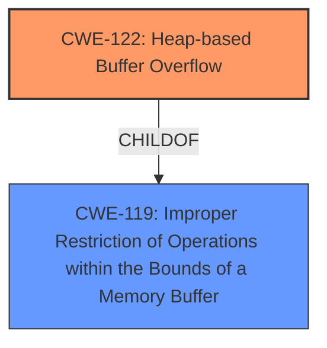

# Final Resolution for CVE-2021-23169

# Summary
| CWE ID | CWE Name | Confidence | CWE Abstraction Level | CWE Vulnerability Mapping Label | CWE-Vulnerability Mapping Notes |
|---|---|---|---|---|---|
| CWE-122 | Heap-based Buffer Overflow | 0.95 | Variant | Allowed | Primary CWE |
| CWE-119 | Improper Restriction of Operations within the Bounds of a Memory Buffer | 0.65 | Class | Allowed | Secondary CWE |

## Evidence and Confidence

*   **Confidence Score:** 0.95
*   **Evidence Strength:** HIGH

## Relationship Analysis
The primary relationship influencing the classification is the parent-child relationship between CWE-119 and CWE-122. CWE-122 is a variant of CWE-119, making it a more specific classification for a heap-based buffer overflow. The abstraction levels also played a role, as the variant level of CWE-122 provides more precise information than the class level of CWE-119.

## Vulnerability Chain
The vulnerability chain starts with the **ROOTCAUSE** of improper bounds checking during memory allocation on the heap. This leads to the **WEAKNESS** of a heap-based buffer overflow (CWE-122), where data can be written beyond the allocated buffer. The consequence of this is the potential for arbitrary code execution.

## Summary of Analysis
The initial analysis and criticism both agree that CWE-122 is the most appropriate primary CWE. The vulnerability description explicitly mentions "heap-buffer overflow," aligning directly with the definition of CWE-122. The secondary CWE, CWE-119, is included to represent the broader class of buffer overflows. The relationship analysis reinforces this decision, as CWE-122 is a variant of CWE-119, providing a more specific classification. The evidence is strong, and the confidence is high due to the explicit mention of "heap-buffer overflow" in the vulnerability description: "A heap-buffer overflow was found in the copyIntoFrameBuffer function of OpenEXR in versions before 3.0.1." The selected CWEs are at the optimal level of specificity, with CWE-122 capturing the heap-based nature of the overflow and CWE-119 providing context as the general class of weakness.