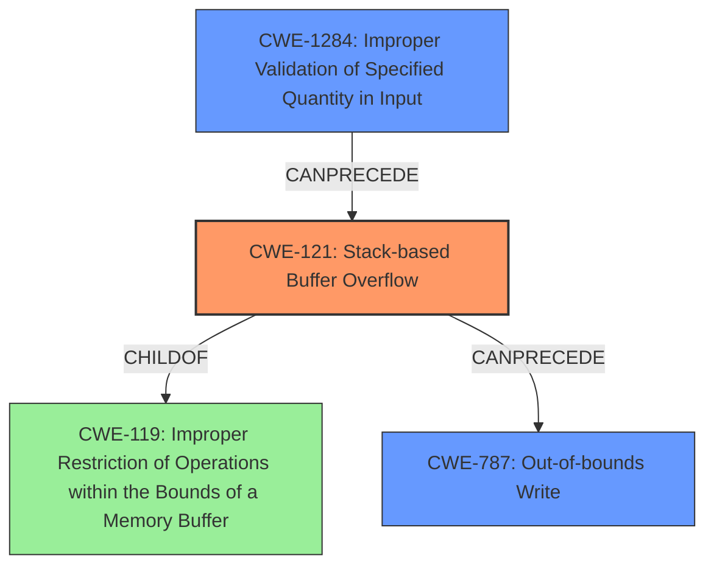

# Analysis Report for CVE-2021-23206

# Vulnerability Analysis Report: CVE-2021-23206

## Description

A flaw was found in htmldoc in v1.9.12 and prior. A stack buffer overflow in parse_table() in ps-pdf.cxx may lead to execute arbitrary code and denial of service.

## Vulnerability Description Key Phrases

**Rootcause:** stack buffer overflow
**Impact:** ['execute arbitrary code', 'denial of service']
**Product:** htmldoc
**Version:** v1.9.12 and prior
**Component:** parse_table() in ps-pdf.cxx

## Analysis (with Relationship Data)

# Summary
| CWE ID | CWE Name | Confidence | CWE Abstraction Level | CWE Vulnerability Mapping Label | CWE-Vulnerability Mapping Notes |
|---|---|---|---|---|---|
| CWE-121 | Stack-based Buffer Overflow | 0.95 | Variant | Allowed | Primary CWE: The vulnerability is a stack-based buffer overflow. |
| CWE-125 | Out-of-bounds Read | 0.70 | Base | Allowed | Secondary CWE: The root cause mentions insufficient input validation that leads to out-of-bounds reads. |
| CWE-787 | Out-of-bounds Write | 0.60 | Base | Allowed | Secondary CWE: The root cause mentions insufficient input validation that leads to out-of-bounds writes. |

## Evidence and Confidence

*   **Confidence Score:** 0.85
*   **Evidence Strength:** HIGH

- **Analysis and Justification:**  
  - *Explanation:* The vulnerability description clearly states a **stack buffer overflow** in the `parse_table()` function of `ps-pdf.cxx`. The CVE Reference Links Content Summary elaborates that the code doesn't properly validate the `colspan` and `rowspan` attributes of table elements, potentially leading to out-of-bounds writes to the `table.col_widths` array. This directly aligns with CWE-121 (Stack-based Buffer Overflow). The description explicitly mentions the overflow occurs on the stack, making CWE-121 a precise match. The CVE summary also mentions that the fix involves adding range checks to prevent out-of-bounds writes. CWE-125 (Out-of-bounds Read) and CWE-787 (Out-of-bounds Write) are considered as contributing factors due to the nature of buffer overflows, but CWE-121 is the primary weakness.
  
  - *Relationship Analysis:* CWE-121 is a variant of CWE-119 (Improper Restriction of Operations within the Bounds of a Memory Buffer). The vulnerability can potentially lead to other issues such as arbitrary code execution, which could involve CWE-269 (Improper Privilege Management) or CWE-284 (Improper Access Control). The root cause stems from insufficient input validation, suggesting a possible connection to CWE-20 (Improper Input Validation).

- **Confidence Score:**  
  - Confidence: 0.95 (High confidence due to the explicit mention of a stack buffer overflow and detailed technical explanation).
---

## Criticism of Analysis

Okay, I've reviewed the analysis of the htmldoc vulnerability against the provided CWE specifications. Here's a critique of the analysis, focusing on accuracy, completeness, and adherence to CWE guidelines:

**Overall Assessment:**

The analysis is generally good, especially in identifying CWE-121 as the primary weakness. The high confidence level assigned to it is justified. However, the secondary CWE mappings could be improved by focusing on the root cause, which is improper quantity validation.

**Detailed Review:**

*   **CWE-121: Stack-based Buffer Overflow**
    *   **Confidence:** 0.95 (High) - This is accurate and appropriate. The vulnerability description and CVE reference content explicitly describe a stack-based buffer overflow.
    *   **Justification:** The explanation is clear and well-supported by the provided information. The mention of `table.col_widths` residing on the stack directly points to this CWE.
    *   **CWE Abstraction Level:** Variant - Correctly identified.  CWE-121 is a variant of CWE-787.
    *   **Mapping Guidance:**  Adheres to the allowed usage of variant.
    *   **Potential Mitigations:** Appropriate. Using compilers with built-in buffer overflow detection mechanisms, using safe string handling functions or libraries, and implementing bounds checking are all standard mitigations for stack-based buffer overflows.
    *   **Improvements:** The analysis correctly identifies CWE-121 as the primary weakness.

*   **CWE-125: Out-of-bounds Read**
    *   **Confidence:** 0.70 - This is a reasonable assessment. While an out-of-bounds *write* is the direct action causing the overflow, the insufficient validation *could* also lead to out-of-bounds reads, especially if the code attempts to determine the size of the input based on corrupted metadata.
    *   **Justification:** The justification is weak. While a buffer overflow can *lead* to an out-of-bounds read, it's not a direct consequence in this case. The root cause is the lack of validation *before* the write occurs.
    *   **CWE Abstraction Level:** Base - Correctly identified.
    *   **Mapping Guidance:**  Adheres to the allowed usage.
    *   **Potential Mitigations:** Assumes all inputs are malicious, use input validation frameworks, and validate and ensure correct calculations for length arguments, buffer size calculation or offsets are great potential mitigations.
    *   **Improvements:** This could be removed, or the justification could be strengthened by providing a clearer scenario in which the out-of-bounds read occurs. This is more of a *potential* consequence, not a contributing factor.
    *   Consider how the read occurs. Are they reading *before* the buffer or *after* the buffer? Or are they reading another variable on the stack?

*   **CWE-787: Out-of-bounds Write**
    *   **Confidence:** 0.60 - This is a reasonable assessment. The description details that there is insufficient input validation that causes an out-of-bounds write to `table.col_widths`.
    *   **Justification:** The justification is adequate. The fact that the `colspan` and `rowspan` attributes of table elements are not properly validated leading to out-of-bounds writes to the `table.col_widths` array is a great reasoning.
    *   **CWE Abstraction Level:** Base - Correctly identified.
    *   **Mapping Guidance:**  Adheres to the allowed usage.
    *   **Potential Mitigations:** Using a language that does not allow this weakness to occur, using a vetted library or framework, and using automatic buffer overflow detection mechanisms are good potential mitigations.
    *    **Improvements:** The justification for this could be stronger.

**Alternative CWEs to Consider:**

*   **CWE-1284: Improper Validation of Specified Quantity in Input:** This is a strong contender and should be considered as a primary or secondary CWE instead of CWE-125. The root cause is that the code isn't validating the `colspan` and `rowspan` attributes, which are *quantities*. Using CWE-1284 would better describe the nature of the vulnerability. The analysis in the CVE description directly links to this CWE.
*   **CWE-20: Improper Input Validation:** While the analysis touches on this indirectly, explicitly mentioning CWE-20 (or preferably a more specific child CWE) would highlight the source of the problem. However, the mapping guidance for CWE-20 suggests to use children, like CWE-1284.

**General Improvements:**

*   **Chain Analysis:** The "Relationship Analysis" section is a good start, but it could be expanded to explicitly discuss potential CWE chains. For example:
    *   `CWE-20 (Improper Input Validation) -> CWE-1284 (Improper Validation of Specified Quantity in Input) -> CWE-121 (Stack-based Buffer Overflow) -> CWE-787 (Out-of-bounds Write)`
    This chain is more accurate and detailed than the analysis that was given.
*   **Balance in CWE Selection:** The analysis seems to focus too heavily on the direct memory corruption aspects (CWE-125, CWE-787) and not enough on the *cause* (validation). The focus should be on the primary root cause.

**Revised Analysis Summary (Suggested):**

| CWE ID | CWE Name | Confidence | CWE Abstraction Level | CWE Vulnerability Mapping Label | CWE-Vulnerability Mapping Notes |
|---|---|---|---|---|---|
| CWE-121 | Stack-based Buffer Overflow | 0.95 | Variant | Allowed | Primary CWE: The vulnerability is a stack-based buffer overflow. |
| CWE-1284 | Improper Validation of Specified Quantity in Input | 0.85 | Base | Allowed | Secondary CWE: The root cause is insufficient validation of the `colspan` and `rowspan` attributes which leads to out-of-bounds writes. |
| CWE-787 | Out-of-bounds Write | 0.60 | Base | Allowed | Secondary CWE: The root cause mentions insufficient input validation that leads to out-of-bounds writes. |

**In summary, the analysis is good, but can be improved by:**

1.  Strengthening the justification for including CWE-125 or removing it altogether.
2.  Emphasizing CWE-1284, as this better identifies the root cause of the vulnerability.
3.  Making a stronger case for chaining CWEs, such as by providing a specific chain and path.
4.   Focusing on identifying and describing the root cause in most depth.

By making these adjustments, the analysis will be more accurate, complete, and in line with CWE best practices.

## Final Resolution

# Summary
| CWE ID | CWE Name | Confidence | CWE Abstraction Level | CWE Vulnerability Mapping Label | CWE-Vulnerability Mapping Notes |
|---|---|---|---|---|---|
| CWE-121 | Stack-based Buffer Overflow | 0.95 | Variant | Allowed | Primary CWE: The vulnerability is a stack-based buffer overflow in the `parse_table()` function of `ps-pdf.cxx`. |
| CWE-1284 | Improper Validation of Specified Quantity in Input | 0.85 | Base | Allowed | Secondary CWE: The root cause is insufficient validation of the `colspan` and `rowspan` attributes, which are quantities, leading to out-of-bounds writes. |
| CWE-787 | Out-of-bounds Write | 0.60 | Base | Allowed | Secondary CWE: The vulnerability leads to out-of-bounds writes to the `table.col_widths` array. |

## Evidence and Confidence

*   **Confidence Score:** 0.90
*   **Evidence Strength:** HIGH

## Relationship Analysis
The primary weakness is a **CWE-121 (Stack-based Buffer Overflow)**, which is a variant of **CWE-119 (Improper Restriction of Operations within the Bounds of a Memory Buffer)**. The root cause is the improper validation of input quantities, which is best represented by **CWE-1284 (Improper Validation of Specified Quantity in Input)**. This improper validation leads to **CWE-787 (Out-of-bounds Write)**, which is a direct consequence of the overflow.

## Vulnerability Chain
The vulnerability chain starts with the lack of proper input validation (**CWE-1284**), specifically, failing to validate the `colspan` and `rowspan` attributes of table elements. This leads to a **CWE-121 (Stack-based Buffer Overflow)** when writing to the `table.col_widths` array. The direct consequence of this overflow is a **CWE-787 (Out-of-bounds Write)**, which can lead to arbitrary code execution or denial of service.

## Summary of Analysis
The initial analysis correctly identifies **CWE-121 (Stack-based Buffer Overflow)** as the primary weakness. However, the secondary CWE mappings could be improved. The criticism correctly points out that **CWE-1284 (Improper Validation of Specified Quantity in Input)** is a more accurate representation of the root cause compared to **CWE-125 (Out-of-bounds Read)**. The provided evidence from the vulnerability description states that the code doesn't properly validate the `colspan` and `rowspan` attributes. This directly aligns with **CWE-1284**. The choice of **CWE-121** is at the optimal level of specificity because the vulnerability is explicitly stated as a stack-based buffer overflow. **CWE-1284** and **CWE-787** are suitable secondary CWEs because they accurately describe the root cause and the immediate consequence of the overflow, respectively.

*Report generated on 2025-03-17 23:15:41*
