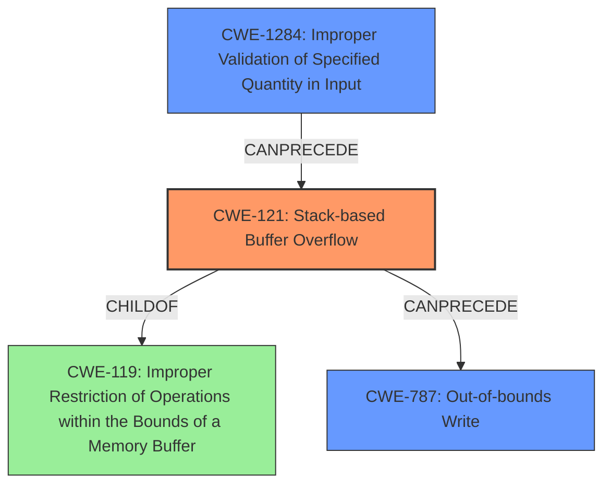

# Final Resolution for CVE-2021-23206

# Summary
| CWE ID | CWE Name | Confidence | CWE Abstraction Level | CWE Vulnerability Mapping Label | CWE-Vulnerability Mapping Notes |
|---|---|---|---|---|---|
| CWE-121 | Stack-based Buffer Overflow | 0.95 | Variant | Allowed | Primary CWE: The vulnerability is a stack-based buffer overflow in the `parse_table()` function of `ps-pdf.cxx`. |
| CWE-1284 | Improper Validation of Specified Quantity in Input | 0.85 | Base | Allowed | Secondary CWE: The root cause is insufficient validation of the `colspan` and `rowspan` attributes, which are quantities, leading to out-of-bounds writes. |
| CWE-787 | Out-of-bounds Write | 0.60 | Base | Allowed | Secondary CWE: The vulnerability leads to out-of-bounds writes to the `table.col_widths` array. |

## Evidence and Confidence

*   **Confidence Score:** 0.90
*   **Evidence Strength:** HIGH

## Relationship Analysis
The primary weakness is a **CWE-121 (Stack-based Buffer Overflow)**, which is a variant of **CWE-119 (Improper Restriction of Operations within the Bounds of a Memory Buffer)**. The root cause is the improper validation of input quantities, which is best represented by **CWE-1284 (Improper Validation of Specified Quantity in Input)**. This improper validation leads to **CWE-787 (Out-of-bounds Write)**, which is a direct consequence of the overflow.

## Vulnerability Chain
The vulnerability chain starts with the lack of proper input validation (**CWE-1284**), specifically, failing to validate the `colspan` and `rowspan` attributes of table elements. This leads to a **CWE-121 (Stack-based Buffer Overflow)** when writing to the `table.col_widths` array. The direct consequence of this overflow is a **CWE-787 (Out-of-bounds Write)**, which can lead to arbitrary code execution or denial of service.

## Summary of Analysis
The initial analysis correctly identifies **CWE-121 (Stack-based Buffer Overflow)** as the primary weakness. However, the secondary CWE mappings could be improved. The criticism correctly points out that **CWE-1284 (Improper Validation of Specified Quantity in Input)** is a more accurate representation of the root cause compared to **CWE-125 (Out-of-bounds Read)**. The provided evidence from the vulnerability description states that the code doesn't properly validate the `colspan` and `rowspan` attributes. This directly aligns with **CWE-1284**. The choice of **CWE-121** is at the optimal level of specificity because the vulnerability is explicitly stated as a stack-based buffer overflow. **CWE-1284** and **CWE-787** are suitable secondary CWEs because they accurately describe the root cause and the immediate consequence of the overflow, respectively.