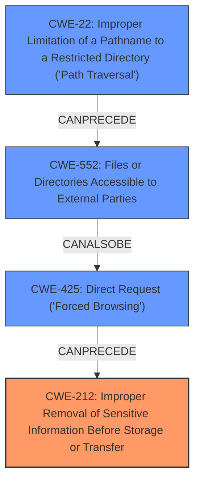

# Final Resolution for CVE-2021-23263

# Summary
| CWE ID | CWE Name | Confidence | CWE Abstraction Level | CWE Vulnerability Mapping Label | CWE-Vulnerability Mapping Notes |
|---|---|---|---|---|---|
| CWE-212 | Improper Removal of Sensitive Information Before Storage or Transfer | 0.7 | Base | Primary CWE | Allowed |
| CWE-425 | Direct Request ('Forced Browsing') | 0.7 | Base | Secondary Candidate | Allowed |
| CWE-552 | Files or Directories Accessible to External Parties | 0.5 | Base | Secondary Candidate | Allowed |
| CWE-22 | Improper Limitation of a Pathname to a Restricted Directory ('Path Traversal') | 0.3 | Base | Secondary Candidate | Allowed |

## Evidence and Confidence

*   **Confidence Score:** 0.7
*   **Evidence Strength:** MEDIUM

## Relationship Analysis
The primary change is to focus on the data handling issue of **CWE-212** Improper Removal of Sensitive Information Before Storage or Transfer. The relationships between CWEs are important, because the **direct request** (CWE-425) is the action, but the handling of the data is the root cause.

## Vulnerability Chain
The vulnerability chain starts with the FreeMarker component not properly removing sensitive information (CWE-212) from the files it serves. This allows unauthenticated attackers to make direct requests (CWE-425) to access these files, leading to the files or directories becoming accessible to external parties (CWE-552). The possibility of path traversal (CWE-22) further exacerbates the issue, potentially allowing access to more sensitive files.

## Summary of Analysis
The initial analysis was well-reasoned, but the criticism correctly identified that the primary focus should be on the data handling issue. The change to **CWE-212** as the primary CWE reflects this shift in focus.

The evidence is based on the vulnerability description, which states that "Unauthenticated remote attackers can read textual content via FreeMarker including files /scripts/*, /templates/* and some of the files in /.git/* (non-binary)." This directly supports the classification of CWE-212, as sensitive information is being exposed. The fact that this information is textual content is the key aspect.

The graph relationships influenced the final selection by highlighting the chain of events that leads to the vulnerability. The change to CWE-212 as the primary CWE reflects a better understanding of the root cause.

The selected CWEs are at the optimal level of specificity because they directly address the vulnerability. CWE-212 is a Base-level CWE, which is preferred for mapping to the root causes of vulnerabilities. The other CWEs are also at the Base level, providing a good level of granularity.