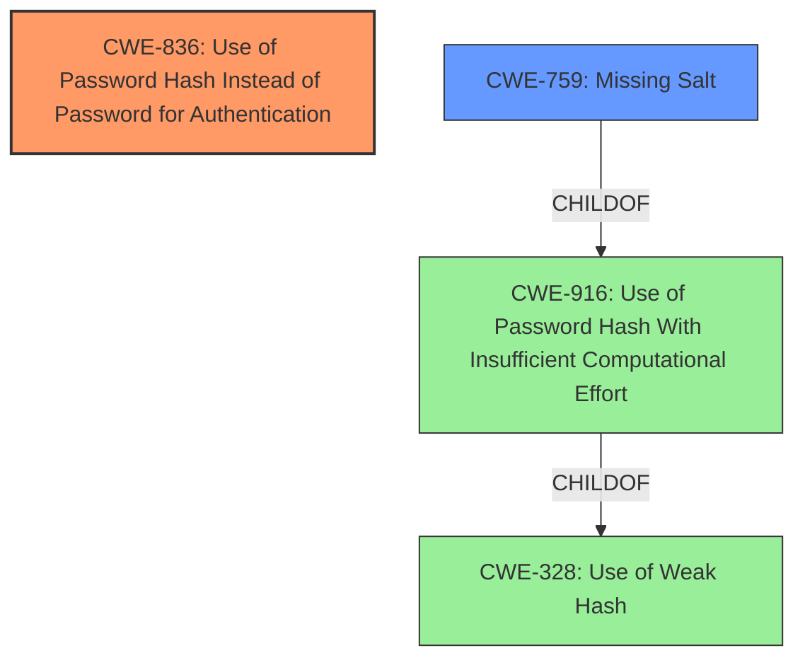

# Final Resolution for CVE-2021-23857

# Summary
| CWE ID | CWE Name | Confidence | CWE Abstraction Level | CWE Vulnerability Mapping Label | CWE-Vulnerability Mapping Notes |
|---|---|---|---|---|---|
| **CWE-836** | **Use of Password Hash Instead of Password for Authentication** | 0.95 | Base | Allowed | Primary CWE |
| **CWE-759** | **Missing Salt** | 0.8 | Variant | Allowed | Secondary Candidate |

## Evidence and Confidence

*   **Confidence Score:** 0.9
*   **Evidence Strength:** MEDIUM

## Relationship Analysis
The primary relationship is the child-parent relationship between **CWE-759** and **CWE-916**, and **CWE-916** and **CWE-328**. However, since there is no explicit mention of a weak hash algorithm in the vulnerability description, it is better to focus on **CWE-759**, which is about the missing salt. This makes the classification more specific. **CWE-836** stands alone as the core issue.

## Vulnerability Chain
The chain starts with the flawed design of allowing login with a password hash (**CWE-836**). If the password hashes are stored without a salt (**CWE-759**), this increases the likelihood of successful attacks such as rainbow table attacks or pre-computation attacks, leading to unauthorized access.

## Summary of Analysis
The initial analysis correctly identified **CWE-836** as the primary issue since the vulnerability description explicitly states that the system allows login using the password hash instead of the actual password.

The criticism suggested considering **CWE-759** (Missing Salt) or **CWE-760** (Use of a One-Way Hash with a Predictable Salt). Given the vulnerability description, it's more reasonable to assume a missing salt rather than a predictable one, as the description makes no mention of any salt being used. Therefore, I am choosing **CWE-759** as a secondary weakness.

I am removing **CWE-916**. While a weak hashing algorithm *could* be present, there's no direct evidence in the description to support it. **CWE-759** is more directly related to the core issue of using password hashes for authentication without proper protection.

The selected CWEs are at the optimal level of specificity. **CWE-836** accurately describes the core flaw, and **CWE-759** highlights the increased risk due to the lack of salting. These classifications provide actionable information for remediation.