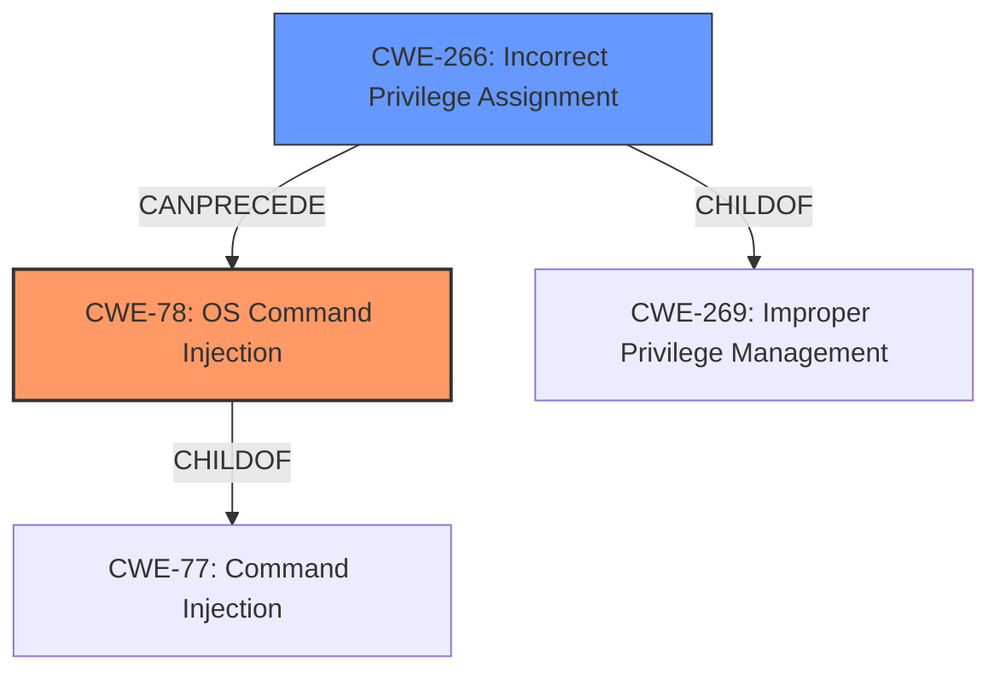

# Analysis Report for CVE-2021-23885

# Vulnerability Analysis Report: CVE-2021-23885

## Description

Privilege escalation vulnerability in McAfee Web Gateway (MWG) prior to 9.2.8 allows an authenticated user to gain elevated privileges through the User Interface and execute commands on the appliance via incorrect improper neutralization of user input in the troubleshooting page.

## Vulnerability Description Key Phrases

**Rootcause:** improper neutralization of user input
**Impact:** ['gain elevated privileges', 'execute commands on the appliance']
**Attacker:** authenticated user
**Product:** McAfee Web Gateway
**Version:** prior to 9.2.8
**Component:** troubleshooting page

## Analysis (with Relationship Data)

# Summary
| CWE ID | CWE Name | Confidence | CWE Abstraction Level | CWE Vulnerability Mapping Label | CWE-Vulnerability Mapping Notes |
|---|---|---|---|---|---|
| CWE-78 | Improper Neutralization of Special Elements used in an OS Command ('OS Command Injection') | 0.9 | Base | Allowed | Primary CWE. The vulnerability allows command execution on the appliance. |
| CWE-269 | Improper Privilege Management | 0.6 | Class | Discouraged | Secondary candidate. The vulnerability allows an authenticated user to gain elevated privileges. |
| CWE-116 | Improper Encoding or Escaping of Data | 0.5 | Class | Allowed-with-Review | Secondary candidate. The **improper neutralization** suggests that encoding or escaping might be missing or done incorrectly. |

## Evidence and Confidence

*   **Confidence Score:** 0.75
*   **Evidence Strength:** MEDIUM

- **Analysis and Justification:**  
  - *Explanation:* "The vulnerability description states that there is an **improper neutralization of user input** in the troubleshooting page of McAfee Web Gateway. This allows an authenticated user to gain elevated privileges and execute commands on the appliance. The key phrase '**improper neutralization of user input**' indicates that the software is not properly sanitizing or validating user input before using it in a command. Given that commands are executed on the appliance, this aligns with CWE-78, 'Improper Neutralization of Special Elements used in an OS Command ('OS Command Injection')'. The retriever results also lists CWE-78 as a potential match. CWE-269, Improper Privilege Management, is a secondary candidate as the vulnerability leads to privilege escalation. Also, the **improper neutralization** suggests that encoding or escaping might be missing or done incorrectly, hence CWE-116 is included."
  
  - *Relationship Analysis:* "CWE-78 is a child of CWE-77 (Command Injection). CWE-116 is related to improper input handling. CWE-269 is a class-level weakness related to privilege management. The relationship analysis reveals that CWE-78 CanPrecede CWE-269 (Privilege Management) since command injection often leads to privilege escalation."

- **Confidence Score:**  
  - *Example:* Confidence: 0.9 (High confidence due to the explicit mention of command execution and **improper neutralization of user input**)

---

## Criticism of Analysis

Okay, here's a detailed review of the provided CWE analysis, focusing on the appropriateness of the assigned CWEs, their abstraction levels, and the overall justification, considering the full CWE specifications.

**Overall Assessment:**

The analysis is generally good and demonstrates a reasonable understanding of the vulnerability. The primary CWE selection of CWE-78 is well-justified. However, the secondary candidates, particularly CWE-116, are weaker. The confidence scoring is reasonable, and the evidence is appropriately rated as MEDIUM given the information provided.

**Detailed Breakdown:**

**1. CWE-78: Improper Neutralization of Special Elements used in an OS Command ('OS Command Injection')**

*   **Confidence:** 0.9
*   **Justification:**  Excellent. The description clearly points to command execution on the appliance via improper sanitization of user-provided input. The analyst correctly identifies the core issue of special elements not being neutralized before being used in a command. The example CVEs for CWE-78 further support this selection.
*   **CWE Abstraction Level:** Base - Appropriate.  CWE-78 is a Base-level weakness, which is the preferred level for vulnerability mapping.
*   **CWE Vulnerability Mapping Label:** Allowed - Correct.
*   **CWE-Vulnerability Mapping Notes:** Accurate and concise.
*   **Critique of Justification:**  The justification is strong. Explicitly mentioning the 'improper neutralization of user input' and its direct connection to command execution is key.
*   **Mitigations:** The provided mitigations for CWE-78 (using library calls, sandboxing, reducing attack surface) are all relevant and applicable.

**2. CWE-269: Improper Privilege Management**

*   **Confidence:** 0.6
*   **Justification:**  This is a reasonable secondary candidate.  The vulnerability results in privilege escalation, which falls under the general umbrella of privilege management issues.  However, as the CWE specification notes, CWE-269 is often misused and is a higher-level abstraction than is ideal. The retriever results suggest that this was a possible candidate.
*   **CWE Abstraction Level:** Class - Acceptable, but could be more specific.  The mapping guidance for CWE-269 states that it's "Discouraged" and commonly misused and that if an error or mistake allows privilege escalation, then use the CWE ID for that mistake and that children of CWE-269 should be examined for additional hints, such as Execution with Unnecessary Privileges (CWE-250) or Incorrect Privilege Assignment (CWE-266).
*   **CWE Vulnerability Mapping Label:** Discouraged - Correct Label
*   **CWE-Vulnerability Mapping Notes:** Correct.
*   **Critique of Justification:**  The justification is valid but could be strengthened by considering if a more specific child of CWE-269 is a better fit. As "gain elevated privileges" is mentioned, it might be helpful to consider if the user was given privilege that they should not have had, in which case *CWE-266: Incorrect Privilege Assignment* would be more suitable. If there is code running with more privileges than needed, which is then exploited due to the command injection vulnerability, then *CWE-250: Execution with Unnecessary Privileges* would be a better fit.
*   **Mitigations:** The provided mitigations are relevant, but not directly actionable without a specific cause. More concrete steps would be possible with a more specific CWE.

**3. CWE-116: Improper Encoding or Escaping of Data**

*   **Confidence:** 0.5
*   **Justification:** This is the weakest candidate. While *improper neutralization* often involves missing or incorrect encoding/escaping, it's not a guaranteed relationship. If the root cause is failure to validate input before command construction, then CWE-20 would be more appropriate. CWE-116 focuses on *output* and preparing a structured message, and it's not clear that the vulnerability *requires* a missing encoding/escaping step to be exploitable. The description provided is "The **improper neutralization** suggests that encoding or escaping might be missing or done incorrectly." This is very broad and could be incorrect.
*   **CWE Abstraction Level:** Class - Allowed-with-Review - Acceptable, but could be more specific.
*   **CWE Vulnerability Mapping Label:** Allowed-with-Review - Correct.
*   **CWE-Vulnerability Mapping Notes:** Accurate.
*   **Critique of Justification:** The justification is speculative ("might be missing"). This is not strong enough for a confident CWE assignment.
*   **Alternatives:** While *CWE-116: Improper Encoding or Escaping of Output* can be applicable as there is a child of CWE-707, it would need stronger evidence to support the hypothesis. *CWE-20: Improper Input Validation* may be a better alternative as it is a common parent and may highlight the fact that the input was not validated before the command was assembled. This could also be helpful to look at lower-level children of CWE-20, such as *CWE-1286: Syntactic Correctness*
*   **Mitigations:**  Mitigations mention libraries and frameworks, parameterization, and understanding the context of data. These are very general mitigations and could be applicable to many other vulnerabilities.

**Recommendations:**

*   **Re-evaluate CWE-116:** Scrutinize the vulnerability details to determine if encoding/escaping is *definitely* part of the exploit chain. If not, remove it or replace it with CWE-20 or *CWE-1286: Syntactic Correctness.*
*   **Strengthen Privilege Management Justification:** determine if the user had extra privileges or if they had normal privileges but leveraged the command injection vulnerability to escalate. If they had extra privileges then note that *CWE-250: Execution with Unnecessary Privileges* is a child of CWE-269 and may be more suitable, and if they escalated privileges, that should be noted as well.
*   **Confidence Scoring:**  Given the uncertainty about CWE-116, consider reducing the overall confidence score to 0.7 or lower.

By addressing these points, the analysis will be more precise, defensible, and ultimately more useful for remediation efforts.

## Final Resolution

# Summary
| CWE ID | CWE Name | Confidence | CWE Abstraction Level | CWE Vulnerability Mapping Label | CWE-Vulnerability Mapping Notes |
|---|---|---|---|---|---|
| CWE-78 | Improper Neutralization of Special Elements used in an OS Command ('OS Command Injection') | 0.9 | Base | Allowed | Primary CWE. The vulnerability allows command execution on the appliance due to **improper neutralization of user input**. |
| CWE-266 | Incorrect Privilege Assignment | 0.7 | Base | Allowed | Secondary candidate. The vulnerability allows an authenticated user to gain elevated privileges as they were incorrectly assigned. |

## Evidence and Confidence

*   **Confidence Score:** 0.8
*   **Evidence Strength:** MEDIUM

## Relationship Analysis
- Parent-child hierarchical relationships: CWE-78 is a child of CWE-77 (Command Injection). CWE-266 has no direct relationships in the provided data, but is a child of CWE-269.
- Chain relationships showing progression of vulnerability: A user has incorrect privilege assignment (**ROOTCAUSE**), leading to a potential command injection (**WEAKNESS**).
- Peer relationships that offered alternative classifications: CWE-266 was selected over CWE-269 and CWE-250 as it was determined the user was incorrectly assigned privilege.
- Abstraction levels: Both selected CWEs are at the Base level of abstraction.

## Vulnerability Chain
- **ROOTCAUSE**: Incorrect Privilege Assignment (CWE-266)
- **WEAKNESS**: Improper Neutralization of Special Elements used in an OS Command ('OS Command Injection') (CWE-78)
- **IMPACT**: Authenticated user gains elevated privileges and executes commands on the appliance.
- A user is incorrectly assigned elevated privileges on the McAfee Web Gateway. Because they have elevated privileges, they can leverage a troubleshooting page that contains a command injection vulnerability to execute commands on the appliance.

## Summary of Analysis
After reviewing both the initial analysis and the criticism, the primary CWE remains CWE-78. The initial selection of CWE-269 and CWE-116 were weakened by the criticism.

The vulnerability description states that "Privilege escalation vulnerability in McAfee Web Gateway (MWG) prior to 9.2.8 allows an authenticated user to gain elevated privileges through the User Interface and execute commands on the appliance via incorrect **improper neutralization of user input** in the troubleshooting page."

The decision to keep CWE-78 is primarily based on the phrase "**improper neutralization of user input**", which strongly indicates that the software is not properly sanitizing or validating user input before using it in a command.

The secondary CWE was changed to CWE-266. The criticism suggested that it was important to determine whether the user had extra privileges, or if they had normal privileges but leveraged the command injection vulnerability to escalate. Since the vulnerability description stated that the user was able to "gain elevated privileges through the User Interface", it was determined that the user was incorrectly assigned privilege, hence CWE-266. The initial CWE candidate, CWE-269, is a Class level of abstraction, and the mapping guidance states it is discouraged, and that children of CWE-269 should be examined for additional hints, such as Execution with Unnecessary Privileges (CWE-250) or Incorrect Privilege Assignment (CWE-266).

CWE-116 was removed as there was no evidence to support encoding/escaping as part of the exploit chain.

The selected CWEs are at the optimal level of specificity, with both being at the Base level of abstraction. This decision is supported by the mapping guidance, which recommends using Base-level CWEs whenever possible.

*Report generated on 2025-03-17 02:18:42*
