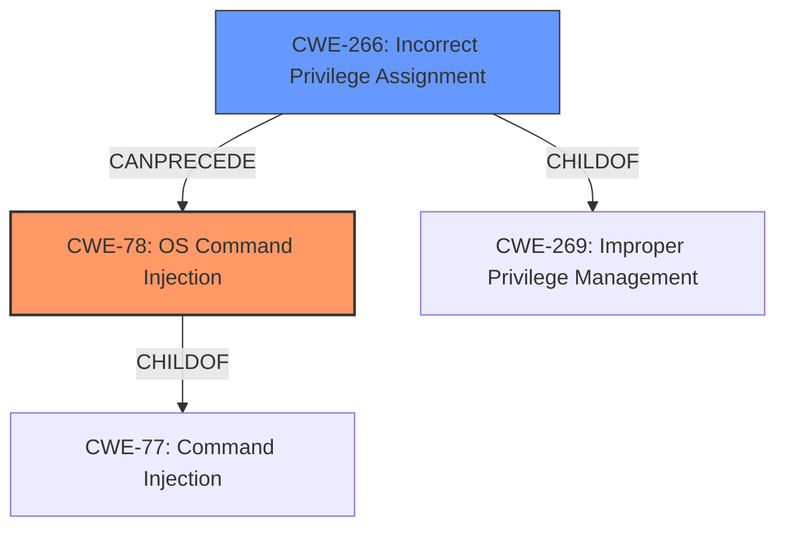

# Final Resolution for CVE-2021-23885

# Summary
| CWE ID | CWE Name | Confidence | CWE Abstraction Level | CWE Vulnerability Mapping Label | CWE-Vulnerability Mapping Notes |
|---|---|---|---|---|---|
| CWE-78 | Improper Neutralization of Special Elements used in an OS Command ('OS Command Injection') | 0.9 | Base | Allowed | Primary CWE. The vulnerability allows command execution on the appliance due to **improper neutralization of user input**. |
| CWE-266 | Incorrect Privilege Assignment | 0.7 | Base | Allowed | Secondary candidate. The vulnerability allows an authenticated user to gain elevated privileges as they were incorrectly assigned. |

## Evidence and Confidence

*   **Confidence Score:** 0.8
*   **Evidence Strength:** MEDIUM

## Relationship Analysis
- Parent-child hierarchical relationships: CWE-78 is a child of CWE-77 (Command Injection). CWE-266 has no direct relationships in the provided data, but is a child of CWE-269.
- Chain relationships showing progression of vulnerability: A user has incorrect privilege assignment (**ROOTCAUSE**), leading to a potential command injection (**WEAKNESS**).
- Peer relationships that offered alternative classifications: CWE-266 was selected over CWE-269 and CWE-250 as it was determined the user was incorrectly assigned privilege.
- Abstraction levels: Both selected CWEs are at the Base level of abstraction.

## Vulnerability Chain
- **ROOTCAUSE**: Incorrect Privilege Assignment (CWE-266)
- **WEAKNESS**: Improper Neutralization of Special Elements used in an OS Command ('OS Command Injection') (CWE-78)
- **IMPACT**: Authenticated user gains elevated privileges and executes commands on the appliance.
- A user is incorrectly assigned elevated privileges on the McAfee Web Gateway. Because they have elevated privileges, they can leverage a troubleshooting page that contains a command injection vulnerability to execute commands on the appliance.

## Summary of Analysis
After reviewing both the initial analysis and the criticism, the primary CWE remains CWE-78. The initial selection of CWE-269 and CWE-116 were weakened by the criticism.

The vulnerability description states that "Privilege escalation vulnerability in McAfee Web Gateway (MWG) prior to 9.2.8 allows an authenticated user to gain elevated privileges through the User Interface and execute commands on the appliance via incorrect **improper neutralization of user input** in the troubleshooting page."

The decision to keep CWE-78 is primarily based on the phrase "**improper neutralization of user input**", which strongly indicates that the software is not properly sanitizing or validating user input before using it in a command.

The secondary CWE was changed to CWE-266. The criticism suggested that it was important to determine whether the user had extra privileges, or if they had normal privileges but leveraged the command injection vulnerability to escalate. Since the vulnerability description stated that the user was able to "gain elevated privileges through the User Interface", it was determined that the user was incorrectly assigned privilege, hence CWE-266. The initial CWE candidate, CWE-269, is a Class level of abstraction, and the mapping guidance states it is discouraged, and that children of CWE-269 should be examined for additional hints, such as Execution with Unnecessary Privileges (CWE-250) or Incorrect Privilege Assignment (CWE-266).

CWE-116 was removed as there was no evidence to support encoding/escaping as part of the exploit chain.

The selected CWEs are at the optimal level of specificity, with both being at the Base level of abstraction. This decision is supported by the mapping guidance, which recommends using Base-level CWEs whenever possible.