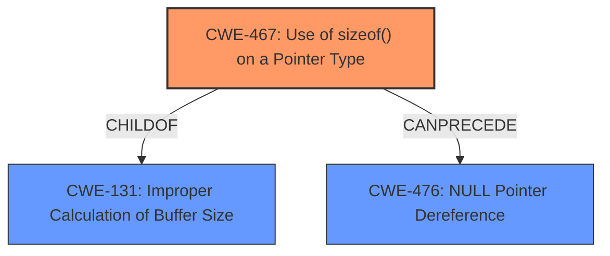

# Final Resolution for CVE-2021-23975

# Summary
| CWE ID | CWE Name | Confidence | CWE Abstraction Level | CWE Vulnerability Mapping Label | CWE-Vulnerability Mapping Notes |
|---|---|---|---|---|---|
| CWE-467 | Use of sizeof() on a Pointer Type | 0.90 | Variant | Allowed | Primary CWE; directly reflects the **incorrect** function call. Related to CWE-131. |
| CWE-131 | Improper Calculation of Buffer Size | 0.70 | Base | Allowed | Secondary CWE; CWE-467 is a ChildOf CWE-131, reflects the potential for **incorrect** size calculation. |
| CWE-476 | NULL Pointer Dereference | 0.65 | Base | Allowed | Secondary Candidate; plausible consequence of using sizeof() on an invalid pointer. |

## Evidence and Confidence

*   **Confidence Score:** 0.85
*   **Evidence Strength:** MEDIUM

## Relationship Analysis
The classification is primarily driven by the direct match of **CWE-467 (Use of sizeof() on a Pointer Type)** to the vulnerability description, which highlights the use of `sizeof()` on a pointer without validating its validity. This is further strengthened by the explicit ChildOf relationship between CWE-467 and **CWE-131 (Improper Calculation of Buffer Size)**, indicating that the **incorrect** use of `sizeof()` can lead to **incorrect** size calculations. **CWE-476 (NULL Pointer Dereference)** is retained as a secondary candidate due to the possibility of a NULL pointer dereference resulting from the **incorrect** memory access but is considered less direct.

## Vulnerability Chain
The vulnerability chain starts with the **root cause**, the **incorrect** use of `sizeof()` on a pointer (**CWE-467**). This can lead to an **improper calculation of buffer size** (**CWE-131**) because the size might not be what the programmer intended. This, in turn, *could* lead to a **NULL pointer dereference** (**CWE-476**) or another form of invalid memory access, ultimately resulting in a crash. The chain highlights the progression from the **incorrect** function call to its potential consequences.

## Summary of Analysis
The analysis is refined based on the criticism and additional CWE information. The primary classification remains **CWE-467 (Use of sizeof() on a Pointer Type)**, as it directly aligns with the vulnerability description: *"When this function was invoked we **incorrectly** called the sizeof function, instead of using the API method that checks for invalid pointers."* The inclusion of **CWE-131 (Improper Calculation of Buffer Size)** as a secondary CWE is based on the ChildOf relationship with CWE-467 and the potential for **incorrect** size calculation. **CWE-476 (NULL Pointer Dereference)** remains a plausible consequence. The final classification reflects a more comprehensive understanding of the vulnerability and its potential impacts.

The decision is primarily based on the direct evidence in the vulnerability description, strengthened by the relationship analysis and mapping guidance provided by MITRE. The selected CWEs are at the optimal level of specificity, representing the **root cause** and potential consequences of the vulnerability.