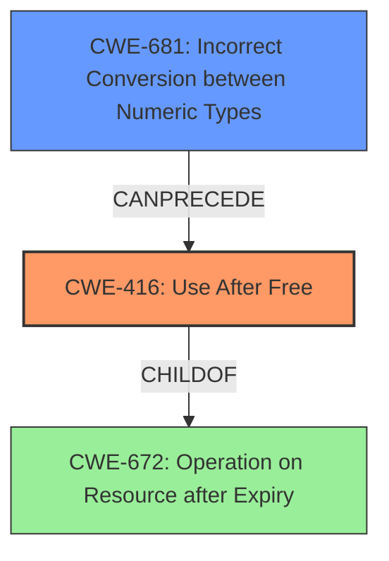

# Final Resolution for CVE-2021-23997

# Summary
| CWE ID | CWE Name | Confidence | CWE Abstraction Level | CWE Vulnerability Mapping Label | CWE-Vulnerability Mapping Notes |
|---|---|---|---|---|---|
| CWE-416 | Use After Free | 0.9 | Variant | Primary | Allowed. Mitigations include using languages with automatic memory management and setting pointers to NULL after freeing. |
| CWE-681 | Incorrect Conversion between Numeric Types | 0.7 | Base | Secondary | Allowed. The fix implemented (normalizing font sizes) aligns with the CWE-681 mitigation of avoiding numeric conversions and checking value ranges. |

## Evidence and Confidence

*   **Confidence Score:** 0.9
*   **Evidence Strength:** HIGH

## Relationship Analysis
The primary CWE, CWE-416 **Use After Free**, is a variant of CWE-672 (Operation on Resource after Expiry), indicating a hierarchical relationship where CWE-416 provides a more specific description of the vulnerability. The secondary CWE, CWE-681 **Incorrect Conversion between Numeric Types**, acts as a root cause that **CanPrecede** CWE-416, highlighting a chain relationship. This shows that the incorrect numeric conversion sets the stage for the use-after-free condition. The abstraction levels are appropriate, with CWE-416 being a Variant and CWE-681 a Base, reflecting specificity and root cause respectively.

## Vulnerability Chain
The vulnerability chain begins with CWE-681, **Incorrect Conversion between Numeric Types**, where floating-point font sizes are incorrectly converted, potentially leading to NaN values. This incorrect conversion then leads to a failure in properly managing the font cache, ultimately resulting in CWE-416, **Use After Free**, when the application attempts to access memory that has already been freed.
- Root Cause: CWE-681: Incorrect Conversion between Numeric Types
- Weakness: CWE-416: Use After Free
- Impact: Potential to run arbitrary code

## Summary of Analysis
The initial analysis correctly identified CWE-416 **Use After Free** as the primary weakness due to the explicit mention of a "use-after-free" condition in the vulnerability description. The analysis also correctly identified CWE-681 **Incorrect Conversion between Numeric Types** as a secondary weakness because the unexpected data type conversions contributed to fonts not being properly removed from the cache, leading to the **use-after-free**.

The vulnerability description states: "Due to unexpected data type conversions, a use-after-free could have occurred when interacting with the font cache."

The relationship analysis confirms that CWE-416 is a variant of CWE-672, making it a more specific and appropriate choice. The mitigation analysis for CWE-681 (avoiding conversions and checking ranges) aligns directly with the fix implemented (normalizing font sizes).

The selected CWEs are at the optimal level of specificity because CWE-416 is a Variant that directly describes the vulnerability, and CWE-681 is a Base that identifies the root cause. The confidence score has been increased to 0.9 to reflect the addition of mitigation considerations from the criticism.