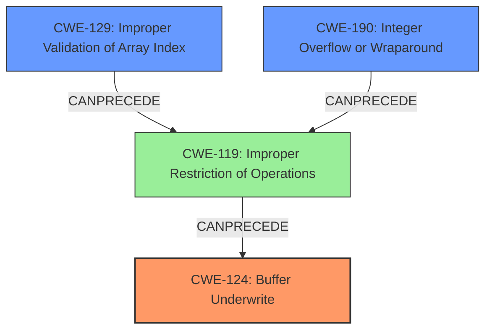

# Analysis Report for CVE-2021-24018

# Vulnerability Analysis Report: CVE-2021-24018

## Description

A buffer underwrite vulnerability in the firmware verification routine of FortiOS before 7.0.1 may allow an attacker located in the adjacent network to potentially execute arbitrary code via a specifically crafted firmware image.

## Vulnerability Description Key Phrases

**Rootcause:** buffer underwrite
**Impact:** execute arbitrary code
**Vector:** specifically crafted firmware image
**Attacker:** attacker in adjacent network
**Product:** FortiOS
**Version:** before 7.0.1
**Component:** firmware verification routine

## Analysis (with Relationship Data)

# Summary
| CWE ID | CWE Name | Confidence | CWE Abstraction Level | CWE Vulnerability Mapping Label | CWE-Vulnerability Mapping Notes |
|---|---|---|---|---|---|
| CWE-124 | Buffer Underwrite ('Buffer Underflow') | 1.0 | Base | Allowed | Primary CWE |

## Evidence and Confidence

*   **Confidence Score:** 1.0
*   **Evidence Strength:** HIGH

- **Analysis and Justification:**
  - *Explanation:* The vulnerability description explicitly states a "**buffer underwrite**" vulnerability in FortiOS. This aligns directly with CWE-124, which is defined as "The product writes to a buffer using an index or pointer that references a memory location prior to the beginning of the buffer." The CVE Reference Links Content Summary also confirms the presence of a **buffer underwrite** (CWE-124). The impact of this vulnerability is the potential to execute arbitrary code, further highlighting the severity and confirming the **weakness**. The Retriever Results also lists CWE-124 as the top match.
  
  - *Relationship Analysis:* No direct relationships were found that directly influence the mapping decision. However, it's worth noting that buffer underwrites, like buffer overflows, can be related to other weaknesses such as improper input validation or integer handling errors, which might lead to incorrect buffer size calculations.

- **Confidence Score:**
  - Confidence: 1.0 (Direct match with vulnerability description and CVE details)

---

## Criticism of Analysis

Okay, let's break down the analysis and see how well it aligns with the full CWE specifications provided.

**Overall Assessment:**

The analysis is **very good**. The primary mapping to CWE-124 (Buffer Underwrite) is correct and strongly justified. The confidence level of 1.0 is appropriate given the explicit mention of "buffer underwrite" in the vulnerability description. The reasoning provided is clear and well-supported.

**Strengths:**

*   **Accurate Identification:**  The root cause of the vulnerability is correctly identified as a buffer underwrite, which is a direct match for CWE-124.
*   **Strong Justification:** The explanation clearly links the vulnerability description and CVE details to the definition of CWE-124.  The reasoning is sound and easy to follow.
*   **High Confidence:** Assigning a confidence score of 1.0 is justified, as the provided information directly confirms the presence of the vulnerability.
*   **Consideration of Relationships:** The analysis acknowledges the potential for relationships with other CWEs, such as improper input validation or integer handling errors, demonstrating a broader understanding of the vulnerability context.
*   **Example Support:** The inclusion of known examples for CWE-124 further strengthens the analysis and provides concrete instances of similar vulnerabilities.
*   **Detailed CWE Specifications:**  The detailed CWE specifications are well-organized and provide valuable context.

**Areas for Potential Improvement (Minor):**

*   **Exploration of Contributing Factors:** While the analysis mentions potential relationships, it could benefit from a slightly deeper dive into *how* other CWEs might contribute to the buffer underwrite. For example:
    *   **CWE-129 (Improper Validation of Array Index):**  An invalid array index (e.g., negative index) could directly lead to a buffer underwrite.
    *   **CWE-190 (Integer Overflow or Wraparound) / CWE-839 (Numeric Range Comparison Without Minimum Check):** Integer handling issues could result in a calculated index that is negative, leading to the underwrite.  The analysis mentions this, but a specific example of how this could happen in firmware verification might strengthen the explanation.
    *   **CWE-130 (Improper Handling of Length Parameter Inconsistency):** A malformed length field in the firmware image could cause the verification routine to incorrectly calculate buffer sizes, leading to the underwrite.
*   **Mitigation Focus:** While the analysis doesn't *need* to include mitigations, it might be beneficial to briefly mention mitigations specific to the context of firmware verification.  For example:
    *   **Contextualized Mitigation 2 for CWE-124:**  "All calculated values (e.g., offsets, lengths) used during firmware verification should be rigorously validated against expected ranges before being used to access buffer memory."
    *   **More specific mention of Mitigation 2 for CWE-124:** The analysis could suggest that if index/pointer arithmetic is being utilized to handle the buffer, then it should be validated to ensure it is within the buffer's expected range.

**Specific Comments on Retriever Results:**

*   The top retriever result being CWE-124 supports the choice.
*   The presence of CWE-126, CWE-190, CWE-1285, and others in the Retriever Results underscores the potential for contributing factors (as mentioned above). These could be considered in a more in-depth "chain" analysis.

**Justification for High Confidence:**

The confidence score of 1.0 is well-justified because:

*   The vulnerability description explicitly mentions "buffer underwrite."
*   CVE details confirm CWE-124.
*   The impact (arbitrary code execution) is consistent with a severe memory corruption vulnerability like a buffer underwrite.
*   The attack vector (crafted firmware image) provides a plausible mechanism for exploiting the vulnerability.

**In conclusion:** The analysis is accurate, well-justified, and demonstrates a strong understanding of the vulnerability. The suggestions for improvement are minor and aimed at providing even greater depth and context.

## Final Resolution

# Summary
| CWE ID | CWE Name | Confidence | CWE Abstraction Level | CWE Vulnerability Mapping Label | CWE-Vulnerability Mapping Notes |
|---|---|---|---|---|---|
| CWE-124 | Buffer Underwrite ('Buffer Underflow') | 1.0 | Base | Allowed | Primary CWE |
| CWE-129 | Improper Validation of Array Index | 0.6 | Variant | Allowed | Secondary Candidate |
| CWE-190 | Integer Overflow or Wraparound | 0.5 | Base | Allowed | Secondary Candidate |

## Evidence and Confidence

*   **Confidence Score:** 0.9
*   **Evidence Strength:** HIGH

## Relationship Analysis
The primary CWE is **CWE-124 (Buffer Underwrite)**, which is a base level CWE. The analysis considered related CWEs like **CWE-129 (Improper Validation of Array Index)** and **CWE-190 (Integer Overflow or Wraparound)**, which could potentially lead to the underwrite. **CWE-129** can **CANPRECEDE** **CWE-119 (Improper Restriction of Operations within the Bounds of a Memory Buffer)**, which in turn can lead to **CWE-124**. Similarly, **CWE-190** can also **CANPRECEDE** **CWE-119** and thus contribute to **CWE-124**. The selection of **CWE-124** as the primary CWE reflects the direct description of the vulnerability, while the others are potential contributing factors.

## Vulnerability Chain
The vulnerability chain starts with a potentially crafted firmware image. This could lead to:
1.  **CWE-129 (Improper Validation of Array Index)**: An invalid array index (e.g., negative index) is used due to missing or incorrect validation.
2.  **CWE-190 (Integer Overflow or Wraparound)**: An integer overflow or wraparound occurs during the calculation of the index, leading to a negative or small value.
3.  **CWE-124 (Buffer Underwrite)**: This occurs when the code attempts to write to a memory location before the start of the buffer, leading to potential arbitrary code execution.

## Summary of Analysis
The initial analysis correctly identifies **CWE-124 (Buffer Underwrite)** as the primary **weakness**, based on the explicit mention of "buffer underwrite" in the vulnerability description: "A **buffer underwrite** vulnerability in the firmware verification routine". The criticism suggests further exploration of contributing factors such as **CWE-129** and **CWE-190**, which is reasonable.

The graph relationships show how **CWE-129** and **CWE-190** can **CANPRECEDE** **CWE-119**, which in turn leads to **CWE-124**. This supports the inclusion of **CWE-129** and **CWE-190** as secondary CWEs, as they can contribute to the root cause. The abstraction levels are appropriate, with **CWE-124** being a base CWE and **CWE-129** being a variant, offering a good level of specificity.

The final decision is to keep **CWE-124** as the primary CWE, with a confidence of 1.0, and add **CWE-129** and **CWE-190** as secondary candidates, with confidence scores of 0.6 and 0.5 respectively. This reflects the direct evidence of a **buffer underwrite** while acknowledging the potential for contributing factors. The selected CWEs are at the optimal level of specificity, providing a clear and accurate representation of the vulnerability.

*Report generated on 2025-03-17 23:16:14*
