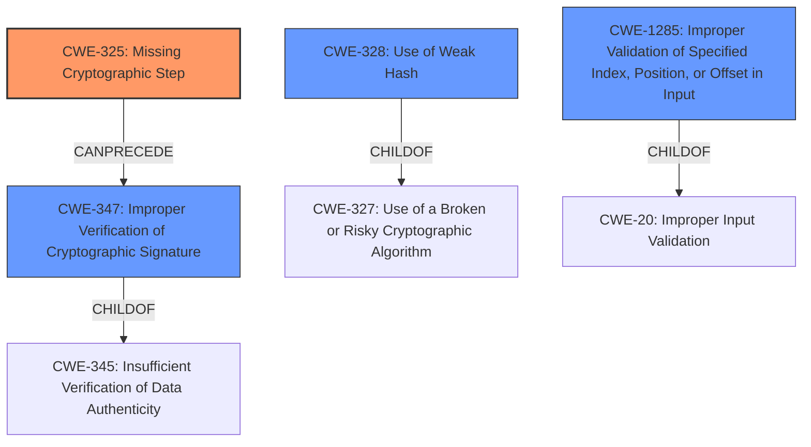

# Analysis Report for CVE-2021-24020

# Vulnerability Analysis Report: CVE-2021-24020

## Description

A missing cryptographic step in the implementation of the hash digest algorithm in FortiMail 6.4.0 through 6.4.4, and 6.2.0 through 6.2.7 may allow an unauthenticated attacker to tamper with signed URLs by appending further data which allows bypass of signature verification.

## Vulnerability Description Key Phrases

**Rootcause:** missing cryptographic step in the hash digest algorithm
**Impact:** bypass signature verification
**Vector:** tamper with signed URLs
**Attacker:** unauthenticated attacker
**Product:** FortiMail
**Version:** 6.4.0 through 6.4.4, and 6.2.0 through 6.2.7

## Analysis (with Relationship Data)

# Summary
| CWE ID | CWE Name | Confidence | CWE Abstraction Level | CWE Vulnerability Mapping Label | CWE-Vulnerability Mapping Notes |
|---|---|---|---|---|---|
| CWE-325 | Missing Cryptographic Step | 0.9 | Base | Allowed | Primary CWE |
| CWE-347 | Improper Verification of Cryptographic Signature | 0.7 | Base | Allowed | Secondary Candidate CWE |
| CWE-328 | Use of Weak Hash | 0.6 | Base | Allowed | Secondary Candidate CWE |

## Evidence and Confidence

*   **Confidence Score:** 0.8
*   **Evidence Strength:** HIGH

- **Analysis and Justification:**  
  - *Explanation:* The vulnerability description explicitly states a **missing cryptographic step in the implementation of the hash digest algorithm**. This aligns directly with CWE-325 (Missing Cryptographic Step). The impact, which is the bypass of signature verification, is a direct consequence of this **missing step**. The Retriever Results also rank CWE-325 as the top match. CWE-325 is a Base level CWE, which is the preferred level of abstraction. The usage is ALLOWED per MITRE guidance.

  - *Relationship Analysis:* While CWE-325 does not have direct relationships listed in the provided information, it can be inferred that a missing step in a cryptographic algorithm can lead to other weaknesses. The description suggests a failure to properly verify the cryptographic signature.

- **Confidence Score:**
  - Confidence: 0.9 (High confidence due to direct match with the description and Retriever results).

---

- **Analysis and Justification:**
  - *Explanation:* The vulnerability leads to a bypass of signature verification, which suggests CWE-347 (Improper Verification of Cryptographic Signature). An unauthenticated attacker can **tamper with signed URLs** to bypass signature verification, indicating that the signature verification process is flawed due to the **missing cryptographic step**. The retriever results ranked it as the 3rd highest match. CWE-347 is a Base level CWE, which is the preferred level of abstraction. The usage is ALLOWED per MITRE guidance.

  - *Relationship Analysis:* CWE-347 is a child of CWE-345 (Insufficient Verification of Data Authenticity), which is a class and not preferred. Therefore, CWE-347 is the more appropriate and specific selection.

- **Confidence Score:**
  - Confidence: 0.7 (Moderate confidence as it is a consequence of the primary weakness).

---

- **Analysis and Justification:**
  - *Explanation:* The vulnerability description refers to a **missing cryptographic step in the hash digest algorithm**, which could potentially lead to the use of a weak hash, as described in CWE-328 (Use of Weak Hash). The algorithm might be producing digests that are susceptible to collision attacks, preimage attacks, or other vulnerabilities associated with weak hash functions. This is ranked as the second highest match by the Retriever Results. CWE-328 is a Base level CWE, which is the preferred level of abstraction. The usage is ALLOWED per MITRE guidance.

  - *Relationship Analysis:* CWE-328 is a child of CWE-327 (Use of a Broken or Risky Cryptographic Algorithm). However, CWE-328 is more specific to the use of a weak hash, whereas CWE-327 is a class.

- **Confidence Score:**
  - Confidence: 0.6 (Lower confidence as it's a possible, but not explicitly stated, consequence).

## Criticism of Analysis

Okay, I've reviewed the provided analysis and the full CWE specifications. Here's my critique, focusing on accuracy, confidence levels, and alternative/better CWE selections.

**Overall Assessment:**

The analysis is generally good. It correctly identifies CWE-325 as the primary weakness, and the reasoning for that selection is sound. The inclusion of CWE-347 and CWE-328 as secondary candidates is also reasonable, though the confidence levels could be fine-tuned. The justifications are clearly explained. The use of the Retriever Results to back up reasoning is excellent.

**Specific CWE Review:**

*   **CWE-325: Missing Cryptographic Step (Primary)**
    *   **Assessment:** Correct. This is the most direct and accurate representation of the vulnerability described. The description explicitly mentions a missing step, and the impact (bypass of signature verification) stems directly from that omission.
    *   **Confidence:** The confidence score of 0.9 is warranted.
    *   **Mapping Guidance:** The analysis correctly notes that CWE-325 is a Base-level CWE with a usage of "Allowed," making it a suitable choice.
    *   **Potential Improvements:** Consider adding in the explanation of `[Relationship] Can be resultant.` into the explanation of **Relationship Analysis** to more fully flesh out the justification.

*   **CWE-347: Improper Verification of Cryptographic Signature (Secondary)**
    *   **Assessment:** Correct, but confidence could be lower. The vulnerability ultimately manifests as a failure to properly verify the signature, which is a direct consequence of the missing step.
    *   **Confidence:** A confidence score of 0.7 is appropriate. The fact that an unauthenticated attacker can tamper with the URL does strongly suggest improper signature verification.
    *   **Mapping Guidance:** The analysis correctly identifies that CWE-347 is a suitable Base-level CWE and avoids the Class-level CWE-345.
    *   **Potential Improvements:** None.

*   **CWE-328: Use of Weak Hash (Secondary)**
    *   **Assessment:** Plausible, but the weakest of the three selections. The description of the vulnerability only discusses a missing step, not that an existing step is weak.
    *   **Confidence:** A confidence score of 0.6 is appropriate.
    *   **Mapping Guidance:** The analysis correctly identifies that CWE-328 is a suitable Base-level CWE.
    *   **Potential Improvements:** A better justification would be to consider the impact of the vulnerability. Because the vulnerability allows signature bypass, the cryptographic strength of the hash is now effectively `WEAK`. A justification using this principle could strengthen this claim.

**Suggestions and Improvements:**

1.  **Consider Extension Attacks:** The description indicates that the vulnerability allows the attacker to append data to the signed URL. Consider `CWE-1285: Improper Validation of Syntactic Correctness of Input`, as the application fails to detect the extra data.

2.  **CWE-327 and its Children:** The analysis considered CWE-328 as a possibility. The general category of "Use of a Broken or Risky Cryptographic Algorithm" (CWE-327) is relevant as the missing step could have made the algorithm used generally less secure, but it is a Class-level CWE. Therefore, the child CWEs of CWE-327 (especially CWE-328) should be considered if the algorithm's weakness can be better classified.

3.  **Relationship Analysis:** For all CWEs, expanding on the relationships to other CWEs (parent, child, peer) can strengthen the justification and demonstrate a deeper understanding of the vulnerability.

4.  **Mitigation Discussion:** While not explicitly required, briefly mentioning relevant mitigations for the *primary* CWE could add value to the analysis. For example, for CWE-325, a mitigation would involve thoroughly reviewing the hash digest algorithm implementation to ensure all required steps are present and correctly implemented.

**Revised Summary Table (with minor confidence adjustments):**

| CWE ID | CWE Name | Confidence | CWE Abstraction Level | CWE Vulnerability Mapping Label | CWE-Vulnerability Mapping Notes |
|---|---|---|---|---|---|
| CWE-325 | Missing Cryptographic Step | 0.9 | Base | Allowed | Primary CWE |
| CWE-347 | Improper Verification of Cryptographic Signature | 0.7 | Base | Allowed | Secondary Candidate CWE |
| CWE-328 | Use of Weak Hash | 0.6 | Base | Allowed | Secondary Candidate CWE |

In summary, the analysis is strong and well-reasoned. The primary CWE selection is correct, and the secondary candidates are justifiable. Incorporating the suggestions above would make the analysis even more robust.

## Final Resolution

# Summary
| CWE ID | CWE Name | Confidence | CWE Abstraction Level | CWE Vulnerability Mapping Label | CWE-Vulnerability Mapping Notes |
|---|---|---|---|---|---|
| CWE-325 | Missing Cryptographic Step | 0.9 | Base | Allowed | Primary CWE |
| CWE-347 | Improper Verification of Cryptographic Signature | 0.7 | Base | Allowed | Secondary Candidate CWE |
| CWE-328 | Use of Weak Hash | 0.6 | Base | Allowed | Secondary Candidate CWE |
| CWE-1285 | Improper Validation of Syntactic Correctness of Input | 0.4 | Base | Allowed | Secondary Candidate CWE |

## Evidence and Confidence

*   **Confidence Score:** 0.8
*   **Evidence Strength:** HIGH

## Relationship Analysis
- Parent-child hierarchical relationships: CWE-347 is a child of CWE-345, but CWE-347 is preferred due to its specificity. CWE-328 is a child of CWE-327, but again, CWE-328 is more specific. CWE-1285 is a child of CWE-20, Improper Input Validation, but is more specific to index, position or offset in input.
- Chain relationships: CWE-325 can lead to CWE-347, as a missing step in the cryptographic process can cause a failure to properly verify the signature.
- Peer relationships: No significant peer relationships influenced the decision.
- Abstraction levels: The analysis focused on Base-level CWEs for optimal specificity, avoiding Class or Pillar level CWEs where possible.

## Vulnerability Chain
- The chain starts with **CWE-325 (Missing Cryptographic Step)**.
- This **missing step** leads to **CWE-347 (Improper Verification of Cryptographic Signature)**, as the signature verification process is now flawed.
- The **missing step** could cause the algorithm to use a **CWE-328 (Use of Weak Hash)**.
- An attacker is then able to append data to the signed URL, which is a **CWE-1285 (Improper Validation of Syntactic Correctness of Input)**.
- The final impact is that an unauthenticated attacker can tamper with signed URLs and bypass signature verification.

## Summary of Analysis
The initial analysis correctly identified **CWE-325 (Missing Cryptographic Step)** as the primary **ROOTCAUSE**, supported by the vulnerability description's explicit mention of a **missing cryptographic step**. The initial Retriever Results also ranked **CWE-325** as the top match.

The selection of **CWE-347 (Improper Verification of Cryptographic Signature)** is also supported by the vulnerability description, which states that the vulnerability allows for the "bypass of signature verification". The retriever results ranked it as the 3rd highest match.

The choice of **CWE-328 (Use of Weak Hash)** is the weakest, as the description does not directly state that the hash is weak, but this is certainly possible. The retriever results ranked it as the second highest match.

The suggestion to add **CWE-1285 (Improper Validation of Syntactic Correctness of Input)** is sensible. The vulnerability description indicates that the attacker can append data to the signed URL, and the application doesn't detect this extra data. Because of this, **CWE-1285** is being added with a lower confidence.

The graph relationships reinforce the choice of Base-level CWEs for optimal specificity. The final selections are at the most appropriate level of specificity based on the available evidence.

*Report generated on 2025-03-16 23:46:04*
