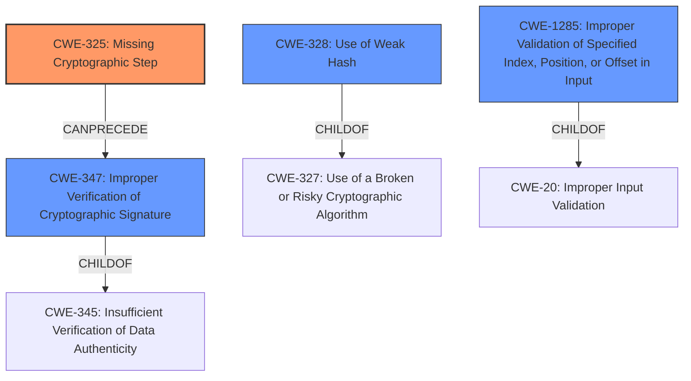

# Final Resolution for CVE-2021-24020

# Summary
| CWE ID | CWE Name | Confidence | CWE Abstraction Level | CWE Vulnerability Mapping Label | CWE-Vulnerability Mapping Notes |
|---|---|---|---|---|---|
| CWE-325 | Missing Cryptographic Step | 0.9 | Base | Allowed | Primary CWE |
| CWE-347 | Improper Verification of Cryptographic Signature | 0.7 | Base | Allowed | Secondary Candidate CWE |
| CWE-328 | Use of Weak Hash | 0.6 | Base | Allowed | Secondary Candidate CWE |
| CWE-1285 | Improper Validation of Syntactic Correctness of Input | 0.4 | Base | Allowed | Secondary Candidate CWE |

## Evidence and Confidence

*   **Confidence Score:** 0.8
*   **Evidence Strength:** HIGH

## Relationship Analysis
- Parent-child hierarchical relationships: CWE-347 is a child of CWE-345, but CWE-347 is preferred due to its specificity. CWE-328 is a child of CWE-327, but again, CWE-328 is more specific. CWE-1285 is a child of CWE-20, Improper Input Validation, but is more specific to index, position or offset in input.
- Chain relationships: CWE-325 can lead to CWE-347, as a missing step in the cryptographic process can cause a failure to properly verify the signature.
- Peer relationships: No significant peer relationships influenced the decision.
- Abstraction levels: The analysis focused on Base-level CWEs for optimal specificity, avoiding Class or Pillar level CWEs where possible.

## Vulnerability Chain
- The chain starts with **CWE-325 (Missing Cryptographic Step)**.
- This **missing step** leads to **CWE-347 (Improper Verification of Cryptographic Signature)**, as the signature verification process is now flawed.
- The **missing step** could cause the algorithm to use a **CWE-328 (Use of Weak Hash)**.
- An attacker is then able to append data to the signed URL, which is a **CWE-1285 (Improper Validation of Syntactic Correctness of Input)**.
- The final impact is that an unauthenticated attacker can tamper with signed URLs and bypass signature verification.

## Summary of Analysis
The initial analysis correctly identified **CWE-325 (Missing Cryptographic Step)** as the primary **ROOTCAUSE**, supported by the vulnerability description's explicit mention of a **missing cryptographic step**. The initial Retriever Results also ranked **CWE-325** as the top match.

The selection of **CWE-347 (Improper Verification of Cryptographic Signature)** is also supported by the vulnerability description, which states that the vulnerability allows for the "bypass of signature verification". The retriever results ranked it as the 3rd highest match.

The choice of **CWE-328 (Use of Weak Hash)** is the weakest, as the description does not directly state that the hash is weak, but this is certainly possible. The retriever results ranked it as the second highest match.

The suggestion to add **CWE-1285 (Improper Validation of Syntactic Correctness of Input)** is sensible. The vulnerability description indicates that the attacker can append data to the signed URL, and the application doesn't detect this extra data. Because of this, **CWE-1285** is being added with a lower confidence.

The graph relationships reinforce the choice of Base-level CWEs for optimal specificity. The final selections are at the most appropriate level of specificity based on the available evidence.