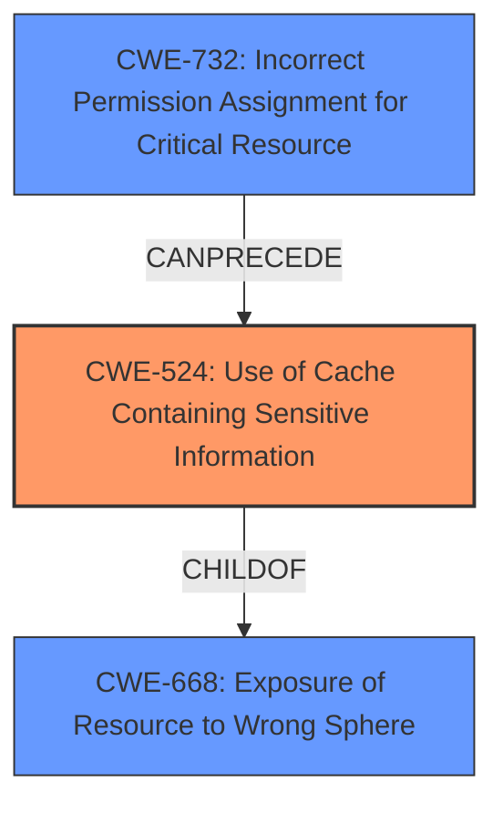

# Analysis Report for CVE-2021-24027

# Vulnerability Analysis Report: CVE-2021-24027

## Description

A cache configuration issue prior to WhatsApp for Android v2.21.4.18 and WhatsApp Business for Android v2.21.4.18 may have allowed a third party with access to the devices external storage to read cached TLS material.

## Vulnerability Description Key Phrases

**Rootcause:** cache configuration issue
**Impact:** read cached TLS material
**Attacker:** third party with access to the devices external storage
**Product:** ['WhatsApp for Android', 'WhatsApp Business for Android']
**Version:** v2.21.4.18

## Analysis (with Relationship Data)

# Summary
| CWE ID | CWE Name | Confidence | CWE Abstraction Level | CWE Vulnerability Mapping Label | CWE-Vulnerability Mapping Notes |
|---|---|---|---|---|---|
| CWE-524 | Use of Cache Containing Sensitive Information | 0.9 | Base | Allowed | Primary CWE |

## Evidence and Confidence

*   **Confidence Score:** 0.9
*   **Evidence Strength:** HIGH

- **Analysis and Justification:**  
  - *Explanation:* The vulnerability description explicitly states a "**cache configuration issue**" that allowed a third party to "read cached TLS material." This directly maps to CWE-524 (Use of Cache Containing Sensitive Information), which describes a scenario where "The code uses a cache that contains sensitive information, but the cache can be read by an actor outside of the intended control sphere." The fact that TLS material (a type of sensitive information) was accessible due to a misconfiguration solidifies this mapping. The CWE's description and usage aligns perfectly with the **rootcause** and impact of the vulnerability. MITRE mapping guidance indicates that CWE-524 is ALLOWED and is at the Base level of abstraction.

  - *Relationship Analysis:* While there are no direct relationships provided for CWE-524 in the retriever results, the nature of the vulnerability does not necessarily imply any specific preceeding or following CWEs. The vulnerability is primarily about the improper use of a cache.

- **Confidence Score:**  
  - Confidence: 0.9 (High confidence due to direct match with vulnerability description and CVE summary.)

## Criticism of Analysis

Okay, let's review the analysis, incorporating the full CWE specifications.

**Overall Assessment:**

The analysis is generally good and the primary CWE selection (CWE-524) is accurate and well-justified. The confidence level of 0.9 is appropriate. However, there are some nuances and opportunities to improve the analysis by considering related CWEs and mitigations.

**Detailed Review:**

*   **CWE-524: Use of Cache Containing Sensitive Information (Primary CWE)**

    *   **Strengths:** The justification is strong. The analysis accurately connects the "cache configuration issue" and the ability to "read cached TLS material" to the core description of CWE-524: "The code uses a cache that contains sensitive information, but the cache can be read by an actor outside of the intended control sphere."
    *   **Improvements:** The analysis mentions that there are no direct relationships provided in retriever results for CWE-524. However, it should note that, as per the CWE specification, **CWE-524 is a ChildOf -> CWE-668 (Exposure of Resource to Wrong Sphere)**. Including this relationship can strengthen the understanding of the broader context of the vulnerability. While the analysis should not include CWE-668 as the *primary* weakness (given its high-level nature), acknowledging this relationship can add value.
    *   **Mitigations:** The analysis doesn't directly address mitigations. It would be good to explicitly mention mitigations based on the CWE specifications, such as:
        *   "Protect information stored in cache."  This could involve setting appropriate permissions on the cache storage location.
        *   "Do not store unnecessarily sensitive information in the cache." This could lead to recommendations to avoid caching TLS material altogether or to limit what is cached.
        *   "Consider using encryption in the cache." This is a key mitigation for protecting sensitive information even if the cache is accessed by an unauthorized actor.

*   **Review of Retriever Results & Potentially Related CWEs**

    Here's a review of the other CWEs suggested by the retriever results and whether they are applicable. I'll focus on why they are likely not the *primary* weakness, but potentially contributing factors.

    *   **CWE-770: Allocation of Resources Without Limits or Throttling:** This is unlikely to be directly relevant. The vulnerability is not related to resource exhaustion or denial of service. The issue is about *exposure* of data, not consumption of resources.

    *   **CWE-532: Insertion of Sensitive Information into Log File:** This is *potentially* relevant, but not the core issue. While TLS material could *potentially* be logged (and thus exposed), the vulnerability description focuses on a dedicated *cache*, not logs. If there were evidence of logging TLS material, this CWE could be considered a contributing factor, but not the primary cause.

    *   **CWE-732: Incorrect Permission Assignment for Critical Resource:** This is relevant and could be a *contributing factor*. The analysis already touches on this implicitly. The "cache configuration issue" could very well *be* an "Incorrect Permission Assignment" on the cache storage location, allowing the third party with access to external storage to read the cached files. While CWE-524 is more direct, acknowledging that incorrect permissions could be the underlying cause of the cache exposure is valid. However, be aware of the **Mapping Guidance** which indicates this CWE is "Allowed-with-Review" and that you should closely analyze the *specific mistake* that is allowing the resource to be exposed.

    *   **CWE-287: Improper Authentication:** Not relevant. Authentication isn't mentioned in the description.

    *   **CWE-20: Improper Input Validation:** Very unlikely. Input validation is unrelated to this type of vulnerability.

    *   **CWE-668: Exposure of Resource to Wrong Sphere:** As mentioned earlier, this is the *parent* of CWE-524. While it's *technically* related, it is too high-level to be the primary CWE. The analysis is correct to choose the more specific CWE-524.

    *   **CWE-284: Improper Access Control:** Like CWE-668, this is a broad, high-level CWE. While *technically* true (the cache wasn't properly access-controlled), CWE-524 is a much more precise description of the problem.

    *   **CWE-257: Storing Passwords in a Recoverable Format:** Not directly applicable. The issue isn't about passwords being stored in a recoverable format, but TLS material being cached and exposed.

    *   **CWE-250: Execution with Unnecessary Privileges:** Not relevant. This vulnerability has nothing to do with unnecessary privileges.

*   **Consider CWE-525: Use of Web Browser Cache Containing Sensitive Information:**

    *   This is a *variant* of CWE-524 that is specific to web browsers. Since the target is an Android application, you'd need to ascertain if the caching mechanism can be described as part of a web browser component or not. If it is leveraging a web browser component's caching, then this variant may be more appropriate than the base.

**Revised Summary Table (Incorporating suggestions):**

| CWE ID | CWE Name | Confidence | CWE Abstraction Level | CWE Vulnerability Mapping Label | CWE-Vulnerability Mapping Notes |
|---|---|---|---|---|---|
| CWE-524 | Use of Cache Containing Sensitive Information | 0.9 | Base | Allowed | Primary CWE. Consider relation to CWE-668. |
| CWE-732 | Incorrect Permission Assignment for Critical Resource | 0.3 | Class | Allowed-with-Review | Possible contributing factor if cache configuration involved incorrect permissions. |

**Revised Analysis Snippets:**

*   Add to Relationship Analysis:  "CWE-524 is a ChildOf -> CWE-668 (Exposure of Resource to Wrong Sphere), which provides a higher-level context for understanding the vulnerability.  The underlying cause could also be related to CWE-732 (Incorrect Permission Assignment for Critical Resource), if the cache configuration involved incorrect file system permissions."
*   Add to Confidence Score:  "Confidence: 0.9 (High confidence due to direct match with vulnerability description and CVE summary.  The potential connection to CWE-732 doesn't diminish confidence in CWE-524 as the primary weakness.)"
*   Add Mitigation Discussion: "Potential mitigations, based on the CWE-524 specification, include: protecting the information stored in the cache (e.g., setting appropriate file system permissions), avoiding storing unnecessarily sensitive information in the cache (e.g., disabling caching of TLS material or limiting what is cached), and encrypting the cache."

**Conclusion:**

The original analysis is solid. The suggested improvements offer a more comprehensive understanding of the vulnerability's context and potential mitigations, further strengthening the analysis. By adding the relationship to CWE-668, acknowledging the potential role of CWE-732, and explicitly mentioning mitigations from the CWE specification, the analysis becomes even more robust and informative.

## Final Resolution

# Summary
| CWE ID | CWE Name | Confidence | CWE Abstraction Level | CWE Vulnerability Mapping Label | CWE-Vulnerability Mapping Notes |
|---|---|---|---|---|---|
| CWE-524 | Use of Cache Containing Sensitive Information | 0.9 | Base | Allowed | Primary CWE. Consider relation to CWE-668. |
| CWE-732 | Incorrect Permission Assignment for Critical Resource | 0.3 | Base | Allowed-with-Review | Possible contributing factor if cache configuration involved incorrect permissions. |

## Evidence and Confidence

*   **Confidence Score:** 0.9
*   **Evidence Strength:** HIGH

## Relationship Analysis
The primary CWE, CWE-524 (**CWE-524: Use of Cache Containing Sensitive Information**), has a parent-child relationship with CWE-668 (**CWE-668: Exposure of Resource to Wrong Sphere**). This relationship places CWE-524 at a more specific level of abstraction, which is beneficial for accurately representing the vulnerability. Additionally, CWE-732 (**CWE-732: Incorrect Permission Assignment for Critical Resource**) is considered as a potential contributing factor, indicating that improper permissions might have led to the cache exposure.

## Vulnerability Chain
The vulnerability chain starts with a misconfigured cache (CWE-524), potentially due to incorrect permission assignments (CWE-732). This leads to the exposure of sensitive TLS material to unauthorized third parties with access to the device's external storage. The chain highlights how an initial misconfiguration can directly result in sensitive data exposure. There is no missing link.

## Summary of Analysis
The initial analysis correctly identified CWE-524 as the primary weakness, supported by the vulnerability description stating a "cache configuration issue" leading to the exposure of "cached TLS material." The criticism highlighted the parent-child relationship between CWE-524 and CWE-668, providing a broader context. It also introduced the possibility of CWE-732 as a contributing factor, suggesting that the cache misconfiguration might stem from incorrect permission assignments.

The graph relationships influenced the final selection by emphasizing the specificity of CWE-524 compared to its parent, CWE-668. While CWE-668 provides a high-level view, CWE-524 directly addresses the use of a cache containing sensitive information. The potential contribution of CWE-732 was acknowledged, but it was deemed a secondary factor since it represents a possible underlying cause rather than the direct vulnerability itself.

The decision to retain CWE-524 as the primary weakness is based on its direct match with the vulnerability description and its appropriate level of specificity. The evidence clearly points to a problem with how the cache was configured, making CWE-524 the most accurate classification.

*Report generated on 2025-03-17 01:46:34*
