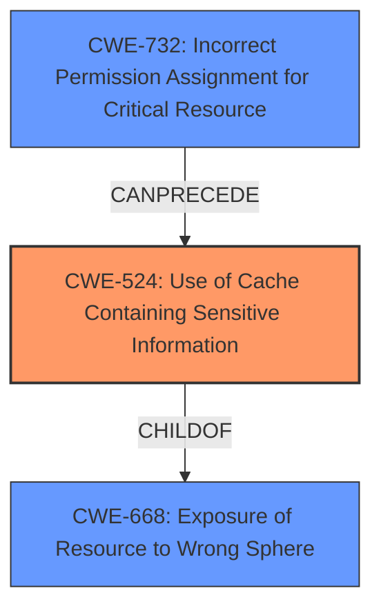

# Final Resolution for CVE-2021-24027

# Summary
| CWE ID | CWE Name | Confidence | CWE Abstraction Level | CWE Vulnerability Mapping Label | CWE-Vulnerability Mapping Notes |
|---|---|---|---|---|---|
| CWE-524 | Use of Cache Containing Sensitive Information | 0.9 | Base | Allowed | Primary CWE. Consider relation to CWE-668. |
| CWE-732 | Incorrect Permission Assignment for Critical Resource | 0.3 | Base | Allowed-with-Review | Possible contributing factor if cache configuration involved incorrect permissions. |

## Evidence and Confidence

*   **Confidence Score:** 0.9
*   **Evidence Strength:** HIGH

## Relationship Analysis
The primary CWE, CWE-524 (**CWE-524: Use of Cache Containing Sensitive Information**), has a parent-child relationship with CWE-668 (**CWE-668: Exposure of Resource to Wrong Sphere**). This relationship places CWE-524 at a more specific level of abstraction, which is beneficial for accurately representing the vulnerability. Additionally, CWE-732 (**CWE-732: Incorrect Permission Assignment for Critical Resource**) is considered as a potential contributing factor, indicating that improper permissions might have led to the cache exposure.

## Vulnerability Chain
The vulnerability chain starts with a misconfigured cache (CWE-524), potentially due to incorrect permission assignments (CWE-732). This leads to the exposure of sensitive TLS material to unauthorized third parties with access to the device's external storage. The chain highlights how an initial misconfiguration can directly result in sensitive data exposure. There is no missing link.

## Summary of Analysis
The initial analysis correctly identified CWE-524 as the primary weakness, supported by the vulnerability description stating a "cache configuration issue" leading to the exposure of "cached TLS material." The criticism highlighted the parent-child relationship between CWE-524 and CWE-668, providing a broader context. It also introduced the possibility of CWE-732 as a contributing factor, suggesting that the cache misconfiguration might stem from incorrect permission assignments.

The graph relationships influenced the final selection by emphasizing the specificity of CWE-524 compared to its parent, CWE-668. While CWE-668 provides a high-level view, CWE-524 directly addresses the use of a cache containing sensitive information. The potential contribution of CWE-732 was acknowledged, but it was deemed a secondary factor since it represents a possible underlying cause rather than the direct vulnerability itself.

The decision to retain CWE-524 as the primary weakness is based on its direct match with the vulnerability description and its appropriate level of specificity. The evidence clearly points to a problem with how the cache was configured, making CWE-524 the most accurate classification.