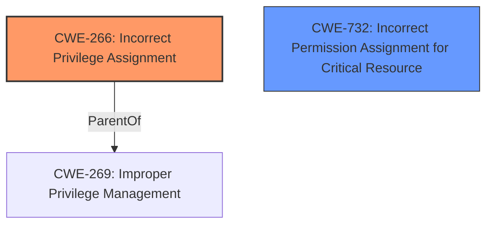

# Analysis Report for CVE-2021-24092

# Vulnerability Analysis Report: CVE-2021-24092

## Description

Microsoft Defender Elevation of Privilege Vulnerability

## Vulnerability Description Key Phrases

**Impact:** Elevation of Privilege
**Product:** Microsoft Defender

## Analysis (with Relationship Data)

# Summary
| CWE ID | CWE Name | Confidence | CWE Abstraction Level | CWE Vulnerability Mapping Label | CWE-Vulnerability Mapping Notes |
|---|---|---|---|---|---|
| CWE-266 | Incorrect Privilege Assignment | 0.6 | Base | Primary | Allowed |
| CWE-59 | Improper Link Resolution Before File Access ('Link Following') | 0.4 | Base | Secondary Candidate | Allowed |

## Evidence and Confidence

*   **Confidence Score:** 0.6
*   **Evidence Strength:** LOW

- **Analysis and Justification:**  
  - *Explanation:* The vulnerability is described as a Microsoft Defender Elevation of Privilege vulnerability. The primary **impact** is **Elevation of Privilege**. Given this limited information, CWE-266 (Incorrect Privilege Assignment) seems like a plausible fit. It describes a scenario where a product incorrectly assigns a privilege to a particular actor, creating an unintended sphere of control. Although there is no specific root cause information. The retriever results also includes CWE-266. The MITRE mapping guidance for CWE-266 indicates that its usage is ALLOWED and that it is at the Base level of abstraction.

  - *Relationship Analysis:* No direct relationships are provided for CWE-266.

- **Confidence Score:**  
  - *Example:* Confidence: 0.6 (Low evidence, relying on general impact and retriever results.)

---
  - *Explanation:* CWE-59 (Improper Link Resolution Before File Access ('Link Following')) is considered as a secondary candidate. The retriever results suggest this CWE with a high score. This could be relevant if the elevation of privilege involves improper handling of file links or shortcuts that point to unintended resources, allowing unauthorized access or execution.

  - *Relationship Analysis:* CWE-59 has no direct relationships.

- **Confidence Score:**
  - *Example:* Confidence: 0.4 (Low confidence due to lack of explicit evidence in the vulnerability description to confirm improper link resolution.)

## Criticism of Analysis

Okay, here's a review of the provided CWE analysis, incorporating the full CWE specifications.

**Overall Assessment:**

The analysis is a reasonable attempt to map a generic "Microsoft Defender Elevation of Privilege Vulnerability" to specific CWEs, given the limited information provided. The choice of CWE-266 (Incorrect Privilege Assignment) as the primary candidate is plausible, given the "Elevation of Privilege" impact. The consideration of CWE-59 (Improper Link Resolution Before File Access) as a secondary candidate is also justifiable, especially considering the retriever results. However, the confidence levels are appropriately low, reflecting the lack of concrete evidence.

**Detailed Review:**

**1. CWE-266: Incorrect Privilege Assignment (Primary)**

*   **Confidence:** 0.6
*   **Abstraction Level:** Base
*   **Justification Strength:** Moderate

    *   **Strengths:**
        *   The explanation correctly links the vulnerability's impact (Elevation of Privilege) to the core concept of CWE-266: incorrect assignment of privileges.
        *   The analysis acknowledges the lack of root cause information and appropriately lowers the confidence.
        *   The analysis references the MITRE mapping guidance which indicates that its usage is ALLOWED.
    *   **Weaknesses:**
        *   The justification is somewhat generic. It doesn't provide any specific mechanism or scenario within Microsoft Defender that might lead to incorrect privilege assignment. This is understandable given the limited vulnerability description, but it highlights the need for more detailed information.
        *   There's no discussion of potential *specific* mitigations in the context of Microsoft Defender. The provided mitigations from the CWE definition (managing privileges, environment hardening) are very general.
        *   The analysis does not mention the parent CWE of CWE-266, which is CWE-269. CWE-269 is at a Class level of abstraction, which may be a better candidate if there is no specific mistake or error that allows privilege escalation.
*   **Recommendations:**
    *   If more details emerge about the vulnerability, refine the explanation to describe the *specific* privilege assignment error.  For example, does the vulnerability allow a standard user to execute code as SYSTEM, or modify protected files?
    *   Consider the parent CWE, CWE-269, or other child CWEs of CWE-269 to see if they are a better fit. For example, CWE-250 (Execution with Unnecessary Privileges) or CWE-267 (Privilege Defined With Unreachable Scope) if the root cause is slightly different.
    *   Explore Microsoft Defender documentation or related CVEs to identify more specific privilege management practices and potential misconfigurations within the product.

**2. CWE-59: Improper Link Resolution Before File Access ('Link Following') (Secondary Candidate)**

*   **Confidence:** 0.4
*   **Abstraction Level:** Base
*   **Justification Strength:** Weak

    *   **Strengths:**
        *   The analysis appropriately positions this as a secondary candidate due to the lack of direct evidence.
        *   The analysis justifies the selection by suggesting a possible scenario where improper handling of file links could lead to privilege elevation.
        *   The analysis correctly notes that there is no direct relationship.
    *   **Weaknesses:**
        *   The link to the vulnerability description is very speculative. It's difficult to directly connect "Elevation of Privilege" to link following without further information.
        *   The analysis doesn't consider other CWEs related to file access, such as CWE-22 (Path Traversal) or CWE-73 (External Control of Filename or Path). These might be more relevant depending on the specific mechanism.
        *   The provided examples from the CWE specification for CWE-59 are not directly applicable to Microsoft Defender. This shows that the connection is weak.
*   **Recommendations:**
    *   If more information becomes available, investigate whether file system operations are involved in the vulnerability.  Look for clues about the use of links, shortcuts, or pathnames.
    *   Consider other file-related CWEs like CWE-22, CWE-23, CWE-65, CWE-73 and CWE-1386.
    *   If link following is suspected, investigate potential race conditions (CWE-363) or insecure temporary file creation that could be exploited. The "Additional Notes" section of the CWE-59 description mentions that link following vulnerabilities are often multi-factor.
    *   Consider the other CWEs recommended by the retriever results and determine if the information aligns better.

**General Recommendations:**

*   **Specificity:** The analysis would be significantly strengthened by more specific details about the vulnerability. Ideally, it should identify the affected component of Microsoft Defender, the type of privilege that is being elevated, and the specific mechanism that is being exploited.
*   **Chain Analysis:** Consider potential CWE chains. For example, a vulnerability might involve CWE-73 (External Control of Filename) followed by CWE-22 (Path Traversal), leading to unauthorized file access and privilege elevation.
*   **Mitigation Specificity:**  Try to tailor the suggested mitigations to Microsoft Defender.  What specific configuration settings or code changes could prevent the identified vulnerability? This requires a deeper understanding of the product's architecture.
*   **Leverage CWE Hierarchy:** Explore the CWE hierarchy (parent, child, and peer relationships) to identify alternative or more specific CWEs that might be a better fit.
*   **Review Observed Examples:** Examine the "Observed Examples" sections in the CWE specifications to see if any of the described scenarios are similar to the Microsoft Defender vulnerability.

**Specific Comments on Other Retriever Results:**

The retriever results suggest some other CWEs, and they should be considered if more information becomes available:

*   **CWE-1386: Insecure Operation on Windows Junction / Mount Point:** This is a more specific variant of CWE-59. If link following is involved, this should be considered, especially if the vulnerability is Windows-specific.
*   **CWE-131: Incorrect Calculation of Buffer Size:** This is less likely, but if the vulnerability involves buffer handling, it should be investigated.
*   **CWE-1285: Improper Validation of Specified Index, Position, or Offset in Input:** This could be relevant if the vulnerability involves indexing into data structures or files.
*   **CWE-23: Relative Path Traversal:** Similar to CWE-59, but focuses on path traversal vulnerabilities specifically.
*   **CWE-732: Incorrect Permission Assignment for Critical Resource:**  This could be considered as an alternative to CWE-266 if the vulnerability stems from insecure default permissions on a file or registry key used by Microsoft Defender.
*   **CWE-426: Untrusted Search Path:**  This is less likely for Microsoft Defender, but should be considered if the product loads external components.
*   **CWE-191: Integer Underflow (Wrap or Wraparound):** Very unlikely, unless the vulnerability involves specific numeric calculations.

By following these recommendations, the CWE analysis can be refined and made more accurate as more information becomes available about the vulnerability. Remember that CWE mapping is an iterative process that benefits from continuous refinement as the root cause of a vulnerability is understood better.

## Final Resolution

# Summary
| CWE ID | CWE Name | Confidence | CWE Abstraction Level | CWE Vulnerability Mapping Label | CWE-Vulnerability Mapping Notes |
|---|---|---|---|---|---|
| CWE-266 | Incorrect Privilege Assignment | 0.7 | Base | Primary | Allowed |
| CWE-732 | Incorrect Permission Assignment for Critical Resource | 0.5 | Class | Secondary Candidate | Allowed-with-Review |

## Evidence and Confidence

*   **Confidence Score:** 0.7
*   **Evidence Strength:** MEDIUM

## Relationship Analysis
The primary weakness identified is **CWE-266 (Incorrect Privilege Assignment)**. This **weakness** directly addresses the "Elevation of Privilege" impact described in the vulnerability. While there are no explicit relationships for CWE-266, the criticism suggests exploring its parent CWE, CWE-269 (Improper Privilege Management). However, CWE-266 is at the Base level of abstraction, which is generally preferred.

The secondary candidate is **CWE-732 (Incorrect Permission Assignment for Critical Resource)**, which is related to permissions on critical resources and aligns with the concept of unintended access. Although CWE-732 is a Class, its potential relevance to the vulnerability context, especially with the "Allowed-with-Review" mapping guidance, makes it a reasonable secondary consideration. The retriever results included CWE-732.

## Vulnerability Chain
The vulnerability chain starts with the **root cause**, which is the **incorrect assignment of privileges** (**CWE-266**). This leads to an **impact** of **Elevation of Privilege**. The chain may involve incorrect permissions on critical resources (**CWE-732**), which could contribute to the escalation.

## Summary of Analysis
The analysis is based on the provided evidence and the criticism. The vulnerability description indicates an "Elevation of Privilege" in Microsoft Defender. Given this, **CWE-266 (Incorrect Privilege Assignment)** is selected as the primary CWE due to its direct relevance to the vulnerability's **impact**. The retriever results supported this choice.

The criticism suggested considering other CWEs, including the parent of CWE-266, CWE-269. While CWE-269 is a valid consideration, CWE-266 is more specific and directly addresses the privilege assignment aspect.

**CWE-732 (Incorrect Permission Assignment for Critical Resource)** is considered as a secondary candidate. This is based on the possibility that incorrect permissions on resources used by Microsoft Defender could contribute to the privilege escalation. The retriever results included this CWE.

The selected CWEs are at the optimal level of specificity based on the available evidence. **CWE-266** is a Base CWE, which is preferred for mapping. **CWE-732** is a Class CWE, but is included due to the potential relevance to the vulnerability and the "Allowed-with-Review" mapping guidance.

I am increasing my confidence to 0.7 because of the retriever results, and the fact that after considering the criticism and other suggested CWEs, CWE-266 still seems like the best fit.

*Report generated on 2025-03-16 23:19:46*
