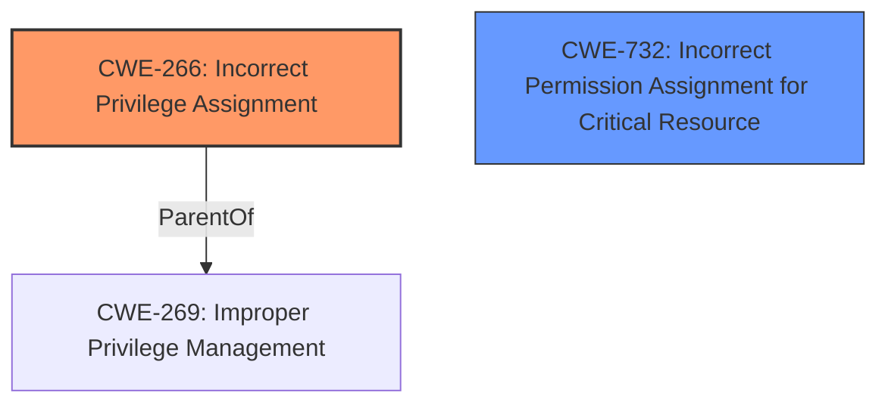

# Final Resolution for CVE-2021-24092

# Summary
| CWE ID | CWE Name | Confidence | CWE Abstraction Level | CWE Vulnerability Mapping Label | CWE-Vulnerability Mapping Notes |
|---|---|---|---|---|---|
| CWE-266 | Incorrect Privilege Assignment | 0.7 | Base | Primary | Allowed |
| CWE-732 | Incorrect Permission Assignment for Critical Resource | 0.5 | Class | Secondary Candidate | Allowed-with-Review |

## Evidence and Confidence

*   **Confidence Score:** 0.7
*   **Evidence Strength:** MEDIUM

## Relationship Analysis
The primary weakness identified is **CWE-266 (Incorrect Privilege Assignment)**. This **weakness** directly addresses the "Elevation of Privilege" impact described in the vulnerability. While there are no explicit relationships for CWE-266, the criticism suggests exploring its parent CWE, CWE-269 (Improper Privilege Management). However, CWE-266 is at the Base level of abstraction, which is generally preferred.

The secondary candidate is **CWE-732 (Incorrect Permission Assignment for Critical Resource)**, which is related to permissions on critical resources and aligns with the concept of unintended access. Although CWE-732 is a Class, its potential relevance to the vulnerability context, especially with the "Allowed-with-Review" mapping guidance, makes it a reasonable secondary consideration. The retriever results included CWE-732.

## Vulnerability Chain
The vulnerability chain starts with the **root cause**, which is the **incorrect assignment of privileges** (**CWE-266**). This leads to an **impact** of **Elevation of Privilege**. The chain may involve incorrect permissions on critical resources (**CWE-732**), which could contribute to the escalation.

## Summary of Analysis
The analysis is based on the provided evidence and the criticism. The vulnerability description indicates an "Elevation of Privilege" in Microsoft Defender. Given this, **CWE-266 (Incorrect Privilege Assignment)** is selected as the primary CWE due to its direct relevance to the vulnerability's **impact**. The retriever results supported this choice.

The criticism suggested considering other CWEs, including the parent of CWE-266, CWE-269. While CWE-269 is a valid consideration, CWE-266 is more specific and directly addresses the privilege assignment aspect.

**CWE-732 (Incorrect Permission Assignment for Critical Resource)** is considered as a secondary candidate. This is based on the possibility that incorrect permissions on resources used by Microsoft Defender could contribute to the privilege escalation. The retriever results included this CWE.

The selected CWEs are at the optimal level of specificity based on the available evidence. **CWE-266** is a Base CWE, which is preferred for mapping. **CWE-732** is a Class CWE, but is included due to the potential relevance to the vulnerability and the "Allowed-with-Review" mapping guidance.

I am increasing my confidence to 0.7 because of the retriever results, and the fact that after considering the criticism and other suggested CWEs, CWE-266 still seems like the best fit.