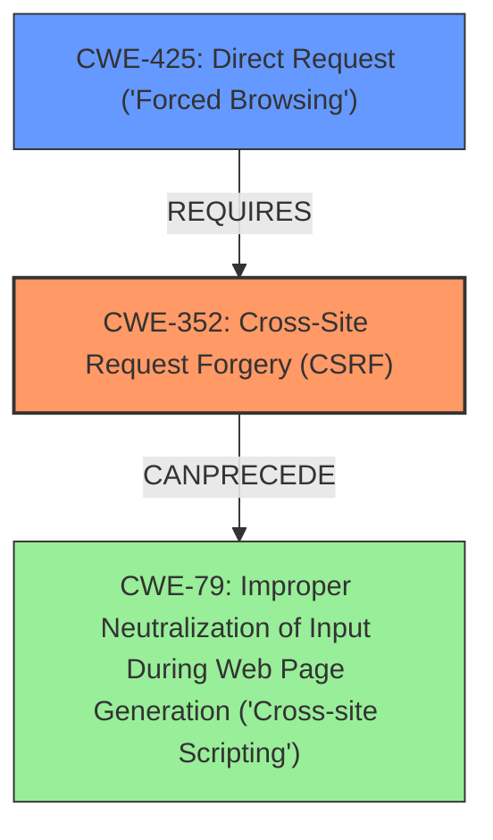

# Final Resolution for CVE-2021-24249

# Summary
| CWE ID | CWE Name | Confidence | CWE Abstraction Level | CWE Vulnerability Mapping Label | CWE-Vulnerability Mapping Notes |
|---|---|---|---|---|---|
| **CWE-352** | **Cross-Site Request Forgery (CSRF)** | 0.9 | Compound | Allowed | This is the primary **weakness**, as the vulnerability is a CSRF issue. Mitigation should include implementing anti-CSRF tokens for sensitive actions like exporting. |
| CWE-425 | Direct Request ('Forced Browsing') | 0.5 | Base | Allowed | The lack of proper authorization checks on the export functionality contributes to the severity of the CSRF. Implementing stricter authorization controls in addition to CSRF protection would reduce the impact. |
| CWE-79 | Improper Neutralization of Input During Web Page Generation ('Cross-site Scripting') | 0.3 | Base | Allowed | While not the root cause, successful CSRF exploitation *could* be chained with XSS if exported data is not properly sanitized. Adding input sanitization to the output data is a mitigation to prevent the chain. |

## Evidence and Confidence

*   **Confidence Score:** 0.8
*   **Evidence Strength:** MEDIUM

## Relationship Analysis
The primary **weakness** is **CWE-352 (CSRF)**, a compound CWE. While it is the most direct match, the analysis considered **CWE-79 (XSS)** and **CWE-425 (Missing Authorization)**. The relationships between these CWEs are important: CSRF can potentially lead to XSS if the exported data isn't properly sanitized, creating a vulnerability chain. Also, the absence of proper authorization (CWE-425) on the export functionality exacerbates the CSRF vulnerability.

## Vulnerability Chain
The vulnerability chain starts with the **ROOTCAUSE**, a missing CSRF protection (**CWE-352**). This allows an attacker to trick a logged-in administrator into exporting files. If the exported data is not sanitized, it could lead to **CWE-79 (XSS)**. The lack of authorization checks (**CWE-425**) on the export functionality makes the CSRF easier to exploit and increases the potential impact.

## Summary of Analysis
The initial analysis correctly identified **CWE-352 (CSRF)** as the primary **weakness**. The criticism highlighted the importance of considering related CWEs like **CWE-79** and **CWE-425**, which contribute to the vulnerability's impact and exploitability.

The vulnerability description explicitly mentions the CSRF issue: "The Business Directory Plugin Easy Listing Directories for WordPress WordPress plugin before 5.11.2 suffered from a **Cross-Site Request Forgery** issue, allowing an attacker to make a logged in administrator export files..." This statement supports the primary classification of CWE-352.

The relationship analysis shows that CWE-79 can follow CWE-352 if the exported data is not properly sanitized. CWE-425 requires CWE-352 because the lack of authorization makes the CSRF vulnerability more severe. The mitigation for CWE-352 is to implement anti-CSRF tokens. Mitigation for CWE-79 would involve output sanitization. For CWE-425, it means implementing proper access controls.

The selected CWEs are at the optimal level of specificity. CWE-352 is a compound CWE that accurately represents the **ROOTCAUSE** of the vulnerability. CWE-79 and CWE-425 are base CWEs that provide additional context about the potential impact and contributing factors.