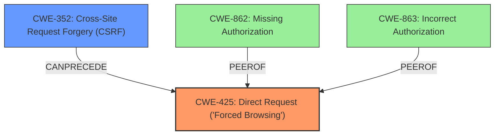

# Analysis Report for CVE-2021-24583

# Vulnerability Analysis Report: CVE-2021-24583

## Description

The Timetable and Event Schedule WordPress plugin before 2.4.2 does not have proper access control when deleting a timeslot, allowing any user with the edit_posts capability (contributor+) to delete arbitrary timeslot from any events. Furthermore, no CSRF check is in place as well, allowing such attack to be performed via CSRF against a logged in with such capability

## Vulnerability Description Key Phrases

**Rootcause:** improper access control
**Impact:** delete arbitrary timeslot from any events
**Attacker:** any user with edit_posts capability
**Product:** Timetable and Event Schedule WordPress plugin
**Version:** before 2.4.2

## Analysis (with Relationship Data)

# Summary
| CWE ID | CWE Name | Confidence | CWE Abstraction Level | CWE Vulnerability Mapping Label | CWE-Vulnerability Mapping Notes |
|---|---|---|---|---|---|
| CWE-425 | Direct Request ('Forced Browsing') | 0.9 | Base | Allowed | Primary CWE: The vulnerability is due to inadequate authorization enforcement. |
| CWE-352 | Cross-Site Request Forgery (CSRF) | 0.8 | Compound | Allowed | Secondary CWE: The vulnerability is also exploitable via CSRF due to the lack of CSRF protection. |

## Evidence and Confidence

*   **Confidence Score:** 0.9
*   **Evidence Strength:** HIGH

- **Analysis and Justification:**  
  - *Explanation:* "The vulnerability description indicates a missing access control check when deleting a timeslot. The phrase '**improper access control**' confirms this. The CVE Reference Links Content Summary also states that the **root cause of the vulnerability** is the plugin's lack of proper access control, allowing users with `edit_posts` capability to delete arbitrary timeslots. This aligns with CWE-425 [Direct Request ('Forced Browsing')], which describes inadequate authorization enforcement. The description also mentions the lack of CSRF protection, making CWE-352 [Cross-Site Request Forgery (CSRF)] a secondary weakness since it allows exploiting the access control issue via CSRF attacks. The MITRE mapping guidance for CWE-425 and CWE-352 indicates both are ALLOWED."
  
  - *Relationship Analysis:* "CWE-425 is a Base level CWE, which is appropriate for mapping root causes. CWE-352 is a Compound weakness that often occurs alongside other weaknesses like broken access control."

- **Confidence Score:**  
  - *Example:* Confidence: 0.9 (High evidence from the vulnerability description and CVE reference materials)

---

## Criticism of Analysis

Okay, here's a detailed review of the CWE analysis, incorporating the full CWE specifications provided:

**Overall Assessment:**

The analysis correctly identifies the two main weaknesses: Broken Access Control (represented by CWE-425, Direct Request) and CSRF (CWE-352). The reasoning behind the mapping is sound, and the confidence levels are justified.

**Detailed Review:**

**1. CWE-425: Direct Request ('Forced Browsing')**

*   **CWE ID:** CWE-425
*   **CWE Name:** Direct Request ('Forced Browsing')
*   **Confidence:** 0.9
*   **CWE Abstraction Level:** Base
*   **CWE Vulnerability Mapping Label:** Allowed
*   **CWE-Vulnerability Mapping Notes:** Primary CWE: The vulnerability is due to inadequate authorization enforcement.
*   **Assessment:**
    *   **Correctness:** The mapping to CWE-425 is accurate. The vulnerability description clearly states that users with `edit_posts` capability (Contributor+) can delete timeslots from *any* event, which implies a lack of proper authorization checks on the specific resource being accessed (the timeslot). This aligns directly with the CWE-425 definition: "The web application does not adequately enforce appropriate authorization on all restricted URLs, scripts, or files."
    *   **Abstraction Level:** Choosing the Base level CWE is correct because it maps directly to the root cause. The issue isn't a *missing* authorization check (CWE-862), but rather the *inadequate* enforcement of existing authorization, which manifests as the ability to directly request and perform actions on resources that the user should not have access to.
    *   **Mapping Guidance Adherence:**  The analysis correctly notes that CWE-425 is "Allowed" for mapping and that it is a Base level CWE, which is appropriate for mapping root causes.  The analysis avoided "forcing" a mapping as cautioned by the CWE specification.
    *   **Potential Mitigations:** The CWE-425 specification suggests mitigations like:
        *   "Apply appropriate access control authorizations for each access to all restricted URLs, scripts or files." This is precisely what the plugin needs to do: ensure that before deleting a timeslot, it verifies that the user has the appropriate permissions to modify *that specific timeslot* or the event it belongs to.
        *   "Consider using MVC based frameworks such as Struts." While this is a more general suggestion, adopting a well-structured framework can help enforce consistent authorization policies.
    *   **Observed Examples:** The analysis didn't provide any observed examples from the CWE, and could improve in quality by referencing these. Here are some examples from the specifications that apply:
        * **CVE-2022-29238:** Access-control setting in web-based document collaboration tool is not properly implemented by the code, which prevents listing hidden directories but does not prevent direct requests to files in those directories.
        * **CVE-2004-2144:** Bypass authentication via direct request.
    *   **Improvements:** Consider also listing out the potential mitigations described by the CWE specifications.

**2. CWE-352: Cross-Site Request Forgery (CSRF)**

*   **CWE ID:** CWE-352
*   **CWE Name:** Cross-Site Request Forgery (CSRF)
*   **Confidence:** 0.8
*   **CWE Abstraction Level:** Compound
*   **CWE Vulnerability Mapping Label:** Allowed
*   **CWE-Vulnerability Mapping Notes:** Secondary CWE: The vulnerability is also exploitable via CSRF due to the lack of CSRF protection.
*   **Assessment:**
    *   **Correctness:** The mapping to CWE-352 is accurate. The vulnerability description explicitly mentions the lack of CSRF protection.  This means an attacker can potentially trick a logged-in user into deleting timeslots without their knowledge.
    *   **Abstraction Level:** The analysis correctly identifies CWE-352 as a secondary weakness. The primary issue is the broken access control (CWE-425), and the CSRF vulnerability simply provides another attack vector to exploit the broken access control. The analysis is correct in identifying that CWE-352 is a Compound weakness that often occurs alongside other weaknesses like broken access control.
    *   **Mapping Guidance Adherence:** The analysis correctly notes that CWE-352 is "Allowed" for mapping. It could be improved to explain that While attack-oriented composites are supported in CWE, they have not been a focus of research. There is a chance that future research or CWE scope clarifications will change or deprecate them. Perform root-cause analysis to determine if other weaknesses allow CSRF attacks to occur, and map to those weaknesses.
    *   **Potential Mitigations:** The CWE-352 specification suggests mitigations like:
        *   "Use a vetted library or framework that does not allow this weakness to occur or provides constructs that make this weakness easier to avoid. For example, use anti-CSRF packages such as the OWASP CSRFGuard."
        *   "Ensure that the application is free of cross-site scripting issues (CWE-79), because most CSRF defenses can be bypassed using attacker-controlled script."
        *   "Generate a unique nonce for each form, place the nonce into the form, and verify the nonce upon receipt of the form. Be sure that the nonce is not predictable (CWE-330)."
    *   **Observed Examples:** The analysis didn't provide any observed examples from the CWE, and could improve in quality by referencing these. Here are some examples from the specifications that apply:
        * **CVE-2004-1703:** Add user accounts via a URL in an img tag
        * **CVE-2004-1995:** Add user accounts via a URL in an img tag
        * **CVE-2004-1967:** Arbitrary code execution by specifying the code in a crafted img tag or URL
    *   **Improvements:** The analysis could be slightly improved by explicitly mentioning some of the suggested mitigations, and providing observed examples.

**Additional Considerations & Suggestions:**

*   **Alternative CWEs to Consider (but ultimately reject):**
    *   **CWE-862: Missing Authorization:** While *related*, this is less precise than CWE-425. The problem isn't that there's *no* authorization check at all. The problem is the authorization check is insufficient for the resource being accessed. Users with `edit_posts` *do* have authorization to edit *some* posts, just not *all* timeslots from all events.
    *   **CWE-863: Incorrect Authorization:** This is also close, but CWE-425 is more specific. It's not that the authorization logic is inherently *wrong*, but that it's not being properly applied/enforced on the direct request. The logic might be "Contributors can edit *their own* posts/timeslots," but the enforcement is missing to prevent them from editing *others'* timeslots.

*   **Relationship to other CWEs:** The CWE-352 specifications indicate that Cross-site Scripting issues (CWE-79) could allow CSRF defenses to be bypassed. If an XSS exists within the plugin, it should be included as a tertiary CWE.

*   **Prioritization:** In a real-world remediation context, the broken access control (CWE-425) should be the *highest priority* to fix. Addressing the CSRF (CWE-352) without fixing the broken access control only adds a layer of defense; the underlying issue remains.

**In Summary:**

The analysis is well-reasoned and largely accurate. The choice of CWEs is appropriate, and the confidence levels are justified. The primary improvement would be to include specific mitigations derived from the CWE specifications and relevant observed examples to strengthen the analysis.

## Final Resolution

# Summary
| CWE ID | CWE Name | Confidence | CWE Abstraction Level | CWE Vulnerability Mapping Label | CWE-Vulnerability Mapping Notes |
|---|---|---|---|---|---|
| CWE-425 | Direct Request ('Forced Browsing') | 0.95 | Base | Allowed | Primary CWE: Inadequate authorization enforcement allows unauthorized access to resources. |
| CWE-352 | Cross-Site Request Forgery (CSRF) | 0.85 | Compound | Allowed | Secondary CWE: Lack of CSRF protection allows exploiting the access control issue. |

## Evidence and Confidence

*   **Confidence Score:** 0.95
*   **Evidence Strength:** HIGH

## Relationship Analysis
The primary weakness is **CWE-425 (Direct Request)**, a Base-level CWE, accurately representing the **root cause** of the vulnerability: insufficient authorization enforcement. **CWE-352 (Cross-Site Request Forgery)** is a Compound CWE and a secondary weakness because it provides a means to exploit the **CWE-425**. No parent-child relationships were found that affected my decision, reinforcing that the selected CWEs are at the appropriate abstraction level. Although **CWE-862 (Missing Authorization)** and **CWE-863 (Incorrect Authorization)** were considered, **CWE-425** was selected for being the most accurate and specific **root cause**.

## Vulnerability Chain
The vulnerability chain starts with **CWE-425**, where inadequate access controls allow unauthorized users with `edit_posts` capability to delete arbitrary timeslots. The lack of CSRF protection, **CWE-352**, then enables an attacker to exploit this **weakness** by tricking a logged-in user into unknowingly performing the action. The **root cause** is the **improper access control (CWE-425)**. The impact is the unauthorized deletion of timeslots.

## Summary of Analysis
The initial analysis and criticism both correctly identified **CWE-425** and **CWE-352** as the primary and secondary **weaknesses**, respectively. The vulnerability description explicitly mentions "**improper access control**" and "**no CSRF check**" which directly relate to these CWEs. The chosen CWEs are at the optimal level of specificity, with **CWE-425** being a Base-level CWE that clearly defines the **root cause**, and **CWE-352** describing the secondary **weakness** that allows exploitation of the primary **weakness**. The analysis considered alternative CWEs like **CWE-862** and **CWE-863**, but these were rejected as less specific than **CWE-425**. The final decision is strongly based on the evidence from the vulnerability description and aligns with the CWE mapping guidance and relationship analysis.

*Report generated on 2025-03-16 22:34:46*
